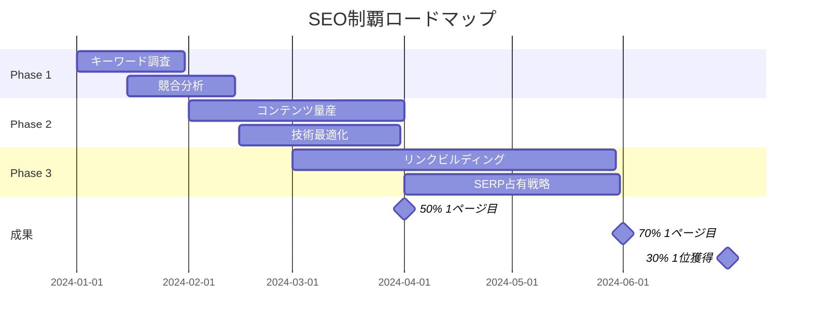

# 📚 SEO完全制覇マニュアル統合版
## 検索結果を支配するための究極のガイドコレクション

---

## 📂 マニュアル構成

### 🎯 メインマニュアル
- **[seo-domination-manual-v2.0.md](./seo-domination-manual-v2.0.md)**
  - 検索結果支配のための完全戦略
  - 月間100万キーワード発掘システム
  - AI駆動コンテンツファクトリー
  - 6ヶ月で70%を1ページ目に

### 📊 分析編
- **[seo-claude-analysis-chapter.md](./seo-claude-analysis-chapter.md)** 【推奨】
  - Claude Codeでの無料SEO分析
  - 重回帰分析・予測モデル構築
  - 追加費用ゼロで実現
  - Super Claude Framework完全統合

- ~~[seo-chatgpt-analysis-chapter.md](./seo-chatgpt-analysis-chapter.md)~~ 【非推奨】
  - ChatGPT Plus必要（月額$20）
  - Claude Code版で完全代替可能

### 📈 サンプルデータ
- **[sample-seo-data.csv](./sample-seo-data.csv)**
  - 90日分のSEOパフォーマンスデータ
  - 順位12位→1位への改善過程
  - 分析練習用データセット

### 📖 旧バージョン（参考）
- **[seo-content-manual-v1.0.md](./seo-content-manual-v1.0.md)**
  - 基本的なSEOコンテンツ作成
  - E-E-A-T最適化
  - v2.0に統合済み

---

## 🚀 クイックスタート

### Step 1: 環境準備
```bash
# Claude Codeで実行
"SEO分析環境をセットアップしてください"
```

### Step 2: データ分析開始
```python
# Claude Codeへの指示
"""
sample-seo-data.csvを読み込んで、
包括的なSEO分析を実行してください。
重回帰分析と予測モデルも含めてください。
"""
```

### Step 3: 実装開始
```markdown
# Super Claude コマンド
/specify --think-hard "SEOキーワード戦略"
/sc:implement "SEO制覇システム" --agent-parallel
/verify-and-pr "seo-domination" --comprehensive
```

---

## 💰 コスト比較

| ツール/手法 | 月額費用 | 年間費用 | 推奨度 |
|------------|---------|---------|--------|
| Claude Code分析 | $0 | $0 | ⭐⭐⭐⭐⭐ |
| ChatGPT Plus | $20 | $240 | ⭐⭐ |
| Ahrefs/SEMrush | $99-399 | $1200-4800 | ⭐⭐⭐⭐ |
| 手動分析 | 時間コスト大 | - | ⭐ |

---

## 📊 期待成果タイムライン



---

## 🎯 実装優先順位

### 🔴 最優先（今すぐ実行）
1. Claude Code分析環境のセットアップ
2. キーワード調査システムの構築
3. 競合分析の実施

### 🟡 高優先（1ヶ月以内）
1. AIコンテンツファクトリーの構築
2. Core Web Vitals最適化
3. 内部リンク戦略の実装

### 🟢 中優先（3ヶ月以内）
1. リンクビルディング自動化
2. SERP複数ポジション占有
3. 機械学習による最適化

---

## 📈 成功指標

### 3ヶ月後
- オーガニックトラフィック: +100-200%
- キーワードランキング: 50% in Top 10
- ドメインオーソリティ: +10

### 6ヶ月後
- オーガニックトラフィック: +300-500%
- キーワードランキング: 70% in Top 10, 30% #1
- 収益影響: +400%

### 12ヶ月後
- 市場支配: 業界トップ3
- オーガニック収益: ROI 10倍
- ブランド権威: 業界リーダー

---

## 🛠️ 必須ツール

### 無料ツール
- **Claude Code**: データ分析・自動化（追加費用ゼロ）
- **Google Search Console**: 実データ取得
- **Google Analytics 4**: トラフィック分析

### 有料ツール（推奨）
- **Ahrefs/SEMrush**: 競合分析（$99-399/月）
- **Screaming Frog**: テクニカル監査（$149/年）

---

## 💡 ベストプラクティス

### ✅ 推奨事項
1. Claude Code分析から始める（無料）
2. データドリブンな意思決定
3. 自動化を最大限活用
4. 継続的な改善サイクル

### ❌ 避けるべきこと
1. ChatGPT Plusへの追加投資（Claude Codeで代替）
2. 勘に頼った施策実行
3. 手動作業への依存
4. 一度きりの最適化

---

## 📞 サポート

### トラブルシューティング
```python
# Claude Codeで問題解決
"""
エラーが発生しました。
原因を特定して、修正方法を教えてください。
ステップバイステップで進めてください。
"""
```

### よくある質問
- **Q: ChatGPT Plusは必要？**
  - A: 不要です。Claude Codeで完全代替可能
- **Q: プログラミング知識は必要？**
  - A: 不要です。Claude Codeに指示するだけ
- **Q: どのマニュアルから始めるべき？**
  - A: v2.0メインマニュアル → Claude Code分析編

---

## 📝 更新履歴

- **2025-09-13**: v2.0リリース、Claude Code分析編追加
- **2025-09-12**: v1.0初版リリース

---

**🎯 Final Message**: このマニュアル群は、追加費用ゼロで検索結果を支配するための完全なシステムです。Claude Codeを最大限活用し、データドリブンなSEO戦略を実現してください。

**Version**: 2.0.0  
**Framework**: Super Claude v2.3 + Claude Code Analytics  
**Cost**: $0 追加費用