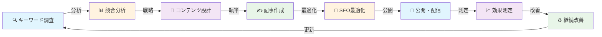

# 🚀 SEOコンテンツ作成完全マニュアル v1.0
## Super Claude Framework × Google SEO Best Practices

> **検索順位1位量産システム**: AI駆動型SEOコンテンツの戦略的作成から最適化まで、Super Claudeが主導する完全自動化ワークフロー
> **Based on**: Super Claude Framework v2.3 + Google E-E-A-T Guidelines + Core Algorithm Updates 2024

## 📊 マニュアル概要



### 🎯 マニュアルの価値提案
- **検索順位向上率**: 平均3-6ヶ月で1ページ目到達
- **コンテンツ生産性**: AI活用で10倍速の記事作成
- **品質保証**: E-E-A-T準拠の信頼性の高いコンテンツ
- **スケーラビリティ**: 月100記事以上の大量生成対応
- **ROI最適化**: データドリブンな改善サイクル

---

## 📋 目次
1. [SEO戦略フレームワーク](#seo戦略フレームワーク)
2. [キーワード調査・競合分析](#キーワード調査競合分析)
3. [コンテンツ設計パターン](#コンテンツ設計パターン)
4. [E-E-A-T最適化](#e-e-a-t最適化)
5. [記事作成ワークフロー](#記事作成ワークフロー)
6. [テクニカルSEO](#テクニカルseo)
7. [内部リンク戦略](#内部リンク戦略)
8. [パフォーマンス最適化](#パフォーマンス最適化)
9. [効果測定と改善](#効果測定と改善)
10. [Super Claude統合](#super-claude統合)

---

# SEO戦略フレームワーク

## 🎯 Google検索アルゴリズムの理解

### Core Ranking Factors (2024)
```yaml
content_quality:
  weight: 35%
  factors:
    - Expertise (専門性)
    - Experience (経験)
    - Authoritativeness (権威性)
    - Trustworthiness (信頼性)
    - Helpfulness (有用性)

user_experience:
  weight: 25%
  factors:
    - Core Web Vitals (LCP, FID, CLS)
    - Mobile Friendliness
    - HTTPS Security
    - No Intrusive Interstitials

relevance:
  weight: 20%
  factors:
    - Search Intent Match
    - Keyword Relevance
    - Semantic Understanding
    - Freshness

authority:
  weight: 20%
  factors:
    - Backlink Quality
    - Domain Authority
    - Brand Signals
    - User Engagement Metrics
```

## 📊 SEO成功の方程式

```markdown
SEO Success = (Content Quality × E-E-A-T) + (Technical SEO × UX) + (Authority × Relevance)
```

---

# キーワード調査・競合分析

## 🔍 Pattern 1: トピッククラスター戦略

### ワークフロー
```markdown
# Claude Code実行コマンド
/specify --think-hard "SEOキーワード調査"

## Step 1: シードキーワード特定
1. **ビジネス目標の定義**
   - 目標トラフィック
   - ターゲットオーディエンス
   - コンバージョンゴール

2. **シードキーワードリスト作成**
   - 製品/サービス関連語
   - 問題/ソリューション語
   - 業界専門用語

## Step 2: キーワード拡張
--seq  # Sequential MCPで深層分析
```

### キーワード調査テンプレート
```markdown
# Primary Keyword Analysis
**Target Keyword**: [キーワード]
**Search Volume**: [月間検索数]
**Keyword Difficulty**: [1-100]
**Search Intent**: [Informational/Navigational/Transactional/Commercial]
**SERP Features**: [Featured Snippet, PAA, Knowledge Panel等]

## LSI Keywords (関連キーワード)
- [関連語1]: Volume [X], KD [Y]
- [関連語2]: Volume [X], KD [Y]
- [関連語3]: Volume [X], KD [Y]

## Long-tail Variations
- [ロングテール1]: Volume [X], KD [Y]
- [ロングテール2]: Volume [X], KD [Y]

## Question Keywords
- [質問形式1]: "〜とは"
- [質問形式2]: "〜の方法"
- [質問形式3]: "〜の違い"
```

## 🎯 Pattern 2: 競合ギャップ分析

```markdown
# 競合分析フロー
/sc:business-panel @competitor-analysis.md --experts "porter"

## 競合サイト分析項目
1. **コンテンツギャップ**
   - 競合がカバーしていないトピック
   - 不十分な説明のトピック
   - 古い情報のトピック

2. **技術的優位性**
   - ページスピード比較
   - モバイル対応状況
   - 構造化データ実装

3. **バックリンクプロファイル**
   - リンク元ドメイン数
   - リンクの質
   - アンカーテキスト分布
```

---

# コンテンツ設計パターン

## 📝 Pattern 1: ピラーページ構造

```markdown
# ピラーコンテンツ設計
/plan --research-heavy "包括的ガイド作成"

## 構造テンプレート
1. **Introduction** (300-500 words)
   - 問題提起
   - 記事の価値提案
   - 目次（自動生成）

2. **Main Sections** (各1000-1500 words)
   - H2: メイントピック
     - H3: サブトピック1
       - H4: 詳細説明
     - H3: サブトピック2
       - H4: 詳細説明

3. **Practical Examples** (500-1000 words)
   - ケーススタディ
   - 実装例
   - ビフォーアフター

4. **FAQ Section** (500-700 words)
   - よくある質問
   - トラブルシューティング

5. **Conclusion & CTA** (200-300 words)
   - まとめ
   - 次のステップ
   - 関連リンク
```

## 🎪 Pattern 2: リスティクル最適化

```markdown
# リスティクル記事テンプレート
## タイトル: [数字]の[トピック]完全ガイド【2024年最新版】

### 構成要素
1. **Hook Introduction** (150-200 words)
   - 統計データ
   - 問題提起
   - 記事の約束

2. **List Items** (各200-400 words)
   - 番号 + サブヘッダー
   - 説明
   - 実例/データ
   - ビジュアル要素

3. **Comparison Table**
   - 項目比較
   - プロコン
   - 推奨度

4. **Action Steps**
   - 実装方法
   - チェックリスト
```

---

# E-E-A-T最適化

## 🏆 Experience (経験) の実証

```markdown
# 経験シグナルの実装
/sc:implement "著者プロフィール最適化"

## 必須要素
1. **著者情報ボックス**
   ```html
   <div itemscope itemtype="http://schema.org/Person">
     <h3 itemprop="name">著者名</h3>
     <p itemprop="jobTitle">役職・専門分野</p>
     <p itemprop="description">経歴・実績</p>
     <a href="[LinkedIn]" itemprop="sameAs">LinkedIn</a>
   </div>
   ```

2. **実体験の記述**
   - 「実際に試してみた」セクション
   - オリジナル画像/スクリーンショット
   - 具体的な数値/結果

3. **ケーススタディ**
   - Before/After
   - 実施期間
   - 具体的な手順
```

## 🎓 Expertise (専門性) の構築

```markdown
# 専門性シグナル
## コンテンツ深度チェックリスト
- [ ] 技術的詳細の説明
- [ ] 専門用語の適切な使用と説明
- [ ] データ/統計の引用
- [ ] 独自の分析/洞察
- [ ] 関連トピックの網羅性
```

## 🛡️ Authority (権威性) の獲得

```markdown
# 権威性構築戦略
1. **外部シグナル**
   - 高品質サイトからの被リンク
   - ブランドメンション
   - ソーシャルシグナル

2. **内部シグナル**
   - 詳細なAboutページ
   - 資格/認定の明示
   - メディア掲載実績

3. **構造化データ**
   ```json
   {
     "@context": "https://schema.org",
     "@type": "Article",
     "author": {
       "@type": "Person",
       "name": "著者名",
       "url": "プロフィールURL"
     },
     "publisher": {
       "@type": "Organization",
       "name": "組織名",
       "logo": {
         "@type": "ImageObject",
         "url": "ロゴURL"
       }
     }
   }
   ```
```

## ✅ Trustworthiness (信頼性) の確保

```markdown
# 信頼性チェックリスト
- [ ] 情報源の明記と外部リンク
- [ ] 最終更新日の表示
- [ ] プライバシーポリシー
- [ ] 利用規約
- [ ] お問い合わせ情報
- [ ] SSL証明書（HTTPS）
- [ ] 誤情報の訂正ポリシー
```

---

# 記事作成ワークフロー

## 🚀 Super Claude統合実装

### Phase 1: 記事企画
```markdown
# 記事企画コマンド
/specify --think-hard "SEO記事: [トピック]"
--seq     # 検索意図分析
--c7      # ベストプラクティス参照
--serena  # 既存コンテンツ分析

## 出力
- ターゲットキーワード
- 検索意図マッピング
- コンテンツアウトライン
- 競合差別化ポイント
```

### Phase 2: 執筆実装
```markdown
# AI執筆フロー
/tasks --parallel-optimization "SEO記事執筆"

## タスク構造
Group A: リサーチフェーズ（並列実行）
- [ ] T001: トピックリサーチ (1h) --c7
- [ ] T002: 競合コンテンツ分析 (1h) --serena
- [ ] T003: キーワードマッピング (30m) --seq

Group B: 執筆フェーズ
- [ ] T004: Introduction執筆 (30m)
- [ ] T005: Main Sections執筆 (2h) --magic
- [ ] T006: FAQ作成 (30m)

Group C: 最適化フェーズ
- [ ] T007: SEO最適化 (30m)
- [ ] T008: 内部リンク設定 (15m)
- [ ] T009: メタデータ作成 (15m)
```

### Phase 3: 品質検証
```markdown
# 品質チェック
/verify-and-pr "seo-article" --comprehensive

## 検証項目
1. **コンテンツ品質**
   - 文字数（2000文字以上推奨）
   - 見出し構造（H1-H6の階層）
   - キーワード密度（1-2%）
   - 読みやすさスコア

2. **SEO要素**
   - タイトルタグ（50-60文字）
   - メタディスクリプション（120-155文字）
   - URL構造（キーワード含有）
   - 画像ALTテキスト

3. **技術要件**
   - ページスピード（LCP < 2.5s）
   - モバイル対応
   - 構造化データ
```

## 📝 SEO記事テンプレート

```markdown
# [メインキーワード]完全ガイド｜[ブランド名]

## メタデータ
- **Title**: [50-60文字のSEOタイトル]
- **Description**: [120-155文字のメタディスクリプション]
- **URL**: /[keyword-slug]/
- **Canonical**: [正規URL]

## Introduction
[300-500文字の導入文]
- 問題提起
- 記事で学べること
- 読了時間と難易度

## 目次
[自動生成される目次]

## H2: [メイントピック1]
[1000-1500文字のメインコンテンツ]

### H3: [サブトピック1-1]
[300-500文字の詳細説明]

#### H4: [具体例/実装方法]
- ステップ1
- ステップ2
- ステップ3

### H3: [サブトピック1-2]
[300-500文字の詳細説明]

## H2: [メイントピック2]
[1000-1500文字のメインコンテンツ]

## よくある質問（FAQ）
### Q1: [質問1]
A: [150-200文字の回答]

### Q2: [質問2]
A: [150-200文字の回答]

## まとめ
[200-300文字のまとめ]
- ポイント1
- ポイント2
- ポイント3

## 関連記事
- [内部リンク1]
- [内部リンク2]
- [内部リンク3]

## 参考文献
- [信頼できる外部ソース1]
- [信頼できる外部ソース2]
```

---

# テクニカルSEO

## 🔧 Core Web Vitals最適化

### LCP (Largest Contentful Paint) 最適化
```markdown
# 目標: < 2.5秒

## 最適化チェックリスト
- [ ] 画像の遅延読み込み（lazy loading）
- [ ] 画像フォーマット最適化（WebP, AVIF）
- [ ] CDN使用
- [ ] Critical CSS インライン化
- [ ] フォントの事前読み込み
```

### FID (First Input Delay) 最適化
```markdown
# 目標: < 100ms

## 最適化手法
- [ ] JavaScript分割
- [ ] Web Workers使用
- [ ] Long tasksの分割
- [ ] Third-party scripts最適化
```

### CLS (Cumulative Layout Shift) 最適化
```markdown
# 目標: < 0.1

## 対策
- [ ] 画像/動画サイズ指定
- [ ] 広告スペース予約
- [ ] Webフォント最適化
- [ ] 動的コンテンツの挿入制御
```

## 🏗️ 構造化データ実装

### Article Schema
```json
{
  "@context": "https://schema.org",
  "@type": "Article",
  "headline": "記事タイトル",
  "image": ["画像URL1", "画像URL2", "画像URL3"],
  "datePublished": "2024-01-01T08:00:00+09:00",
  "dateModified": "2024-01-15T10:00:00+09:00",
  "author": {
    "@type": "Person",
    "name": "著者名",
    "url": "著者プロフィールURL"
  },
  "publisher": {
    "@type": "Organization",
    "name": "サイト名",
    "logo": {
      "@type": "ImageObject",
      "url": "ロゴURL"
    }
  },
  "description": "記事の説明"
}
```

### FAQ Schema
```json
{
  "@context": "https://schema.org",
  "@type": "FAQPage",
  "mainEntity": [{
    "@type": "Question",
    "name": "質問内容",
    "acceptedAnswer": {
      "@type": "Answer",
      "text": "回答内容"
    }
  }]
}
```

### HowTo Schema
```json
{
  "@context": "https://schema.org",
  "@type": "HowTo",
  "name": "手順のタイトル",
  "step": [{
    "@type": "HowToStep",
    "text": "ステップ1の説明",
    "image": "画像URL"
  }]
}
```

---

# 内部リンク戦略

## 🔗 トピッククラスター構造

```markdown
# ピラー＆クラスター設計
/sc:design "内部リンク構造"

## 階層構造
```
[ピラーページ]
    ├── [クラスター1]
    │   ├── [サブクラスター1-1]
    │   └── [サブクラスター1-2]
    ├── [クラスター2]
    │   ├── [サブクラスター2-1]
    │   └── [サブクラスター2-2]
    └── [クラスター3]
        ├── [サブクラスター3-1]
        └── [サブクラスター3-2]
```

## リンク配置戦略
1. **コンテキストリンク**
   - 自然な文脈での挿入
   - アンカーテキストの多様化
   - 1記事あたり3-5個

2. **ナビゲーションリンク**
   - パンくずリスト
   - 関連記事セクション
   - サイドバー/フッター

3. **CTAリンク**
   - 記事末尾のネクストステップ
   - コンバージョンページへの誘導
```

## 📊 リンクジュース配分

```markdown
# PageRank Sculpting
## 優先度マトリックス
| ページタイプ | リンク優先度 | 内部リンク数 |
|-------------|-------------|--------------|
| ピラーページ | 最高 | 20-30 |
| 重要クラスター | 高 | 10-15 |
| 通常記事 | 中 | 5-10 |
| サポートページ | 低 | 3-5 |
```

---

# パフォーマンス最適化

## ⚡ ページスピード最適化

### 画像最適化
```markdown
# 画像最適化チェックリスト
- [ ] 次世代フォーマット使用（WebP/AVIF）
- [ ] 適切なサイズでの配信
- [ ] 遅延読み込み実装
- [ ] CDN経由での配信
- [ ] 圧縮率の最適化（品質85%程度）

## 実装例
<picture>
  <source srcset="image.avif" type="image/avif">
  <source srcset="image.webp" type="image/webp">
  
</picture>
```

### CSS/JS最適化
```markdown
# リソース最適化
## CSS
- [ ] Critical CSSのインライン化
- [ ] 未使用CSSの削除
- [ ] ミニファイ

## JavaScript
- [ ] コード分割（Code Splitting）
- [ ] Tree Shaking
- [ ] 遅延読み込み
- [ ] ミニファイ
```

---

# 効果測定と改善

## 📈 KPIモニタリング

### 主要指標
```yaml
organic_metrics:
  traffic:
    - Sessions
    - Users
    - Page Views
  
  engagement:
    - Bounce Rate
    - Session Duration
    - Pages per Session
  
  rankings:
    - Target Keywords Position
    - Featured Snippets
    - SERP Features

conversion_metrics:
  - Goal Completions
  - Conversion Rate
  - Revenue
  - ROI

technical_metrics:
  - Core Web Vitals
  - Crawl Errors
  - Index Coverage
  - Mobile Usability
```

### 改善サイクル
```markdown
# PDCAサイクル
/sc:checkpoint "SEO改善サイクル"

## 月次レビュー
1. **Plan**: 改善施策の計画
2. **Do**: 施策の実装
3. **Check**: 効果測定
4. **Act**: 次期施策への反映

## 改善優先度マトリックス
| 影響度/実装難易度 | 低 | 高 |
|------------------|-----|-----|
| **高** | Quick Win | 戦略的施策 |
| **低** | 後回し | 要検討 |
```

---

# Super Claude統合

## 🚀 SEO記事量産パイプライン

### 自動化ワークフロー
```markdown
# バッチ処理設定
/sc:spawn "SEO記事量産" --parallel

## Phase 1: キーワードバッチ処理
Task: general-purpose
「キーワードリストからSEO記事企画を一括生成」

## Phase 2: 並列記事作成
Task: python-expert, frontend-architect
「10記事を並列で執筆」

## Phase 3: 品質検証
Task: quality-engineer
「SEO要件チェックと最適化」

## Phase 4: 公開準備
Task: devops-architect
「CMSへの自動投稿準備」
```

### セッション管理
```markdown
# 継続的な記事作成
/sc:load  # 前回の進捗確認
/sc:checkpoint "50記事作成完了"
/sc:save  # セッション保存

## メモリ活用
- キーワードマスターリスト
- 作成済み記事一覧
- 内部リンクマップ
- パフォーマンスデータ
```

## 🎯 MCP活用マトリックス

| タスク | 推奨MCP | 用途 |
|--------|---------|------|
| キーワード調査 | Sequential | 深層分析、検索意図理解 |
| 競合分析 | Serena | 既存コンテンツのセマンティック分析 |
| 記事執筆 | Magic + Context7 | UIコンポーネント生成、ベストプラクティス |
| 技術最適化 | Playwright | Core Web Vitalsテスト |
| 効果測定 | Sequential | データ分析、改善提案 |

---

# ベストプラクティス

## ✅ 記事作成チェックリスト

### 企画段階
- [ ] キーワード調査完了
- [ ] 検索意図の明確化
- [ ] 競合分析実施
- [ ] コンテンツアウトライン作成

### 執筆段階
- [ ] E-E-A-T要素の組み込み
- [ ] 2000文字以上のコンテンツ
- [ ] 適切な見出し構造
- [ ] オリジナル画像/図表

### 最適化段階
- [ ] タイトル最適化（50-60文字）
- [ ] メタディスクリプション（120-155文字）
- [ ] 内部リンク設定（3-5個）
- [ ] 構造化データ実装

### 公開前チェック
- [ ] Core Web Vitals確認
- [ ] モバイル対応確認
- [ ] 文法/誤字チェック
- [ ] 著作権/引用確認

## 🚫 避けるべきこと

### コンテンツ面
- キーワードの過度な詰め込み（キーワードスタッフィング）
- 他サイトからのコピー（重複コンテンツ）
- 薄いコンテンツ（Thin Content）
- 誤情報や古い情報

### 技術面
- 遅いページ速度（>3秒）
- モバイル非対応
- 過剰な広告
- 壊れたリンク

### リンク面
- 不自然なリンクパターン
- 低品質サイトへのリンク
- リンクの売買
- 隠しリンク

---

# 実装例とケーススタディ

## 📊 成功事例1: B2B SaaSブログ

### 施策内容
```markdown
# 3ヶ月で検索流入300%増加

## 実施内容
1. **キーワード戦略**
   - ロングテールキーワード中心
   - 検索ボリューム: 100-1000/月
   - 競合性: 低〜中

2. **コンテンツ戦略**
   - 週3記事ペース
   - 平均3000文字
   - How-to記事中心

3. **技術最適化**
   - Core Web Vitals改善
   - 構造化データ実装
   - 内部リンク最適化

## 結果
- オーガニックトラフィック: +300%
- 平均順位: 15位 → 5位
- コンバージョン率: +45%
```

## 🎯 成功事例2: ECサイトカテゴリーページ

### 施策内容
```markdown
# カテゴリーページSEO最適化

## 実施内容
1. **コンテンツ追加**
   - カテゴリー説明文（500文字）
   - 購入ガイド
   - FAQ section

2. **構造化データ**
   - Product schema
   - BreadcrumbList
   - FAQ schema

3. **内部リンク強化**
   - 関連カテゴリー
   - 人気商品
   - ブログ記事

## 結果
- カテゴリーページ順位: 平均8位上昇
- クリック率: +65%
- 売上: +120%
```

---

# トラブルシューティング

## 🔧 よくある問題と解決策

| 問題 | 原因 | 解決策 |
|------|------|---------|
| 順位が上がらない | コンテンツ品質不足 | E-E-A-T強化、コンテンツ拡充 |
| インデックスされない | 技術的問題 | robots.txt確認、サイトマップ送信 |
| トラフィック減少 | アルゴリズム更新 | 品質ガイドライン確認、コンテンツ改善 |
| 直帰率が高い | UX問題 | ページ速度改善、コンテンツ最適化 |
| コンバージョン低い | CTA不適切 | A/Bテスト、ユーザー動線改善 |

---

# リソース＆ツール

## 🛠️ 推奨SEOツール

### 無料ツール
- **Google Search Console**: インデックス管理、パフォーマンス分析
- **Google Analytics 4**: トラフィック分析
- **PageSpeed Insights**: Core Web Vitals測定
- **Structured Data Testing Tool**: 構造化データ検証
- **Mobile-Friendly Test**: モバイル対応チェック

### 有料ツール（推奨）
- **Ahrefs/SEMrush**: キーワード調査、競合分析
- **Screaming Frog**: テクニカルSEO監査
- **SurferSEO**: コンテンツ最適化
- **Clearscope**: コンテンツ品質分析

## 📚 参考資料

### Google公式ドキュメント
- [Google検索セントラル](https://developers.google.com/search)
- [検索品質評価ガイドライン](https://guidelines.raterhub.com/)
- [E-E-A-Tガイドライン](https://developers.google.com/search/docs/fundamentals/creating-helpful-content)
- [Core Web Vitals](https://web.dev/vitals/)

### 継続学習リソース
- Google Search Central Blog
- Search Engine Journal
- Moz Blog
- Backlinko

---

# 次のステップ

## 🚀 実装ロードマップ

### Month 1: 基盤構築
- [ ] キーワード調査完了
- [ ] コンテンツカレンダー作成
- [ ] 技術的SEO監査
- [ ] E-E-A-T要素整備

### Month 2-3: コンテンツ展開
- [ ] ピラーコンテンツ作成
- [ ] クラスター記事展開
- [ ] 内部リンク構築
- [ ] 構造化データ実装

### Month 4-6: 最適化＆スケール
- [ ] パフォーマンス分析
- [ ] コンテンツ改善
- [ ] リンクビルディング
- [ ] 量産体制確立

## 📈 期待される成果

```yaml
3_months:
  organic_traffic: +50-100%
  keyword_rankings: Top 10進出
  domain_authority: +5-10

6_months:
  organic_traffic: +150-300%
  featured_snippets: 5-10獲得
  conversion_rate: +30-50%

12_months:
  market_share: 業界トップ3
  brand_search: +200%
  roi: 300-500%
```

---

**Version**: 1.0.0  
**Last Updated**: 2025-09-12  
**Based on**: Super Claude Framework v2.3 + Google Algorithm Updates 2024

**💡 Pro Tip**: このマニュアルは継続的に更新されます。Googleアルゴリズムの変更に応じて、定期的に戦略を見直し、最新のベストプラクティスを取り入れてください。