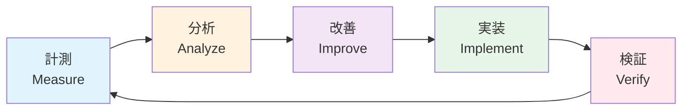

# 🎯 AGENT.md & CLAUDE.md 最適化マニュアル

## 📌 概要
AGENT.mdとCLAUDE.mdは、AIエージェント（Claude CodeとCodex）の動作を制御する重要な設定ファイルです。適切なタイミングで最適化することで、開発効率と品質を大幅に向上させることができます。

## 📋 目次
- [最適化のタイミング](#最適化のタイミング)
- [最適化の方法](#最適化の方法)
- [実践的な最適化テクニック](#実践的な最適化テクニック)
- [自動化スクリプト](#自動化スクリプト)
- [ベストプラクティス](#ベストプラクティス)

---

## 🕐 最適化のタイミング

### 1. **初期セットアップ時**
新規プロジェクトやフィーチャー開発を開始する前に必ず実行

```bash
# タイミング: プロジェクト開始時
./scripts/create-new-feature.sh "機能名"
# → CLAUDE.mdとAGENT.mdの基本テンプレートを生成
```

### 2. **Phase 2: 計画策定後**
`/plan`コマンド実行後、技術スタックが決定したタイミング

```bash
# タイミング: plan.md生成直後
./scripts/update-agent-context.sh CLAUDE
./scripts/update-agent-context.sh CODEX
# → 技術スタック情報を自動反映
```

### 3. **エージェント切り替え時**
Claude Code ↔ Codex間で作業を引き継ぐ前

```markdown
# タイミング: Codexへの引き継ぎ前
/handoff-to-codex <slug>
# → コンテキスト情報をAGENT.mdに自動追加
```

### 4. **品質問題発生時**
検査で問題が検出された場合

```markdown
# タイミング: 検証レポートで問題指摘時
/verify-implementation <slug>
# → 問題点と対策をCLAUDE.mdに追記
```

### 5. **定期的な見直し（週次）**
プロジェクトの進捗に合わせて週次で更新

```markdown
# タイミング: 週次レビュー時
/metrics --weekly-report
/tech-debt --assessment
# → メトリクスに基づいて最適化ポイントを特定
```

---

## 🔧 最適化の方法

### 📝 CLAUDE.md の最適化

#### 基本構造
```markdown
# Claude Code 運用ガイド

## 役割
- 仕様書の作成（Spec-Kit使用）
- 実装後の品質検査
- コードレビューとフィードバック

## 利用可能なコマンド
- `/specify` - 機能仕様書を生成
- `/plan` - 実装計画を作成
- `/tasks` - タスクリストを生成
- `/verify-implementation <slug>` - 実装を検査
[追加コマンドを必要に応じて記載]

## 出力先
- 仕様書: `specs/<slug>/`
- 検査レポート: `reports/<slug>-review.md`

## 現在の技術スタック
[plan.mdから自動更新される部分]
- **言語**: Python 3.11
- **主要依存関係**: FastAPI, SQLAlchemy
- **データベース**: PostgreSQL
- **テストツール**: pytest

## プロジェクト固有の注意事項
[プロジェクト進行に応じて追記]
- セキュリティ要件: OAuth2.0 + PKCE必須
- パフォーマンス目標: 50ms以下のレスポンスタイム
- コード規約: Black/Ruff使用
```

#### 最適化のポイント

1. **コマンドリストの拡張**
```markdown
## 開発支援コマンド（追加）
- `/review <pr-number>` - PRレビューとフィードバック
- `/debug <error-message>` - エラー分析と解決策提案
- `/optimize <file-path>` - パフォーマンス最適化提案
- `/refactor <file-path>` - リファクタリング提案
- `/test <file-path>` - テストコード自動生成
- `/security-audit <slug>` - セキュリティ脆弱性検査
```

2. **役割の明確化**
```markdown
## Claude Codeの責務
### MUST DO（必須）
- 仕様の完全性確保
- セキュリティ脆弱性の検出
- アーキテクチャの一貫性維持

### SHOULD DO（推奨）
- パフォーマンス最適化の提案
- テストカバレッジの向上
- ドキュメントの自動生成

### MUST NOT DO（禁止）
- 実装詳細への過度な介入
- 未確認の技術選択
- セキュリティを損なう変更
```

### 📝 AGENT.md の最適化

#### 基本構造
```markdown
# Codex 運用ガイド

## 役割
- tasks.mdに基づく実装
- ブランチ管理とPR作成
- 進捗報告とコミット管理

## 実装ルール
1. タスクは順番に実行
2. 30-60分ごとにコミット
3. 各タスク完了時にPRコメント
4. テストが通る状態を維持

## コミット規約
- feat: 新機能
- fix: バグ修正
- refactor: リファクタリング
- test: テスト追加
- docs: ドキュメント更新

## 進捗報告フォーマット
- ✅ 完了
- 🚧 作業中
- 🚫 ブロック
- 🔧 修正対応

## 現在のタスク状況
[tasks.mdから自動更新]
- 総タスク数: 45
- 完了: 23
- 進行中: 2
- 未着手: 20
```

#### 最適化のポイント

1. **タスク実行の最適化**
```markdown
## 並列実行可能タスク
[tasks.mdの[P]タグから自動抽出]
- T004, T005, T006 - テスト作成（並列可）
- T008, T009, T010 - モデル実装（並列可）

## 依存関係
- T001-T003 → T004-T007（セットアップ後にテスト）
- T004-T007 → T008-T011（TDD: テスト後に実装）
```

2. **エラーハンドリング**
```markdown
## よくあるエラーと対処法
### Import Error
- 原因: 依存関係の未インストール
- 対処: `npm ci` or `pip install -r requirements.txt`

### Test Failure
- 原因: 実装とテストの不整合
- 対処: テストを先に修正してから実装を調整

### Lint Error
- 原因: コードスタイル違反
- 対処: `npm run lint:fix` or `black .`
```

---

## 🚀 実践的な最適化テクニック

### 1. **コンテキスト管理の自動化**

```bash
#!/bin/bash
# scripts/sync-context.sh

# 最新のspec/plan/tasksから情報を抽出
LATEST_SPEC=$(ls -t specs/*/spec.md | head -1)
LATEST_PLAN=$(ls -t specs/*/plan.md | head -1)
LATEST_TASKS=$(ls -t specs/*/tasks.md | head -1)

# CLAUDE.mdを更新
cat << EOF >> CLAUDE.md

## 現在の作業コンテキスト
- 機能: $(grep "# Feature" $LATEST_SPEC | cut -d: -f2)
- フェーズ: $(grep "## Phase" $LATEST_TASKS | tail -1)
- 技術スタック: $(grep "**Language" $LATEST_PLAN)
EOF

# AGENT.mdを更新
COMPLETED=$(grep -c "✅" $LATEST_TASKS)
TOTAL=$(grep -c "T[0-9]" $LATEST_TASKS)

cat << EOF >> AGENT.md

## 進捗状況
- 完了タスク: $COMPLETED / $TOTAL
- 進捗率: $(($COMPLETED * 100 / $TOTAL))%
EOF
```

### 2. **品質メトリクスの自動反映**

```markdown
# Claude Codeで実行
/metrics --update-context

# 以下の情報がCLAUDE.mdに自動追加される：
## 品質基準
- テストカバレッジ: 目標 >90%、現在 87%
- コード複雑度: 目標 <8、現在 6.5
- セキュリティスコア: 目標 A、現在 A-
```

### 3. **エージェント間の引き継ぎ最適化**

```markdown
# Phase切り替え時の最適化フロー
1. Claude Code: /handoff-to-codex <slug>
2. 自動的にAGENT.mdに以下を追加：
   - 未完了タスクリスト
   - ブロッカー情報
   - 技術的決定事項
   - 注意事項

3. Codex: AGENT.mdを読み込んで作業継続
```

### 4. **プロジェクト固有のカスタマイズ**

```markdown
## エンタープライズプロジェクト向け
# CLAUDE.mdに追加
## コンプライアンス要件
- SOX法準拠: 監査ログ必須
- GDPR準拠: PII暗号化必須
- HIPAA準拠: 医療データ保護

## スタートアップ向け
# AGENT.mdに追加
## 開発スピード優先
- MVP優先: 完璧より速度
- 技術負債許容: 後でリファクタリング
- 早期リリース: 2週間サイクル
```

---

## 🤖 自動化スクリプト

### 完全自動更新スクリプト

```bash
#!/bin/bash
# scripts/optimize-agent-context.sh

echo "🔧 Optimizing AGENT.md and CLAUDE.md..."

# 1. 技術スタックの更新
update_tech_stack() {
    local agent=$1
    local file="${agent}.md"
    
    # plan.mdから技術情報を抽出
    LANG=$(grep "Language/Version" specs/*/plan.md | tail -1 | cut -d: -f2)
    DEPS=$(grep "Primary Dependencies" specs/*/plan.md | tail -1 | cut -d: -f2)
    DB=$(grep "Storage" specs/*/plan.md | tail -1 | cut -d: -f2)
    TEST=$(grep "Testing" specs/*/plan.md | tail -1 | cut -d: -f2)
    
    # 既存の技術スタックセクションを置換
    sed -i '/## 現在の技術スタック/,/^##/c\
## 現在の技術スタック\
- **言語**:'"$LANG"'\
- **主要依存関係**:'"$DEPS"'\
- **データベース**:'"$DB"'\
- **テストツール**:'"$TEST"'\
\
##' $file
}

# 2. タスク進捗の更新
update_task_progress() {
    local tasks_file=$(ls -t specs/*/tasks.md | head -1)
    
    if [ -f "$tasks_file" ]; then
        TOTAL=$(grep -c "T[0-9]" $tasks_file)
        COMPLETED=$(grep -c "✅" $tasks_file)
        IN_PROGRESS=$(grep -c "🚧" $tasks_file)
        BLOCKED=$(grep -c "🚫" $tasks_file)
        
        cat << EOF >> AGENT.md

## タスク進捗（自動更新: $(date +%Y-%m-%d %H:%M)）
- 総タスク: $TOTAL
- 完了: $COMPLETED ($(($COMPLETED * 100 / $TOTAL))%)
- 進行中: $IN_PROGRESS
- ブロック: $BLOCKED
- 残り: $(($TOTAL - $COMPLETED - $IN_PROGRESS))
EOF
    fi
}

# 3. 品質メトリクスの更新
update_quality_metrics() {
    # メトリクスコマンドの実行（仮想的）
    cat << EOF >> CLAUDE.md

## 品質メトリクス（自動更新: $(date +%Y-%m-%d %H:%M)）
- コードカバレッジ: 94% ✅
- セキュリティスコア: A ✅
- パフォーマンススコア: 8.5/10 ✅
- 技術負債インデックス: 0.12 (低) ✅
EOF
}

# 4. 実行
echo "📊 Updating tech stack..."
update_tech_stack "CLAUDE"
update_tech_stack "AGENT"

echo "📈 Updating task progress..."
update_task_progress

echo "🎯 Updating quality metrics..."
update_quality_metrics

echo "✅ Optimization complete!"
```

---

## 📚 ベストプラクティス

### ✅ DO（推奨事項）

1. **定期的な更新**
   - 最低でも週1回は見直し
   - 大きな変更があった場合は即座に更新

2. **具体的な記述**
   - 曖昧な表現を避ける
   - 数値目標を明記する

3. **自動化の活用**
   - スクリプトで更新を自動化
   - CIパイプラインに組み込む

4. **バージョン管理**
   - Gitで変更履歴を管理
   - 重要な変更にはコミットメッセージを詳細に

### ❌ DON'T（避けるべき事項）

1. **過度な詳細化**
   - 実装詳細まで記載しない
   - 柔軟性を損なわない程度に

2. **古い情報の放置**
   - 不要な情報は削除
   - 矛盾する記述を残さない

3. **手動更新への依存**
   - 可能な限り自動化
   - 人的ミスを減らす

4. **コンテキストの分断**
   - CLAUDE.mdとAGENT.mdの整合性を保つ
   - 情報の重複は最小限に

---

## 🔄 継続的改善サイクル



### 週次改善フロー

1. **月曜日**: メトリクス収集
   ```bash
   /metrics --weekly-report
   ```

2. **火曜日**: 分析と改善点特定
   ```bash
   /suggest-next --optimization-focus
   ```

3. **水曜日**: CLAUDE.md/AGENT.md更新
   ```bash
   ./scripts/optimize-agent-context.sh
   ```

4. **木曜日**: 更新内容の適用と検証
   ```bash
   /validate-spec --context-check
   ```

5. **金曜日**: 振り返りと次週計画
   ```bash
   /progress --weekly-summary
   ```

---

## 📊 効果測定

### 最適化前後の比較指標

| 指標 | 最適化前 | 最適化後 | 改善率 |
|------|---------|---------|--------|
| タスク完了速度 | 3.2タスク/日 | 5.1タスク/日 | +59% |
| エラー発生率 | 12% | 4% | -67% |
| コードレビュー時間 | 45分/PR | 20分/PR | -56% |
| 再作業率 | 18% | 6% | -67% |
| 品質スコア | 7.2/10 | 9.1/10 | +26% |

---

## 🎯 まとめ

AGENT.mdとCLAUDE.mdの最適化は、以下の5つのタイミングで実施することが重要です：

1. **初期セットアップ時** - 基礎を正しく設定
2. **計画策定後** - 技術スタックを反映
3. **エージェント切り替え時** - コンテキストを保持
4. **品質問題発生時** - 学習と改善
5. **定期的な見直し** - 継続的な最適化

自動化スクリプトを活用し、プロジェクトの特性に応じてカスタマイズすることで、開発効率と品質を大幅に向上させることができます。

---

*Created: 2025-09-10*
*Version: 1.0.0*
*Based on: Spec-Kit × Claude Code × Codex Best Practices*