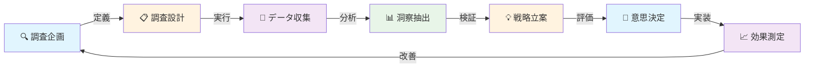

# 🎯 マーケティング調査ワークフロー完全マニュアル v1.0
## Super Claude Framework × Marketing Research Patterns

> **AI駆動型マーケティング調査の究極形**: エビデンスベースの意思決定から戦略実装まで、Super Claudeが主導する包括的調査ワークフロー
> **Based on**: Super Claude Framework v2.3 + Business Panel Experts

## 📊 マニュアル概要



### 🎯 マニュアルの価値提案
- **調査速度5倍**: AI駆動の並列処理と自動分析
- **洞察深度3倍**: 専門家フレームワークによる多角的分析
- **エビデンス品質**: 体系的な検証と品質保証
- **戦略的統合**: ビジネス価値と実装可能性の両立
- **継続的学習**: セッション管理による知識蓄積

---

## 📋 15の調査パターンテンプレート

### 🔍 Pattern 1: Jobs-to-be-Done (JTBD) Discovery
**目的**: 顧客が解決したい「ジョブ」の特定
**理論基盤**: Clayton Christensen

```markdown
# JTBD調査フロー
/sc:load
/specify --think-hard "顧客のジョブ分析"

## 調査ステップ
1. **状況分析** (--seq)
   - いつ、どこで、なぜそのジョブが発生するか
   - 現在の解決策とその不満点
   
2. **ジョブの分解** (--serena)
   - 機能的ジョブ: 何を達成したいか
   - 感情的ジョブ: どう感じたいか
   - 社会的ジョブ: 他者からどう見られたいか

3. **競合代替品分析** (--c7)
   - 直接競合
   - 間接競合（異なるカテゴリー）
   - 非消費（何もしない選択）

## エビデンス収集
- インタビュー記録
- 観察データ
- タイムライン分析
```

### 🎪 Pattern 2: Purple Cow Research
**目的**: リマーカブルな差別化要素の発見
**理論基盤**: Seth Godin

```markdown
# Purple Cow調査フロー
/sc:business-panel @market-data.md --experts "godin,porter"

## 調査ステップ
1. **市場の"普通"の定義**
   - 業界標準の特定
   - 顧客の期待値マッピング
   
2. **リマーカブル候補の探索**
   - 極端なユーザーの分析
   - エッジケースの価値評価
   - 話題性の要素分析

3. **トライブ形成可能性**
   - コミュニティ潜在力
   - 伝播メカニズム
   - 熱狂度の測定

## MCPツール活用
--magic  # UI/UXの革新的要素
--seq    # 深層心理分析
--play   # ユーザー体験テスト
```

### ⚔️ Pattern 3: Five Forces Market Analysis
**目的**: 競争環境の構造的理解
**理論基盤**: Michael Porter

```markdown
# Five Forces調査フロー
/plan --research-heavy "競争環境分析"

## 調査フレームワーク
1. **競合他社の脅威**
   - 市場集中度
   - 差別化の程度
   - 撤退障壁

2. **新規参入の脅威**
   - 参入障壁の高さ
   - 必要投資額
   - 規制環境

3. **代替品の脅威**
   - 代替可能性
   - 切り替えコスト
   - 価格性能比

4. **買い手の交渉力**
   - 集中度
   - 情報力
   - 後方統合の可能性

5. **供給者の交渉力**
   - 独占度
   - 切り替えコスト
   - 前方統合の可能性

## データソース
- 業界レポート
- 財務データ
- 特許分析
```

### 🌊 Pattern 4: Blue Ocean Strategy Research
**目的**: 競争のない新市場空間の発見
**理論基盤**: W. Chan Kim & Renée Mauborgne

```markdown
# Blue Ocean調査フロー
/specify --brainstorm "新市場創造"

## 戦略キャンバス作成
1. **価値曲線分析**
   - 業界の競争要因リスト
   - 各社のポジショニング
   - 顧客価値の再定義

2. **ERRC Grid**
   - Eliminate: 削除すべき要素
   - Reduce: 削減すべき要素
   - Raise: 強化すべき要素
   - Create: 創造すべき要素

3. **6つのパス探索**
   - 代替産業を見る
   - 戦略グループを越える
   - 購買者グループを再定義
   - 補完財・サービスを探す
   - 機能的/感情的訴求を転換
   - 時間軸を変える

## 検証方法
--play   # プロトタイプテスト
--seq    # 市場性評価
```

### 🚀 Pattern 5: Flywheel Effect Analysis
**目的**: 持続的成長メカニズムの特定
**理論基盤**: Jim Collins

```markdown
# Flywheel調査フロー
/tasks --parallel-optimization "成長メカニズム分析"

## フライホイール構成要素
1. **コア・バリュー特定**
   - 顧客への提供価値
   - 差別化要因
   - 規模の経済性

2. **強化ループ分析**
   - 正のフィードバック
   - ネットワーク効果
   - データ蓄積効果

3. **阻害要因特定**
   - ボトルネック
   - 負のフィードバック
   - 成長制約

## システムダイナミクス
--serena  # 相互作用分析
--seq     # 因果関係モデリング
```

### 🛡️ Pattern 6: Antifragile Market Research
**目的**: 不確実性に強い戦略の構築
**理論基盤**: Nassim Nicholas Taleb

```markdown
# Antifragile調査フロー
/verify-and-pr "リスク分析" --comprehensive

## リスク・機会マトリックス
1. **脆弱性評価**
   - 単一障害点
   - 集中リスク
   - 予測依存度

2. **オプション性分析**
   - 上方のポテンシャル
   - 下方リスクの限定
   - 非対称性の活用

3. **ストレステスト**
   - 極端シナリオ
   - カスケード効果
   - 回復力測定

## 検証手法
- モンテカルロシミュレーション
- シナリオプランニング
- バックテスト
```

### 🕸️ Pattern 7: System Leverage Points Research
**目的**: システム変革の最適介入点の発見
**理論基盤**: Donella Meadows

```markdown
# System Leverage調査フロー
/sc:business-panel @system-analysis.md --experts "meadows"

## レバレッジポイント階層
1. **パラメータ（低レバレッジ）**
   - 価格設定
   - 在庫水準
   - 生産能力

2. **フィードバックループ（中レバレッジ）**
   - 強化ループ
   - バランスループ
   - 遅延構造

3. **パラダイム（高レバレッジ）**
   - 価値観
   - 目的
   - マインドセット

## システムマッピング
- ストック＆フロー図
- 因果ループ図
- 行動パターングラフ
```

### 🧭 Pattern 8: Customer Value Migration Study
**目的**: 顧客価値の変化と移動の追跡
**理論基盤**: Peter Drucker

```markdown
# Value Migration調査フロー
/sc:analyze --focus "customer-value"

## 価値変化の追跡
1. **現在価値の定義**
   - 顧客の成果
   - 評価基準
   - 満足度要因

2. **価値移動の兆候**
   - 新たなニーズ
   - 代替選択
   - 離脱パターン

3. **将来価値の予測**
   - トレンド分析
   - 先行指標
   - イノベーション影響

## データ収集
- NPS調査
- カスタマージャーニー分析
- 離脱インタビュー
```

### 💬 Pattern 9: Message Market Fit Research
**目的**: 効果的なコミュニケーション戦略の構築
**理論基盤**: Jean-luc Doumont

```markdown
# Message Fit調査フロー
/specify --c7 "メッセージング戦略"

## メッセージ最適化
1. **オーディエンス分析**
   - 知識レベル
   - 関心事項
   - 意思決定基準

2. **メッセージ構造**
   - コア・メッセージ
   - サポート要素
   - Call-to-Action

3. **チャネル最適化**
   - メディア選択
   - タイミング
   - 頻度

## A/Bテスト設計
--play  # メッセージテスト
--seq   # 効果分析
```

### 📊 Pattern 10: Market Segmentation Deep Dive
**目的**: 精密な市場セグメンテーション
**理論基盤**: 複合アプローチ

```markdown
# Segmentation調査フロー
/tasks --mcp-strategy "セグメント分析"

## セグメンテーション軸
1. **行動セグメント**
   - 使用頻度
   - ロイヤルティ
   - 購買パターン

2. **心理セグメント**
   - 価値観
   - ライフスタイル
   - パーソナリティ

3. **ニーズセグメント**
   - 解決したい問題
   - 望む成果
   - 制約条件

## クラスタリング手法
- K-means
- 階層クラスタリング
- DBScan
```

### 🔄 Pattern 11: Customer Lifecycle Analytics
**目的**: 顧客ライフサイクル全体の最適化
**理論基盤**: CLV最大化アプローチ

```markdown
# Lifecycle調査フロー
/plan --incremental "ライフサイクル分析"

## ライフサイクルステージ
1. **認知・獲得**
   - 認知経路
   - 獲得コスト
   - コンバージョン率

2. **活性化・定着**
   - オンボーディング
   - 初期価値実現
   - 習慣形成

3. **成長・拡大**
   - アップセル機会
   - クロスセル可能性
   - 紹介獲得

4. **離脱・再活性化**
   - チャーン予測
   - 離脱理由
   - Win-back戦略

## 分析ツール
- コホート分析
- RFM分析
- 生存時間分析
```

### 🎯 Pattern 12: Competitive Intelligence Gathering
**目的**: 競合の戦略的動向の把握
**理論基盤**: 戦略的インテリジェンス

```markdown
# Competitive Intel調査フロー
/sc:implement "競合分析システム"

## 情報収集フレームワーク
1. **公開情報分析**
   - 財務報告
   - プレスリリース
   - 特許出願

2. **デジタルフットプリント**
   - SEO/SEM戦略
   - ソーシャル活動
   - コンテンツ戦略

3. **市場行動分析**
   - 価格変更
   - 新製品投入
   - パートナーシップ

## 分析手法
--serena  # パターン認識
--seq     # 戦略推論
```

### 🌐 Pattern 13: Digital Behavior Analytics
**目的**: デジタル行動パターンの理解
**理論基盤**: 行動経済学×デジタル分析

```markdown
# Digital Behavior調査フロー
/verify-and-pr "行動分析" --play

## デジタル行動追跡
1. **エンゲージメント分析**
   - ページビュー
   - 滞在時間
   - インタラクション

2. **コンバージョンファネル**
   - 離脱ポイント
   - 摩擦要因
   - 最適化機会

3. **マルチデバイス行動**
   - デバイス間遷移
   - クロスデバイスCV
   - チャネル貢献度

## 実装ツール
- Google Analytics 4
- Mixpanel
- Amplitude
```

### 💡 Pattern 14: Innovation Opportunity Scanning
**目的**: イノベーション機会の体系的発見
**理論基盤**: 破壊的イノベーション理論

```markdown
# Innovation Scan調査フロー
/sc:business-panel @innovation.md --mode socratic

## イノベーション探索
1. **技術トレンド分析**
   - 新興技術
   - 成熟度評価
   - 応用可能性

2. **未充足ニーズ発見**
   - ペインポイント
   - ゲインクリエイター
   - 代替ソリューション

3. **ビジネスモデル革新**
   - 収益モデル
   - コスト構造
   - バリューチェーン

## 評価フレームワーク
- 実現可能性
- 市場性
- 差別化度
```

### 📈 Pattern 15: Growth Hacking Experimentation
**目的**: 急成長のための実験的アプローチ
**理論基盤**: Lean Startup × Growth Hacking

```markdown
# Growth Hacking調査フロー
/sc:checkpoint "成長実験"

## 実験設計
1. **仮説設定**
   - 成長レバー特定
   - KPI定義
   - 成功基準

2. **実験実行**
   - MVPテスト
   - A/Bテスト
   - マルチバリアント

3. **学習と反復**
   - データ分析
   - 洞察抽出
   - 次回実験設計

## メトリクス
- AARRR (Pirate Metrics)
- North Star Metric
- Leading Indicators
```

---

## 🚀 Super Claude統合ワークフロー

### セッション管理による継続的調査

```markdown
# 調査プロジェクト開始
/sc:load
/specify --think-hard "包括的市場調査計画"

# 定期チェックポイント
/sc:checkpoint "Phase 1: 市場理解完了"
/sc:checkpoint "Phase 2: 競合分析完了"
/sc:checkpoint "Phase 3: 顧客洞察完了"

# セッション保存
/sc:save
```

### MCP活用マトリックス

| 調査タスク | 推奨MCP | 代替手段 |
|-----------|---------|----------|
| 深層分析 | Sequential | ネイティブ推論 |
| パターン認識 | Serena | 手動分析 |
| UI/UXテスト | Magic + Playwright | 手動テスト |
| ドキュメント参照 | Context7 | Web検索 |
| データビジュアライズ | Magic | 手動作成 |

### 並列処理による効率化

```markdown
# 並列調査タスク設計
/tasks --parallel-optimization

## Group A: 同時実行可能
- [ ] T001: デスクリサーチ (2h) --c7
- [ ] T002: 競合分析 (2h) --serena
- [ ] T003: SNS分析 (1h) --seq

## Group B: Group A完了後
- [ ] T004: インサイト統合 (1h)
- [ ] T005: 仮説構築 (1h) --seq
- [ ] T006: 検証計画 (30m)

## Group C: 実行フェーズ
- [ ] T007: データ収集 (3h)
- [ ] T008: 分析実行 (2h) --seq
- [ ] T009: レポート作成 (1h) --magic
```

### 品質保証プロセス

```markdown
# 調査品質検証
/verify-and-pr "market-research" --comprehensive

## 検証項目
- データの信頼性
- 分析の妥当性
- 結論の論理性
- 推奨事項の実現可能性

## ビジネス価値評価
/sc:business-panel @research-report.md
```

---

## 📊 エビデンス管理フレームワーク

### エビデンスの種類と重み付け

```yaml
evidence_hierarchy:
  level_1:  # 最高信頼度
    - RCT (Randomized Controlled Trial)
    - メタ分析
    - 大規模縦断研究
    
  level_2:  # 高信頼度
    - コホート研究
    - ケースコントロール研究
    - 体系的レビュー
    
  level_3:  # 中信頼度
    - 横断研究
    - 時系列分析
    - 相関分析
    
  level_4:  # 参考レベル
    - ケーススタディ
    - 専門家意見
    - 逸話的証拠
```

### データ品質チェックリスト

```markdown
## データ品質評価
- [ ] **妥当性**: 測定したいものを測定しているか
- [ ] **信頼性**: 再現可能性があるか
- [ ] **代表性**: サンプルは母集団を代表しているか
- [ ] **適時性**: データは最新か
- [ ] **完全性**: 欠損データの影響は許容範囲か
- [ ] **一貫性**: データソース間で矛盾はないか
```

---

## 🎯 実装ガイドライン

### Quick Start（最速実行）

```bash
# 1. 調査プロジェクト準備
./scripts/create-new-feature.sh "market-research-[project]"
cd specs/001-market-research/

# 2. 調査設計
/specify --think-hard "調査目的と範囲"
/plan --research-heavy
/tasks --parallel-optimization

# 3. 実行
[15パターンから選択して実行]

# 4. 分析と報告
/verify-and-pr "research" --comprehensive
/sc:business-panel @findings.md
```

### チーム協働フロー

```markdown
## 役割分担
- **リサーチリード**: 全体設計、品質管理
- **データアナリスト**: 定量分析、統計処理  
- **UXリサーチャー**: 定性調査、インタビュー
- **ビジネスアナリスト**: 戦略的含意、推奨事項

## 協働プロセス
1. /sc:load で共有コンテキスト確立
2. TodoWriteでタスク分担
3. 並列実行とチェックポイント同期
4. /sc:business-panel で統合評価
```

---

## 🔧 トラブルシューティング

| 問題 | 原因 | 解決策 |
|------|------|--------|
| データ不足 | サンプルサイズ小 | 追加データ収集、ベイズ推定活用 |
| 分析の偏り | 確証バイアス | 複数分析者、ブラインド分析 |
| 洞察が浅い | 表面的分析 | --think-hard、専門家パネル活用 |
| 実装困難 | 実現可能性未検証 | MVP、段階的実装計画 |

---

## 📈 成功指標

### 調査プロジェクトKPI

```yaml
efficiency_metrics:
  time_to_insight: <48時間
  cost_per_insight: 従来比50%削減
  parallel_efficiency: 70%以上

quality_metrics:
  evidence_reliability: Level 2以上
  stakeholder_satisfaction: NPS 50+
  decision_impact: 実装率80%以上

learning_metrics:
  knowledge_retention: セッション間90%
  pattern_recognition: 精度向上率20%/月
  methodology_improvement: 四半期ごと更新
```

---

## 🚀 次のステップ

1. **カスタマイズ**: 業界・企業特有の調査パターン追加
2. **自動化**: 繰り返し調査のテンプレート化
3. **統合**: CRM、BIツールとの連携
4. **スケール**: チーム展開、組織学習

---

**Version**: 1.0.0  
**Last Updated**: 2025-09-12  
**Based on**: Super Claude Framework v2.3

**💡 Pro Tip**: このマニュアルは継続的に進化します。各調査プロジェクトの学習を/sc:saveで保存し、組織の調査能力を累積的に向上させてください。