# TDD: Batch Command
> Execute TDD cycles for multiple tasks in parallel

## Usage
```bash
/tdd:batch <task-ids> [--parallel] [--group-by <dependency|module|priority>] [--max-workers <n>]
```

## Description
複数タスクのTDDサイクルを効率的に実行します。依存関係を分析し、並列実行可能なタスクを自動的にグループ化します。

## Process
1. タスクの依存関係を分析
2. 並列実行可能なグループを作成
3. 各グループを並列実行
4. 進捗をリアルタイム表示
5. 統合レポートを生成

## Options
- `--parallel`: 並列実行を有効化（デフォルト: true）
- `--group-by`: グループ化戦略
- `--max-workers`: 最大並列数（デフォルト: CPU数）

## Batch Execution Strategy

### 1. Dependency Analysis
```python
def analyze_dependencies(task_ids):
    """タスク間の依存関係を分析"""
    graph = build_dependency_graph(task_ids)

    # Topological sort for execution order
    execution_order = topological_sort(graph)

    # Group independent tasks
    groups = []
    current_group = []

    for task in execution_order:
        if has_dependency_in_group(task, current_group):
            groups.append(current_group)
            current_group = [task]
        else:
            current_group.append(task)

    if current_group:
        groups.append(current_group)

    return groups
```

### 2. Parallel Execution Engine
```python
async def execute_batch(task_ids, max_workers=4):
    """バッチ実行エンジン"""
    groups = analyze_dependencies(task_ids)
    all_results = []

    # Progress tracking
    progress = BatchProgress(total_tasks=len(task_ids))

    for group_idx, group in enumerate(groups):
        print(f"\n🔄 Group {group_idx + 1}/{len(groups)}: {len(group)} tasks")

        # Execute group in parallel
        async with asyncio.Semaphore(max_workers):
            tasks = []
            for task_id in group:
                task = execute_cycle_with_progress(task_id, progress)
                tasks.append(task)

            results = await asyncio.gather(*tasks, return_exceptions=True)

        # Handle results
        for task_id, result in zip(group, results):
            if isinstance(result, Exception):
                handle_task_failure(task_id, result)
            else:
                all_results.append(result)

    return all_results
```

### 3. Real-time Progress Display
```python
class BatchProgress:
    """リアルタイム進捗表示"""

    def __init__(self, total_tasks):
        self.total = total_tasks
        self.completed = 0
        self.in_progress = {}
        self.failed = []

    def update(self, task_id, phase, status):
        """進捗を更新"""
        self.in_progress[task_id] = {
            "phase": phase,
            "status": status
        }
        self.display()

    def display(self):
        """進捗を表示"""
        clear_screen()
        print("═" * 60)
        print(f"TDD Batch Execution: {self.completed}/{self.total} tasks")
        print("═" * 60)

        for task_id, info in self.in_progress.items():
            phase_bar = self._get_phase_bar(info["phase"])
            print(f"{task_id}: {phase_bar} {info['status']}")

        if self.failed:
            print(f"\n⚠️ Failed: {', '.join(self.failed)}")

    def _get_phase_bar(self, phase):
        """フェーズバーを生成"""
        phases = {"RED": "🔴", "GREEN": "🟢", "REFACTOR": "🔄"}
        bar = ["⬜", "⬜", "⬜"]

        if phase == "RED":
            bar[0] = phases["RED"]
        elif phase == "GREEN":
            bar[0] = "✅"
            bar[1] = phases["GREEN"]
        elif phase == "REFACTOR":
            bar[0] = "✅"
            bar[1] = "✅"
            bar[2] = phases["REFACTOR"]

        return " ".join(bar)
```

## Example Execution

### Basic Batch
```bash
$ /tdd:batch T014,T015,T016,T017,T018

📊 Batch Analysis Complete
- Total tasks: 5
- Independent groups: 2
- Estimated time: 3h 30min

Group 1 (Parallel): T014, T015, T016
Group 2 (Sequential): T017, T018

Proceed? [Y/n]: Y

═══════════════════════════════════════════════════════════
TDD Batch Execution: 0/5 tasks
═══════════════════════════════════════════════════════════
T014: 🔴 ⬜ ⬜  Creating tests...
T015: 🔴 ⬜ ⬜  Creating tests...
T016: 🔴 ⬜ ⬜  Creating tests...

[Progress updates in real-time]

═══════════════════════════════════════════════════════════
✅ Batch Complete: 5/5 tasks
═══════════════════════════════════════════════════════════
Success: 5
Failed: 0
Duration: 3h 15min
```

### Module-based Grouping
```bash
$ /tdd:batch T014-T030 --group-by module

📦 Grouping by module:
- users: T014, T015, T016 (3 tasks)
- jobs: T017, T018, T019, T020 (4 tasks)
- matching: T021, T022, T023 (3 tasks)
- analytics: T024, T025, T026, T027 (4 tasks)
- batch: T028, T029, T030 (3 tasks)

Executing 5 modules in sequence, tasks in parallel within each module...
```

## Batch Configuration

### Execution Strategies
```yaml
strategies:
  aggressive:
    max_workers: 8
    parallel: true
    auto_retry: true
    fail_fast: false

  conservative:
    max_workers: 2
    parallel: true
    auto_retry: false
    fail_fast: true

  sequential:
    max_workers: 1
    parallel: false
    auto_retry: false
    fail_fast: true
```

### Priority-based Execution
```python
def group_by_priority(task_ids):
    """優先度でグループ化"""
    priorities = {
        "critical": [],
        "high": [],
        "medium": [],
        "low": []
    }

    for task_id in task_ids:
        task = get_task(task_id)
        priorities[task.priority].append(task_id)

    # Execute critical first, then high, medium, low
    return [
        priorities["critical"],
        priorities["high"],
        priorities["medium"],
        priorities["low"]
    ]
```

## Batch Report

```markdown
# TDD Batch Execution Report

## Summary
- **Batch ID**: BATCH-2025-09-18-001
- **Tasks**: 15 (T014-T028)
- **Duration**: 4h 30min
- **Success Rate**: 93.3% (14/15)

## Execution Timeline

```mermaid
gantt
    title TDD Batch Timeline
    dateFormat HH:mm
    section Group 1
    T014 :done, 09:00, 45min
    T015 :done, 09:00, 50min
    T016 :done, 09:00, 40min
    section Group 2
    T017 :done, 09:50, 35min
    T018 :done, 09:50, 40min
    section Group 3
    T019 :crit, 10:30, 30min
```


## Task Results

| Task | RED | GREEN | REFACTOR | Duration | Status |
|------|-----|-------|----------|----------|--------|
| T014 | ✅ 15min | ✅ 15min | ✅ 15min | 45min | Success |
| T015 | ✅ 20min | ✅ 15min | ✅ 15min | 50min | Success |
| T016 | ✅ 10min | ✅ 15min | ✅ 15min | 40min | Success |
| T017 | ✅ 10min | ✅ 10min | ✅ 15min | 35min | Success |
| T018 | ✅ 15min | ✅ 10min | ✅ 15min | 40min | Success |
| T019 | ✅ 10min | ❌ Failed | - | 30min | Failed |

## Performance Metrics

### Parallelization Efficiency
- Sequential estimated: 10h 30min
- Parallel actual: 4h 30min
- **Speedup**: 2.33x

### Resource Utilization
```
CPU Usage:     ████████░░ 80%
Memory Usage:  ██████░░░░ 60%
Disk I/O:      ███░░░░░░░ 30%
```

## Quality Improvements

### Before Batch
- Test Coverage: 65%
- Tech Debt Index: 0.42
- Complexity Avg: 8.5

### After Batch
- Test Coverage: 82% (+17%)
- Tech Debt Index: 0.28 (-33%)
- Complexity Avg: 5.2 (-38%)

## Failed Tasks

### T019: Job Scoring Algorithm
**Phase**: GREEN
**Error**: Test timeout (>30s)
**Reason**: Complex calculation without optimization
**Action Required**: Simplify implementation or increase timeout

## Recommendations
1. Retry T019 with simplified implementation
2. Continue with T029-T040 batch
3. Schedule refactoring sprint for accumulated debt
```

## Error Handling

### Failure Recovery
```python
async def handle_batch_failure(failed_tasks, strategy="retry"):
    """バッチ失敗の処理"""
    if strategy == "retry":
        # Retry failed tasks
        for task in failed_tasks:
            await retry_with_backoff(task)

    elif strategy == "skip":
        # Skip and continue
        log_skipped_tasks(failed_tasks)

    elif strategy == "fail_fast":
        # Stop entire batch
        raise BatchExecutionError(failed_tasks)
```

### Rollback Strategy
```python
def rollback_batch(batch_id):
    """バッチ全体をロールバック"""
    commits = get_batch_commits(batch_id)

    for commit in reversed(commits):
        git_revert(commit)

    return f"Rolled back {len(commits)} commits"
```

## CI/CD Integration

```yaml
# GitHub Actions workflow
name: TDD Batch Execution
on:
  schedule:
    - cron: '0 2 * * *'  # Daily at 2 AM

jobs:
  tdd-batch:
    runs-on: ubuntu-latest
    steps:
      - uses: actions/checkout@v3

      - name: Execute TDD Batch
        run: |
          tasks=$(cat .tdd/pending_tasks.txt)
          claude-code /tdd:batch $tasks --parallel --max-workers 4

      - name: Upload Report
        uses: actions/upload-artifact@v3
        with:
          name: tdd-batch-report
          path: reports/tdd-batch-*.md
```