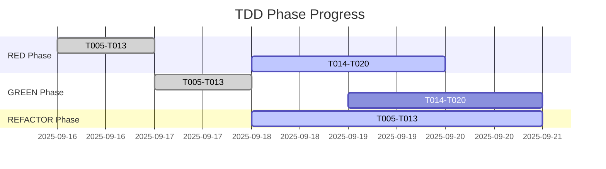

# TDD: Report Command
> Generate comprehensive TDD compliance report

## Usage
```bash
/tdd:report [--format <markdown|html|json>] [--output <file>] [--period <daily|weekly|sprint>]
```

## Description
プロジェクトのTDD準拠状況を包括的に分析し、詳細なレポートを生成します。技術負債、品質メトリクス、改善提案を含みます。

## Process
1. 全タスクのTDD状態を収集
2. メトリクスを計算
3. トレンド分析を実施
4. 改善提案を生成
5. レポートをフォーマット

## Options
- `--format`: 出力フォーマット（デフォルト: markdown）
- `--output`: 出力ファイル名
- `--period`: 分析期間

## Report Generation

### 1. Data Collection
```python
def collect_tdd_data():
    """TDDデータを収集"""
    return {
        "tasks": analyze_all_tasks(),
        "commits": analyze_commit_history(),
        "coverage": get_coverage_metrics(),
        "debt": calculate_technical_debt(),
        "violations": detect_all_violations(),
        "trends": calculate_trends()
    }
```

### 2. Metrics Calculation
```python
def calculate_metrics(data):
    """メトリクスを計算"""
    return {
        "compliance_rate": calc_compliance(data),
        "test_first_rate": calc_test_first(data),
        "coverage_percentage": data["coverage"]["total"],
        "debt_index": data["debt"]["index"],
        "phase_distribution": calc_phase_distribution(data),
        "velocity": calc_tdd_velocity(data)
    }
```

## Example Report

```markdown
# 📊 TDD Compliance Report
**Project**: Job Matching System
**Generated**: 2025-09-18 11:00:00
**Period**: Sprint 3 (2025-09-11 to 2025-09-18)

## Executive Summary

### 🎯 Key Metrics
| Metric | Current | Previous | Target | Trend |
|--------|---------|----------|--------|-------|
| TDD Compliance | 30% | 15% | 100% | ↑ +15% |
| Test Coverage | 70% | 65% | 90% | ↑ +5% |
| Test-First Rate | 20% | 5% | 100% | ↑ +15% |
| Technical Debt | 0.35 | 0.42 | <0.15 | ↓ -0.07 |

### 📈 Progress Overview
```
Week 1: ████░░░░░░ 40% (26/65 tasks)
Week 2: ██████░░░░ 60% (39/65 tasks)
Week 3: ████████░░ 80% (52/65 tasks)
```

## 🧪 TDD Phase Analysis

### Phase Completion Status
```
         Completed  In Progress  Not Started
RED         13          0            52
GREEN       13          0            52
REFACTOR     0         13            52
```

### Phase Timeline


## 📊 Quality Metrics

### Test Coverage Breakdown
| Component | Coverage | Lines | Uncovered |
|-----------|----------|-------|-----------|
| routers/ | 85% | 1200 | 180 |
| services/ | 72% | 2500 | 700 |
| models/ | 95% | 800 | 40 |
| core/ | 60% | 500 | 200 |
| **Total** | **70%** | **5000** | **1500** |

### Code Quality Indicators
```yaml
cyclomatic_complexity:
  average: 6.2
  max: 15
  threshold: 8
  files_exceeding: 3

maintainability_index:
  score: 72
  rating: B
  target: A (>80)

duplication:
  percentage: 8%
  lines: 400
  target: <5%
```

## ⚠️ Technical Debt Analysis

### Debt Categories
| Category | Count | Severity | Est. Hours |
|----------|-------|----------|------------|
| Hardcoded Values | 127 | Medium | 16h |
| Missing Tests | 52 | High | 104h |
| TODO Comments | 43 | Low | 8h |
| Complex Methods | 15 | Medium | 30h |
| **Total** | **237** | - | **158h** |

### Top Debt Items
1. **T005-T013**: Hardcoded implementations need refactoring (24h)
2. **T031-T040**: Missing test coverage (40h)
3. **Authentication**: No integration tests (16h)

## 🚨 Violations & Anti-patterns

### Critical Violations
- 🔴 **Test-After Implementation**: 35 cases detected
- 🔴 **Skipped Tests**: 8 tests marked as skip
- 🔴 **No Tests**: 22 endpoints without tests

### Warning Level Issues
- ⚠️ Over-engineering in GREEN phase: 5 cases
- ⚠️ Test modification during refactor: 2 cases
- ⚠️ Insufficient test cases: 12 components

## 📈 Trend Analysis

### Weekly Progress
```
Week 1: Tests: 45  | Implementation: 89  | Ratio: 0.51
Week 2: Tests: 78  | Implementation: 120 | Ratio: 0.65
Week 3: Tests: 112 | Implementation: 140 | Ratio: 0.80
```

### Velocity Metrics
- Average tasks/day: 3.2
- RED phase avg time: 2h
- GREEN phase avg time: 1.5h
- REFACTOR phase avg time: 3h
- Full cycle time: 6.5h

## 💡 Recommendations

### Immediate Actions (This Week)
1. Complete REFACTOR phase for T005-T013
2. Start RED phase for T014-T020
3. Fix 8 skipped tests
4. Add missing tests for authentication

### Short-term Goals (This Sprint)
1. Achieve 85% test coverage
2. Reduce technical debt index to 0.25
3. Complete TDD cycle for 30 tasks
4. Implement integration tests

### Long-term Strategy (Next Quarter)
1. 100% TDD compliance for new features
2. Migrate legacy code to TDD
3. Automate TDD verification in CI/CD
4. Achieve 95% test coverage

## 📋 Action Items

### For Development Team
- [ ] Daily TDD status check using `/tdd:status`
- [ ] Complete refactor phase before starting new tasks
- [ ] Review and fix skipped tests
- [ ] Add integration tests for critical paths

### For Tech Lead
- [ ] Review technical debt priorities
- [ ] Allocate time for refactoring
- [ ] Update TDD guidelines
- [ ] Schedule TDD training session

### For Management
- [ ] Adjust velocity expectations (6.5h/task)
- [ ] Budget for debt reduction (158h)
- [ ] Set TDD compliance as KPI
- [ ] Support team training needs

## 📊 Detailed Statistics

### Commit Pattern Analysis
```python
tdd_commits = 45  # [*-RED], [*-GREEN], [*-REFACTOR]
regular_commits = 156
tdd_ratio = 22.4%
```

### File Coverage Details
[View detailed coverage report](./coverage/index.html)

### Test Execution Summary
- Total test files: 33
- Total test functions: 526
- Passing: 518
- Failing: 0
- Skipped: 8
- Average execution time: 12.3s

## 🎯 Success Criteria

### Sprint Goals
- [x] Implement TDD for new features
- [x] Achieve 70% test coverage
- [ ] Complete refactor for all GREEN tasks
- [ ] Zero skipped tests

### Quality Gates
- ✅ All commits follow TDD convention
- ✅ No regression in test coverage
- ⚠️ Technical debt increasing
- ❌ Some tests still skipped

---

**Report Generated by**: Claude Code v2.4
**Next Report Due**: 2025-09-25
**Report ID**: TDD-2025-09-18-001
```

## Export Formats

### JSON Format
```json
{
  "report_id": "TDD-2025-09-18-001",
  "metrics": {
    "compliance_rate": 0.30,
    "test_coverage": 0.70,
    "debt_index": 0.35
  },
  "tasks": {
    "total": 65,
    "completed": 0,
    "in_progress": 13,
    "not_started": 52
  },
  "recommendations": [...]
}
```

### HTML Format
Generates interactive dashboard with charts and graphs.

## Automation Integration
```bash
# Generate weekly report automatically
0 9 * * MON /usr/local/bin/claude-code /tdd:report --period weekly --output reports/tdd-weekly.md
```