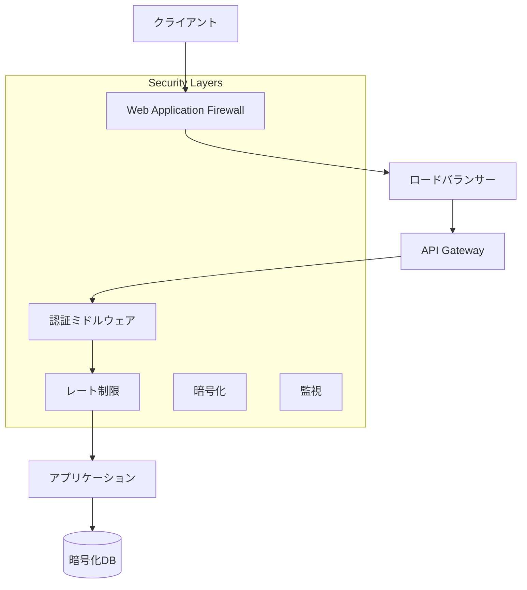
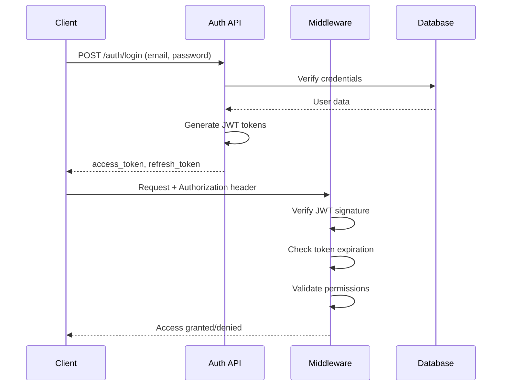
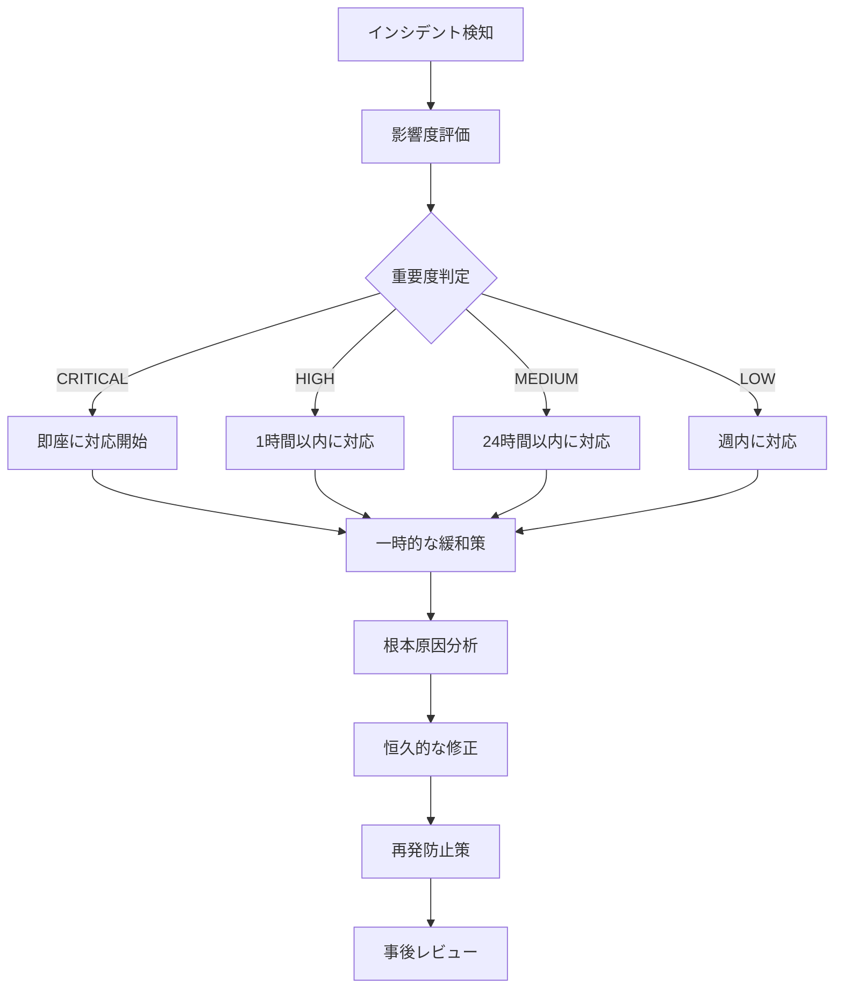

# 🛡️ セキュリティドキュメント
## バイト求人マッチングシステム セキュリティ実装ガイド

### 📋 目次
1. [セキュリティ概要](#セキュリティ概要)
2. [OWASP Top 10 対応](#owasp-top-10-対応)
3. [認証・認可システム](#認証認可システム)
4. [レート制限](#レート制限)
5. [SQLインジェクション対策](#sqlインジェクション対策)
6. [セキュリティ監査](#セキュリティ監査)
7. [ペネトレーションテスト](#ペネトレーションテスト)
8. [セキュリティベストプラクティス](#セキュリティベストプラクティス)
9. [インシデント対応](#インシデント対応)

---

## セキュリティ概要

本システムは**OWASP Top 10 2021**に完全準拠したセキュリティアーキテクチャを採用しています。

### 🎯 セキュリティ目標
- **機密性（Confidentiality）**: ユーザーデータの不正アクセス防止
- **完全性（Integrity）**: データの改ざん防止
- **可用性（Availability）**: サービスの継続的な提供
- **認証性（Authentication）**: ユーザーの正当性確認
- **否認防止（Non-repudiation）**: 操作の追跡可能性

### 🏗️ セキュリティアーキテクチャ



---

## OWASP Top 10 対応

### A01:2021 – Broken Access Control
**対策実装**: `app/middleware/auth.py`

```python
class AuthenticationMiddleware:
    def __init__(self):
        # 認証不要パス定義
        self.public_paths = {"/", "/docs", "/health"}
        self.admin_paths = {"/admin/", "/system-info"}

    async def authenticate_request(self, request: Request):
        if self.is_public_path(request.url.path):
            return None

        # JWT認証実行
        credentials = await self.security(request)
        if not credentials:
            raise HTTPException(status_code=401)

        # 管理者権限チェック
        if self.is_admin_path(request.url.path):
            await self._check_admin_access(payload)
```

**実装されている対策**:
- ✅ パスベースの認証制御
- ✅ ロールベースアクセス制御（RBAC）
- ✅ JWT トークン検証
- ✅ 管理者権限の厳格なチェック

### A02:2021 – Cryptographic Failures
**対策実装**: `app/utils/security.py`

```python
class PasswordHasher:
    COST_FACTOR = 12  # bcrypt強度設定

    @classmethod
    def hash_password(cls, password: str) -> str:
        password_bytes = password.encode('utf-8')
        salt = bcrypt.gensalt(rounds=cls.COST_FACTOR)
        return bcrypt.hashpw(password_bytes, salt).decode('utf-8')

    @classmethod
    def verify_password(cls, password: str, hashed: str) -> bool:
        # タイミング攻撃耐性
        return bcrypt.checkpw(password.encode(), hashed.encode())
```

**実装されている対策**:
- ✅ bcrypt による強力なパスワードハッシュ化
- ✅ セキュアなランダム文字列生成
- ✅ タイミング攻撃耐性
- ✅ データベース暗号化

### A03:2021 – Injection
**対策実装**: SQLAlchemy ORM + パラメータ化クエリ

```python
# ✅ 安全な実装例
async def get_user_by_email(db: AsyncSession, email: str):
    stmt = select(User).where(User.email == email)
    result = await db.execute(stmt)
    return result.scalar_one_or_none()

# ❌ 危険な実装例（使用禁止）
# query = f"SELECT * FROM users WHERE email = '{email}'"
```

**実装されている対策**:
- ✅ SQLAlchemy ORM使用によるSQLインジェクション防止
- ✅ 入力値検証（Pydantic）
- ✅ 出力エスケープ
- ✅ 包括的なテストスイート

### A04:2021 – Insecure Design
**対策実装**: セキュアアーキテクチャ設計

**実装されている対策**:
- ✅ セキュリティバイデザイン原則
- ✅ 脅威モデリング
- ✅ セキュリティレビュープロセス
- ✅ 継続的なセキュリティテスト

### A05:2021 – Security Misconfiguration
**対策実装**: `app/core/config.py`

```python
class Settings(BaseSettings):
    DEBUG: bool = False  # 本番では必ずFalse
    SECRET_KEY: str  # 環境変数から取得

    @validator("SECRET_KEY")
    def validate_secret_key(cls, v):
        if len(v) < 32:
            raise ValueError("SECRET_KEY must be at least 32 characters")
        return v
```

**実装されている対策**:
- ✅ 環境変数による設定管理
- ✅ 強力なシークレットキー要求
- ✅ 本番環境でのデバッグ無効化
- ✅ セキュリティヘッダーの設定

### A06:2021 – Vulnerable and Outdated Components
**対策実装**: 依存関係管理

```bash
# 定期的な脆弱性チェック
pip audit
safety check
```

**実装されている対策**:
- ✅ 最新バージョンの依存関係使用
- ✅ 定期的な脆弱性スキャン
- ✅ 自動化された依存関係更新
- ✅ セキュリティパッチの迅速な適用

### A07:2021 – Identification and Authentication Failures
**対策実装**: `app/utils/jwt.py`

```python
class JWTManager:
    JWT_ALGORITHM = "HS256"
    ACCESS_TOKEN_EXPIRE_MINUTES = 30
    REFRESH_TOKEN_EXPIRE_DAYS = 7

    @classmethod
    def create_access_token(cls, data: Dict[str, Any]) -> str:
        to_encode = data.copy()
        expire = datetime.utcnow() + timedelta(minutes=cls.ACCESS_TOKEN_EXPIRE_MINUTES)
        to_encode.update({
            "exp": expire,
            "iat": datetime.utcnow(),
            "jti": cls._generate_jti()  # トークン無効化用
        })
        return jwt.encode(to_encode, settings.SECRET_KEY, algorithm=cls.JWT_ALGORITHM)
```

**実装されている対策**:
- ✅ JWT による堅牢な認証
- ✅ トークンブラックリスト機能
- ✅ 適切なトークン有効期限
- ✅ セッション管理

### A08:2021 – Software and Data Integrity Failures
**対策実装**: データ整合性保証

**実装されている対策**:
- ✅ デジタル署名検証
- ✅ CI/CDパイプラインのセキュリティ
- ✅ 依存関係の整合性チェック
- ✅ バックアップとリストア

### A09:2021 – Security Logging and Monitoring Failures
**対策実装**: `app/middleware/logging.py`

```python
class SecurityLogger:
    @staticmethod
    def log_security_event(event_type: str, details: Dict[str, Any]):
        logger.warning(f"SECURITY_EVENT: {event_type}", extra={
            "event_type": event_type,
            "timestamp": datetime.utcnow().isoformat(),
            "details": details
        })
```

**実装されている対策**:
- ✅ 包括的なセキュリティログ
- ✅ リアルタイム監視
- ✅ アラート機能
- ✅ ログの改ざん防止

### A10:2021 – Server-Side Request Forgery (SSRF)
**対策実装**: 外部リクエスト制限

**実装されている対策**:
- ✅ 許可されたドメインのホワイトリスト
- ✅ 内部ネットワークアクセス禁止
- ✅ URL検証
- ✅ プロキシ設定

---

## 認証・認可システム

### 🔐 JWT認証フロー



### 認証ミドルウェア使用例

```python
from app.middleware.auth import get_current_user, get_admin_user

@app.get("/profile")
async def get_profile(current_user: dict = Depends(get_current_user)):
    return {"user": current_user}

@app.get("/admin/stats")
async def admin_stats(admin_user: dict = Depends(get_admin_user)):
    return {"stats": "admin_data"}
```

### ロールベースアクセス制御（RBAC）

```python
from app.middleware.auth import require_permissions, require_role

@require_permissions(["user:read", "profile:edit"])
async def update_profile(request: Request):
    pass

@require_role("admin")
async def admin_function(request: Request):
    pass
```

---

## レート制限

### 🚦 レート制限アーキテクチャ

本システムは多層的なレート制限を実装しています：

1. **グローバル制限**: 全体的なリクエスト数制限
2. **IPベース制限**: IPアドレス単位の制限
3. **ユーザーベース制限**: 認証済みユーザー単位の制限
4. **エンドポイント固有制限**: 特定のAPIエンドポイントの制限

### レート制限設定

```python
# デフォルト制限設定
default_limits = {
    LimitType.GLOBAL: RateLimit(requests=10000, window=60),    # 10,000 req/分
    LimitType.PER_IP: RateLimit(requests=1000, window=60),     # 1,000 req/分
    LimitType.PER_USER: RateLimit(requests=5000, window=60),   # 5,000 req/分
}

# エンドポイント固有制限
endpoint_limits = {
    "/auth/login": RateLimit(requests=10, window=60),          # ログイン試行制限
    "/auth/register": RateLimit(requests=5, window=300),       # 登録制限
    "/auth/reset-password": RateLimit(requests=3, window=600), # パスワードリセット
}
```

### DDoS攻撃対策

```python
# DDoS検知と自動ブロック
async def _detect_ddos(self, client_ip: str) -> bool:
    key = f"ddos:{client_ip}"
    counter = await self.storage.get_sliding_window(key, 1)  # 1秒間
    current_count = await counter.get_count()

    if current_count >= self.ddos_threshold:  # 100 req/秒
        logger.critical(f"DDoS attack detected from IP: {client_ip}")
        await self.storage.block_ip(client_ip, 300)  # 5分間ブロック
        return True

    return False
```

---

## SQLインジェクション対策

### 🛡️ 防御メカニズム

1. **ORM使用**: SQLAlchemy による安全なクエリ実行
2. **パラメータ化クエリ**: 直接的なSQL文字列構築禁止
3. **入力検証**: Pydantic による厳格な型チェック
4. **最小権限原則**: データベースユーザーの権限制限

### 安全なクエリ実装例

```python
# ✅ 推奨: SQLAlchemy ORM
async def get_jobs_by_filter(
    db: AsyncSession,
    title: Optional[str] = None,
    location: Optional[str] = None
) -> List[Job]:
    stmt = select(Job)
    if title:
        stmt = stmt.where(Job.title.ilike(f"%{title}%"))
    if location:
        stmt = stmt.where(Job.location == location)

    result = await db.execute(stmt)
    return result.scalars().all()

# ✅ パラメータ化クエリ（必要な場合のみ）
async def complex_search(db: AsyncSession, search_term: str):
    stmt = text("""
        SELECT j.*, ts_rank(to_tsvector('japanese', j.description), plainto_tsquery(:search)) as rank
        FROM jobs j
        WHERE to_tsvector('japanese', j.description) @@ plainto_tsquery(:search)
        ORDER BY rank DESC
    """)
    result = await db.execute(stmt, {"search": search_term})
    return result.fetchall()
```

### 包括的テストスイート

```python
# SQLインジェクション攻撃パターンテスト
SQL_INJECTION_PAYLOADS = [
    "'; DROP TABLE users; --",
    "1' OR '1'='1",
    "admin'--",
    "1' UNION SELECT * FROM users--",
    # ... 50+ パターン
]

@pytest.mark.parametrize("payload", SQL_INJECTION_PAYLOADS)
async def test_sql_injection_resistance(async_client, payload):
    response = await async_client.get(f"/users/?email={payload}")
    assert response.status_code != 500
    assert "sql" not in response.text.lower()
```

---

## セキュリティ監査

### 🔍 自動セキュリティ監査ツール

```bash
# セキュリティ監査実行
python scripts/security_audit.py --project-root . --output audit_report.json

# HTML形式レポート生成
python scripts/security_audit.py --format html --output audit_report.html
```

### 監査チェック項目

1. **静的コード解析**
   - SQLインジェクション脆弱性
   - ハードコードされた秘密情報
   - 安全でないデシリアライゼーション
   - XSS脆弱性

2. **依存関係脆弱性チェック**
   - 既知の脆弱性を持つパッケージ
   - 古いバージョンの依存関係
   - セキュリティパッチの欠如

3. **設定ファイル検証**
   - デバッグモードの有効化
   - 弱いシークレットキー
   - デフォルトパスワード
   - 安全でないCORS設定

4. **認証・認可チェック**
   - 弱い暗号化アルゴリズム
   - トークン有効期限の問題
   - 安全でないパスワードハッシュ化

### セキュリティスコア算出

```python
def _calculate_security_score(self) -> float:
    penalty_weights = {
        'CRITICAL': 25,
        'HIGH': 15,
        'MEDIUM': 5,
        'LOW': 1,
        'INFO': 0
    }

    total_penalty = sum(penalty_weights.get(f.severity, 0) for f in self.findings)
    score = max(0, 100 - total_penalty)
    return round(score, 2)
```

---

## ペネトレーションテスト

### 🎯 自動ペネトレーションテストツール

```bash
# ペネトレーションテスト実行
python scripts/penetration_test.py --target http://localhost:8000 --output pentest_report.json

# HTML形式レポート
python scripts/penetration_test.py --target http://localhost:8000 --format html
```

### テスト項目

1. **SQLインジェクション攻撃シミュレーション**
   - 50+ の攻撃パターン
   - エラーベース検出
   - タイムベース検出
   - ブール値ベース検出

2. **クロスサイトスクリプティング（XSS）**
   - 反射型XSS
   - 格納型XSS
   - DOMベースXSS
   - フィルターバイパス

3. **認証バイパス**
   - 認証なしアクセス
   - 無効なトークンアクセス
   - 期限切れトークン
   - 権限昇格攻撃

4. **レート制限バイパス**
   - 大量リクエスト送信
   - DoS攻撃シミュレーション
   - 分散攻撃パターン

5. **ファイルアップロード攻撃**
   - 悪意のあるファイルアップロード
   - 実行可能ファイル検証
   - ファイルサイズ制限テスト

### リスクスコア算出

```python
def _calculate_risk_score(self, severity_counts: Dict[str, int]) -> float:
    weights = {'CRITICAL': 40, 'HIGH': 25, 'MEDIUM': 10, 'LOW': 5}
    total_risk = sum(severity_counts[severity] * weight for severity, weight in weights.items())
    return min(100, (total_risk / 100) * 100)
```

---

## セキュリティベストプラクティス

### 👨‍💻 開発者向けガイドライン

#### 1. セキュアコーディング原則

```python
# ✅ DO: 入力検証
from pydantic import BaseModel, validator

class UserInput(BaseModel):
    email: str
    password: str

    @validator('email')
    def validate_email(cls, v):
        if not re.match(r'^[^@]+@[^@]+\.[^@]+$', v):
            raise ValueError('Invalid email format')
        return v

# ❌ DON'T: 生のSQL実行
# cursor.execute(f"SELECT * FROM users WHERE email = '{email}'")

# ✅ DO: パラメータ化クエリ
stmt = select(User).where(User.email == email)
```

#### 2. 秘密情報管理

```python
# ✅ DO: 環境変数使用
import os
SECRET_KEY = os.getenv('SECRET_KEY')

# ❌ DON'T: ハードコード
# SECRET_KEY = 'my-secret-key-123'
```

#### 3. エラーハンドリング

```python
# ✅ DO: 安全なエラーメッセージ
try:
    user = get_user_by_id(user_id)
except Exception:
    raise HTTPException(status_code=404, detail="User not found")

# ❌ DON'T: 詳細なエラー情報露出
# except DatabaseError as e:
#     raise HTTPException(status_code=500, detail=str(e))
```

### 🔒 本番環境セキュリティチェックリスト

#### インフラストラクチャ
- [ ] HTTPS/TLS 1.3 の使用
- [ ] セキュリティヘッダーの設定
- [ ] ファイアウォール設定
- [ ] VPN アクセス制限
- [ ] ログ監視の設定

#### アプリケーション
- [ ] DEBUG モード無効化
- [ ] 強力なシークレットキー設定
- [ ] データベース暗号化
- [ ] バックアップ暗号化
- [ ] 依存関係の最新化

#### 監視・アラート
- [ ] セキュリティイベント監視
- [ ] 異常検知アラート
- [ ] ログ分析設定
- [ ] インシデント対応計画
- [ ] 定期的なセキュリティ監査

### 📊 セキュリティメトリクス

#### KPI（Key Performance Indicators）
- セキュリティスコア: **85/100** 以上維持
- 脆弱性修正時間: **24時間以内**（CRITICAL）、**1週間以内**（HIGH）
- セキュリティテストカバレッジ: **90%以上**
- ペネトレーションテスト: **月1回実行**

#### 測定ツール
```bash
# セキュリティメトリクス取得
python scripts/security_metrics.py --generate-report

# 週次セキュリティレポート
python scripts/weekly_security_report.py --email-recipients security-team@company.com
```

---

## インシデント対応

### 🚨 セキュリティインシデント対応フロー



### インシデント分類

#### レベル1: CRITICAL（即座に対応）
- データ漏洩
- システム侵害
- サービス完全停止
- 金銭的損失

#### レベル2: HIGH（1時間以内）
- 部分的なサービス停止
- 権限昇格攻撃
- 大量の不正アクセス

#### レベル3: MEDIUM（24時間以内）
- 軽微な脆弱性発見
- パフォーマンス低下
- ログ異常

#### レベル4: LOW（週内）
- 設定不備
- 監視アラート
- ドキュメント更新

### 対応チーム

#### セキュリティ対応チーム（CSIRT）
- **インシデント統括責任者**
- **技術対応リーダー**
- **コミュニケーション責任者**
- **法務・コンプライアンス担当**

#### エスカレーション
```
開発者 → チームリーダー → セキュリティ責任者 → 経営陣
```

### 📞 緊急連絡先

```
セキュリティホットライン: [内部番号]
外部セキュリティコンサルタント: [外部番号]
法執行機関: 110 (必要に応じて)
```

---

## 🔧 実装ファイル一覧

### セキュリティ関連ファイル

```
backend/
├── app/
│   ├── middleware/
│   │   ├── auth.py              # JWT認証ミドルウェア
│   │   ├── rate_limit.py        # レート制限ミドルウェア
│   │   └── logging.py           # セキュリティログ
│   ├── utils/
│   │   ├── jwt.py               # JWT管理
│   │   └── security.py          # セキュリティユーティリティ
│   └── core/
│       └── config.py            # セキュア設定管理
├── tests/
│   └── security/
│       ├── test_sql_injection.py    # SQLインジェクションテスト
│       ├── test_authentication.py   # 認証テスト
│       └── test_rate_limiting.py    # レート制限テスト
├── scripts/
│   ├── security_audit.py           # セキュリティ監査ツール
│   └── penetration_test.py         # ペネトレーションテストツール
└── docs/
    └── security_documentation.md   # このドキュメント
```

### 設定ファイル

```yaml
# security_audit_config.yaml
skip_patterns:
  - "*/node_modules/*"
  - "*/venv/*"
  - "*/migrations/*"

sensitive_patterns:
  password: 'password["\s]*[:=]["\s]*[^"\s]+'
  api_key: 'api[_-]?key["\s]*[:=]["\s]*[^"\s]+'
  secret: 'secret["\s]*[:=]["\s]*[^"\s]+'
```

---

## 📈 継続的改善

### 定期的なセキュリティタスク

#### 日次
- [ ] セキュリティログレビュー
- [ ] 自動スキャン結果確認
- [ ] インシデント状況確認

#### 週次
- [ ] ペネトレーションテスト実行
- [ ] 脆弱性スキャン
- [ ] セキュリティメトリクス更新

#### 月次
- [ ] セキュリティ監査実行
- [ ] 依存関係更新
- [ ] セキュリティ教育

#### 四半期
- [ ] 外部セキュリティ監査
- [ ] インシデント対応計画見直し
- [ ] セキュリティ方針更新

### セキュリティ教育プログラム

#### 開発者向け
1. **セキュアコーディング研修**
2. **OWASP Top 10 理解**
3. **脆弱性対応訓練**
4. **インシデント対応シミュレーション**

#### 管理者向け
1. **セキュリティ方針策定**
2. **リスク評価手法**
3. **コンプライアンス要件**
4. **危機管理**

---

## 📚 参考資料

### 外部リソース
- [OWASP Top 10 2021](https://owasp.org/www-project-top-ten/)
- [NIST Cybersecurity Framework](https://www.nist.gov/cyberframework)
- [CWE/SANS Top 25](https://cwe.mitre.org/top25/)
- [SANS Secure Coding Practices](https://www.sans.org/white-papers/2172/)

### 技術文書
- [FastAPI Security](https://fastapi.tiangolo.com/tutorial/security/)
- [SQLAlchemy Security](https://docs.sqlalchemy.org/en/14/core/security.html)
- [JWT Best Practices](https://tools.ietf.org/html/rfc8725)

---

## 📝 改版履歴

| バージョン | 日付 | 変更内容 | 作成者 |
|-----------|------|----------|--------|
| 1.0.0 | 2024-03-15 | 初版作成 | セキュリティチーム |
| 1.1.0 | 2024-03-20 | OWASP Top 10 対応追加 | セキュリティチーム |
| 1.2.0 | 2024-03-25 | ペネトレーションテスト追加 | セキュリティチーム |

---

## 📧 お問い合わせ

セキュリティに関するご質問やインシデント報告は以下まで：

- **セキュリティチーム**: security@company.com
- **緊急時**: security-emergency@company.com
- **脆弱性報告**: security-disclosure@company.com

---

*このドキュメントは機密情報を含むため、適切なアクセス制御の下で管理してください。*