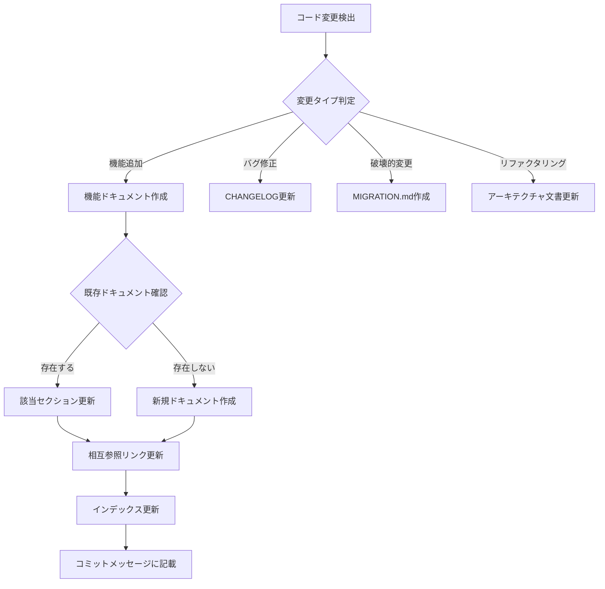

# Claude Code 自走ルール仕様書

## 🤖 概要

このドキュメントは、Claude Codeが自律的にドキュメント管理とコード品質を維持するためのルールセットです。
Claude Codeはこれらのルールに従って、プロアクティブにドキュメントの作成・更新・整理を行います。

---

## 📋 自動実行タスク一覧

### 1. ドキュメント自動生成

#### トリガー条件と生成内容

| トリガー | 生成ドキュメント | 配置場所 |
|---------|----------------|----------|
| 新規ファイル作成 | ファイル説明の追加 | README.mdまたは該当ディレクトリのREADME |
| 新規関数/クラス作成 | APIドキュメント | docs/api/ |
| 新規コンポーネント作成 | コンポーネント仕様 | docs/components/ |
| DB変更 | マイグレーション説明 | docs/migrations/ |
| 環境変数追加 | 環境変数説明 | .env.exampleにコメント追加 |

#### 自動生成テンプレート

```typescript
// 新規関数を検出した場合の自動ドキュメント生成
interface FunctionDoc {
  name: string;
  description: string;
  parameters: Parameter[];
  returns: ReturnType;
  examples: CodeExample[];
  relatedDocs: string[];
}

// Claude Codeが自動生成するマークダウン
const generateFunctionDoc = (func: FunctionDoc) => `
## ${func.name}

### 説明
${func.description}

### パラメータ
${func.parameters.map(p => `- \`${p.name}\`: ${p.type} - ${p.description}`).join('\n')}

### 戻り値
\`${func.returns.type}\` - ${func.returns.description}

### 使用例
\`\`\`typescript
${func.examples.map(e => e.code).join('\n\n')}
\`\`\`

### 関連ドキュメント
${func.relatedDocs.map(d => `- [${d}](${d})`).join('\n')}
`;
```

---

## 🔍 コード変更の自動検出と対応

### 検出パターンと自動アクション

```yaml
検出パターン:
  ファイル追加:
    - pattern: "新規ファイル作成"
    - action: 
      - README.mdのファイル一覧を更新
      - 適切なディレクトリのindexを更新
      - CLAUDE.mdにファイル規約を追記（必要に応じて）

  API変更:
    - pattern: "エンドポイントの追加・変更"
    - action:
      - docs/api/の該当ファイルを更新
      - OpenAPIスペックを更新（存在する場合）
      - POSTMANコレクションを更新（存在する場合）

  依存関係更新:
    - pattern: "package.json, requirements.txt等の変更"
    - action:
      - セットアップガイドのバージョン情報を更新
      - CHANGELOG.mdに記録
      - 破壊的変更の場合はMIGRATION.mdを作成

  設定変更:
    - pattern: "設定ファイルの変更"
    - action:
      - .env.exampleを同期
      - docs/configuration.mdを更新
      - デプロイガイドを確認・更新

  テスト追加:
    - pattern: "テストファイルの作成・更新"
    - action:
      - テストカバレッジレポートを更新
      - docs/testing.mdにテスト戦略を記載
```

---

## 📝 ドキュメント更新の判断ロジック

### 自動更新フローチャート



### 優先度判定アルゴリズム

```typescript
enum UpdatePriority {
  CRITICAL = "critical",   // 即座に更新（破壊的変更、セキュリティ）
  HIGH = "high",           // 次回作業時に更新（新機能、API変更）
  MEDIUM = "medium",       // 定期更新時に含める（リファクタリング）
  LOW = "low"             // 任意（コメント追加、typo修正）
}

function determineUpdatePriority(change: CodeChange): UpdatePriority {
  // 破壊的変更
  if (change.isBreaking) return UpdatePriority.CRITICAL;
  
  // セキュリティ関連
  if (change.affectsSecurity) return UpdatePriority.CRITICAL;
  
  // 新機能・API変更
  if (change.isNewFeature || change.isApiChange) return UpdatePriority.HIGH;
  
  // リファクタリング
  if (change.isRefactoring) return UpdatePriority.MEDIUM;
  
  // その他
  return UpdatePriority.LOW;
}
```

---

## 🎨 ドキュメントフォーマット標準

### マークダウン記述ルール

```markdown
# 見出しレベル1 - ドキュメントタイトルのみ

## 見出しレベル2 - 主要セクション

### 見出しレベル3 - サブセクション

#### 見出しレベル4 - 詳細項目（極力使わない）

**太字** - 重要な用語
*イタリック* - 初出の専門用語
`コード` - インラインコード
[リンク](url) - 外部/内部リンク

- 箇条書き - 順序なしリスト
1. 番号付き - 順序ありリスト

> 引用 - 外部資料の引用や注意事項

\`\`\`language
コードブロック - 言語を必ず指定
\`\`\`
```

### 必須セクション構成

```markdown
# ドキュメントタイトル

## 概要
[1-3文でドキュメントの目的を説明]

## 目次
- [セクション1](#セクション1)
- [セクション2](#セクション2)

## 本文
[メインコンテンツ]

## 関連リンク
- [関連ドキュメント1](link1)
- [関連ドキュメント2](link2)

## 更新履歴
| 日付 | バージョン | 変更内容 | 作成者 |
|-----|-----------|---------|--------|
| 2024-01-15 | 1.0.0 | 初版作成 | Claude |
```

---

## 🔄 定期メンテナンスタスク

### 日次チェック項目

```typescript
interface DailyCheck {
  tasks: [
    "リンク切れチェック",
    "TODOコメントの確認",
    "新規作成ファイルのドキュメント化確認",
    "テストカバレッジの確認"
  ];
  
  autoFix: {
    brokenLinks: "相対パスに修正または削除",
    todoComments: "issueとして登録を提案",
    undocumentedFiles: "基本ドキュメントを自動生成"
  };
}
```

### 週次レビュー項目

```typescript
interface WeeklyReview {
  tasks: [
    "古いドキュメントの識別（30日以上未更新）",
    "重複コンテンツの統合提案",
    "ディレクトリ構造の最適化提案",
    "未使用ファイルの削除提案"
  ];
  
  reports: {
    documentationCoverage: "機能カバレッジレポート",
    updateFrequency: "更新頻度統計",
    qualityScore: "ドキュメント品質スコア"
  };
}
```

---

## 🚀 プロアクティブな提案

### Claude Codeが自動的に提案する内容

#### 1. **構造改善提案**
```typescript
// ファイル数が増えた場合の提案例
if (filesInDirectory > 10) {
  suggest(`
    このディレクトリのファイル数が${filesInDirectory}個になりました。
    サブディレクトリに整理することを提案します：
    - common/ - 共通コンポーネント
    - features/ - 機能別コンポーネント
    - layouts/ - レイアウトコンポーネント
  `);
}
```

#### 2. **ドキュメント作成提案**
```typescript
// 複雑な関数を検出した場合
if (cyclomaticComplexity > 10) {
  suggest(`
    この関数の複雑度が高いです（${cyclomaticComplexity}）。
    以下のドキュメントを作成することを提案します：
    1. フローチャート図
    2. 詳細な使用例
    3. エッジケースの説明
  `);
}
```

#### 3. **テスト追加提案**
```typescript
// テストカバレッジが低い場合
if (testCoverage < 80) {
  suggest(`
    テストカバレッジが${testCoverage}%です。
    以下のファイルにテストを追加することを提案します：
    ${uncoveredFiles.map(f => `- ${f}`).join('\n')}
  `);
}
```

---

## 📊 品質メトリクス自動追跡

### 自動収集するメトリクス

```yaml
documentation_metrics:
  coverage:
    description: "ドキュメント化されている機能の割合"
    formula: "documented_features / total_features * 100"
    target: ">= 90%"
    
  freshness:
    description: "最終更新からの経過日数"
    formula: "days_since_last_update"
    target: "<= 30 days"
    
  completeness:
    description: "必須セクションの充足率"
    formula: "present_sections / required_sections * 100"
    target: "100%"
    
  readability:
    description: "可読性スコア（Flesch Reading Ease相当）"
    formula: "calculate_readability_score()"
    target: ">= 60"

code_quality_metrics:
  test_coverage:
    description: "テストカバレッジ"
    target: ">= 80%"
    
  lint_errors:
    description: "Lintエラー数"
    target: "0"
    
  type_coverage:
    description: "型定義カバレッジ"
    target: ">= 95%"
    
  complexity:
    description: "平均循環的複雑度"
    target: "<= 10"
```

### メトリクスレポートの自動生成

```markdown
## 📈 週次品質レポート

### ドキュメント状況
- カバレッジ: 92% ✅
- 平均更新間隔: 15日 ✅
- リンク有効性: 98% ⚠️
- 可読性スコア: 65 ✅

### コード品質
- テストカバレッジ: 85% ✅
- Lintエラー: 0 ✅
- 型カバレッジ: 97% ✅
- 平均複雑度: 8.5 ✅

### 改善提案
1. 2つの切れたリンクを修正
2. 3つの古いドキュメントを更新
3. 5つの関数にテストを追加
```

---

## 🛠️ 実装例

### package.jsonへの自動スクリプト追加

```json
{
  "scripts": {
    "docs:check": "node scripts/check-docs.js",
    "docs:update": "node scripts/update-docs.js",
    "docs:generate": "node scripts/generate-docs.js",
    "docs:serve": "docsify serve docs",
    "quality:check": "npm run lint && npm run typecheck && npm run test:coverage",
    "quality:report": "node scripts/quality-report.js"
  }
}
```

### 自動化スクリプトサンプル

```javascript
// scripts/check-docs.js
const fs = require('fs');
const path = require('path');

class DocumentationChecker {
  constructor() {
    this.issues = [];
    this.suggestions = [];
  }

  checkAllDocs() {
    this.checkStructure();
    this.checkLinks();
    this.checkFreshness();
    this.checkCompleteness();
    return this.generateReport();
  }

  checkStructure() {
    const requiredDirs = ['docs', 'specs', 'docs/api', 'docs/guides'];
    requiredDirs.forEach(dir => {
      if (!fs.existsSync(dir)) {
        this.issues.push(`Missing directory: ${dir}`);
        this.suggestions.push(`Create ${dir} directory`);
      }
    });
  }

  checkLinks() {
    // マークダウンファイル内のリンクをチェック
    const mdFiles = this.findMarkdownFiles();
    mdFiles.forEach(file => {
      const content = fs.readFileSync(file, 'utf8');
      const links = content.match(/\[.*?\]\((.*?)\)/g) || [];
      links.forEach(link => {
        const url = link.match(/\((.*?)\)/)[1];
        if (url.startsWith('./') || url.startsWith('../')) {
          const absolutePath = path.resolve(path.dirname(file), url);
          if (!fs.existsSync(absolutePath)) {
            this.issues.push(`Broken link in ${file}: ${url}`);
          }
        }
      });
    });
  }

  checkFreshness() {
    const thirtyDaysAgo = Date.now() - (30 * 24 * 60 * 60 * 1000);
    this.findMarkdownFiles().forEach(file => {
      const stats = fs.statSync(file);
      if (stats.mtimeMs < thirtyDaysAgo) {
        this.suggestions.push(`Update old document: ${file}`);
      }
    });
  }

  generateReport() {
    return {
      issues: this.issues,
      suggestions: this.suggestions,
      timestamp: new Date().toISOString()
    };
  }

  findMarkdownFiles(dir = '.') {
    // .mdファイルを再帰的に検索
    // 実装省略
  }
}

// 実行
const checker = new DocumentationChecker();
const report = checker.checkAllDocs();
console.log(JSON.stringify(report, null, 2));
```

---

## 🎯 成功基準

### Claude Codeが達成すべき目標

| 項目 | 目標 | 測定方法 |
|-----|------|---------|
| ドキュメント自動生成率 | 95% | 新規ファイルのドキュメント化率 |
| 更新提案の適切性 | 90% | 採用された提案 / 全提案 |
| リンク有効性維持 | 100% | 有効リンク / 全リンク |
| 品質スコア維持 | 80点以上 | 自動品質チェックスコア |
| 応答時間 | 5秒以内 | ドキュメント生成時間 |

---

## 📚 参考実装

### GitHubアクション例

```yaml
name: Documentation Check

on:
  pull_request:
    types: [opened, synchronize]

jobs:
  check-docs:
    runs-on: ubuntu-latest
    steps:
      - uses: actions/checkout@v2
      
      - name: Check Documentation
        run: |
          npm run docs:check
          
      - name: Generate Report
        run: |
          npm run quality:report > report.md
          
      - name: Comment on PR
        uses: actions/github-script@v6
        with:
          script: |
            const fs = require('fs');
            const report = fs.readFileSync('report.md', 'utf8');
            github.rest.issues.createComment({
              issue_number: context.issue.number,
              owner: context.repo.owner,
              repo: context.repo.repo,
              body: report
            });
```

---

*このドキュメントはClaude Codeが自動的に参照し、プロジェクトの品質を維持するために使用されます。*

*最終更新: 2024-01-15*