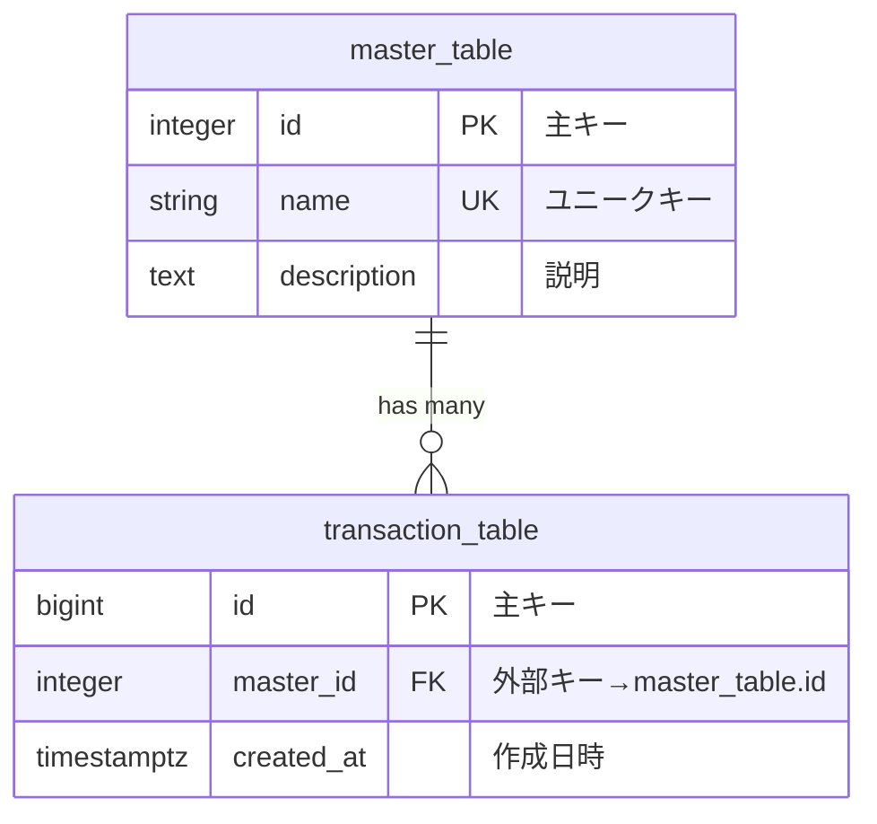

# ER図ドキュメント管理ガイド

## 📊 Mermaid ER図のベストプラクティス

### 1. ER図ファイルの命名規則

```
[日付]_[目的]_[バージョン].mmd

例：
- 20250904_ER_new_modified.mmd （最新版）
- 20240831_ER_initial.mmd （初期版）
- 20250905_ER_with_analytics.mmd （分析機能追加版）
```

### 2. ER図の基本構造



### 3. データ型の標準化

| Mermaid型 | PostgreSQL型 | 用途 |
|-----------|-------------|------|
| integer | INTEGER | 一般的な整数 |
| bigint | BIGINT | 大きな整数、ID |
| serial | SERIAL | 自動採番 |
| string | VARCHAR | 可変長文字列 |
| text | TEXT | 長いテキスト |
| decimal | DECIMAL | 金額、座標 |
| boolean | BOOLEAN | フラグ |
| timestamptz | TIMESTAMPTZ | タイムスタンプ |
| jsonb | JSONB | JSON構造データ |
| text-array | TEXT[] | 配列型 |

### 4. 属性定義のフォーマット

```mermaid
table_name {
    type column_name KEY "説明 ex: サンプル値"
}
```

#### キー指定
- `PK` - Primary Key
- `FK` - Foreign Key
- `UK` - Unique Key
- `PK,FK` - 複合主キー＆外部キー

#### 外部キー参照の記法
```
integer column_name FK "説明 ex: 値→参照先table.column"
```

### 5. リレーション記法

```mermaid
%% 基本的なリレーション
A ||--o{ B : "one to many"
A ||--|| B : "one to one"
A }o--o{ B : "many to many"

%% 詳細な記法
A ||--o{ B : "has many"      %% 1対多（必須）
A ||--o| B : "has zero or one" %% 1対0..1
A |o--o{ B : "has zero or many" %% 0..1対多
```

## 📝 プロジェクト固有のER図ガイドライン

### 現在のER図構造（20250904_ER_new_modified.mmd）

#### マスターテーブル群
1. **occupation_master** - 職種マスター（3階層構造）
2. **prefecture_master** - 都道府県マスター
3. **city_master** - 市区町村マスター（座標情報含む）
4. **employment_type_master** - 雇用形態マスター
5. **salary_type_master** - 給与タイプマスター
6. **feature_master** - 特徴マスター

#### 分析・スコアリングテーブル群
1. **semrush_keywords** - SEMRushキーワード
2. **keyword_scoring** - キーワードスコアリング
3. **job_enrichment** - 求人エンリッチメント

#### リレーションテーブル
1. **adjacent_cities** - 隣接市区町村（自己参照）

### ER図更新時のルール

#### 1. バージョン管理
```bash
# 新しいER図を作成する場合
cp specs/ER/20250904_ER_new_modified.mmd specs/ER/20250905_ER_feature_added.mmd

# archive/ディレクトリに古いバージョンを移動
mv specs/ER/old_version.mmd specs/ER/archive/
```

#### 2. 変更履歴の記録
ER図ファイルの先頭にコメントで記載：
```mermaid
%% ER図バージョン: v2.1
%% 最終更新: 2024-09-05
%% 変更内容:
%% - user_preferencesテーブル追加
%% - job_enrichmentにrecommendation_score追加
%% - adjacent_citiesのdistance計算ロジック更新
```

#### 3. テーブル追加の基準
新テーブル追加時の必須項目：
- 主キー定義
- 作成日時・更新日時
- 外部キー制約の明示
- インデックス候補の明記

### 実装との同期

#### SQLマイグレーション生成
```sql
-- ER図から自動生成されるべきSQL例

-- マスターテーブル
CREATE TABLE IF NOT EXISTS occupation_master (
    occupation_cd1 INTEGER NOT NULL,
    occupation_cd2 INTEGER NOT NULL,
    occupation_cd3 INTEGER NOT NULL,
    occupation_name VARCHAR(255) NOT NULL,
    jobtype_detail INTEGER,
    jobtype_detail_name VARCHAR(255),
    PRIMARY KEY (occupation_cd1, occupation_cd2, occupation_cd3)
);

-- インデックス
CREATE INDEX idx_occupation_name ON occupation_master(occupation_name);
CREATE INDEX idx_jobtype_detail ON occupation_master(jobtype_detail);

-- 外部キー制約
ALTER TABLE city_master 
    ADD CONSTRAINT fk_city_prefecture 
    FOREIGN KEY (pref_cd) 
    REFERENCES prefecture_master(pref_cd);
```

### ER図のドキュメント化テンプレート

```markdown
# [テーブル名]テーブル仕様

## 概要
[テーブルの目的と役割]

## カラム定義
| カラム名 | 型 | 制約 | 説明 | サンプル値 |
|---------|-----|------|------|-----------|
| column1 | INTEGER | PK | 主キー | 1 |
| column2 | VARCHAR(255) | NOT NULL | 名称 | "東京都" |

## インデックス
- idx_[table]_[column]: [用途]

## 外部キー
- fk_[table]_[reference]: [参照先テーブル.カラム]

## 特記事項
- [パフォーマンス考慮事項]
- [データ量の想定]
- [更新頻度]
```

## 🔧 Mermaidツールとの連携

### VS Code拡張機能
```json
{
  "recommendations": [
    "bierner.markdown-mermaid",
    "bpruitt-goddard.mermaid-markdown-syntax-highlighting"
  ]
}
```

### オンラインツール
- [Mermaid Live Editor](https://mermaid.live/)
- [draw.io Mermaid Plugin](https://www.drawio.com/)

### 自動検証スクリプト
```javascript
// scripts/validate-erd.js
const fs = require('fs');
const path = require('path');

function validateERD(filepath) {
  const content = fs.readFileSync(filepath, 'utf8');
  
  // 基本構文チェック
  const hasErDiagram = content.includes('erDiagram');
  const hasDirection = content.includes('direction');
  
  // テーブル定義チェック
  const tables = content.match(/(\w+)\s*{[^}]*}/g) || [];
  
  // 外部キー参照の整合性チェック
  const foreignKeys = content.match(/FK\s*"[^→]*→(\w+\.\w+)"/g) || [];
  
  return {
    isValid: hasErDiagram && tables.length > 0,
    tableCount: tables.length,
    foreignKeyCount: foreignKeys.length,
    warnings: []
  };
}

// 実行
const result = validateERD('specs/ER/20250904_ER_new_modified.mmd');
console.log(JSON.stringify(result, null, 2));
```

## 📋 ER図チェックリスト

### 新規テーブル追加時
- [ ] 主キーが定義されている
- [ ] 外部キーが適切に設定されている
- [ ] インデックス候補が検討されている
- [ ] サンプル値が記載されている
- [ ] timestamptzで時刻管理されている

### 既存テーブル変更時
- [ ] 後方互換性が保たれている
- [ ] マイグレーションスクリプトが準備されている
- [ ] 関連テーブルへの影響が確認されている
- [ ] ドキュメントが更新されている

### リリース前確認
- [ ] ER図とDBスキーマが一致している
- [ ] パフォーマンステストが実施されている
- [ ] バックアップ戦略が確立されている
- [ ] ロールバック手順が準備されている

## 🎯 ベストプラクティスまとめ

1. **命名規則の統一**
   - テーブル名: snake_case
   - カラム名: snake_case
   - 主キー: id または table_name_id
   - 外部キー: referenced_table_id

2. **型の選択**
   - IDには基本的にBIGINT使用
   - 日時はすべてTIMESTAMPTZ
   - フラグはBOOLEAN
   - JSONデータはJSONB

3. **インデックス戦略**
   - WHERE句で頻繁に使用されるカラム
   - JOIN条件のカラム
   - ORDER BY句のカラム
   - 複合インデックスの順序に注意

4. **正規化レベル**
   - 基本的に第3正規形まで
   - パフォーマンスのため適切に非正規化
   - 集計データは別テーブルで管理

---

*最終更新: 2024-01-15*