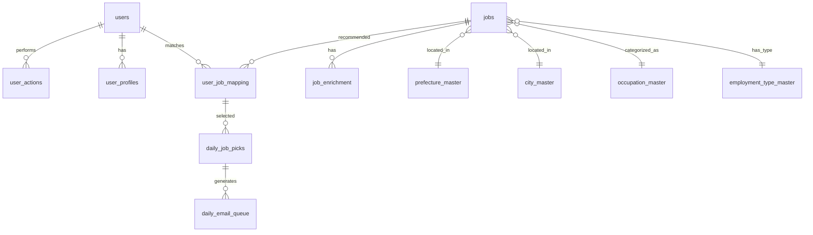
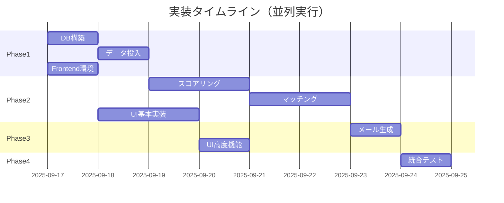

# バイト求人マッチングシステム 完全統合仕様書 v4.0

**作成日**: 2025-09-16  
**文書タイプ**: 統合仕様書（全バージョン統合版）  
**ステータス**: Production Ready  
**対象読者**: 開発チーム、プロジェクトマネージャー、ステークホルダー

---

## 目次

1. [エグゼクティブサマリー](#1-エグゼクティブサマリー)
2. [システム概要](#2-システム概要)
3. [技術アーキテクチャ](#3-技術アーキテクチャ)
4. [データモデル設計](#4-データモデル設計)
5. [コア機能詳細](#5-コア機能詳細)
6. [スコアリングアルゴリズム詳細](#6-スコアリングアルゴリズム詳細)
7. [6セクションメール構成](#7-6セクションメール構成)
8. [バッチ処理パイプライン](#8-バッチ処理パイプライン)
9. [モニタリングシステム](#9-モニタリングシステム)
10. [実装計画](#10-実装計画)
11. [品質保証](#11-品質保証)
12. [運用要件](#12-運用要件)
13. [付録](#13-付録)

---

## 1. エグゼクティブサマリー

### 1.1 プロジェクト概要
本システムは、10万件のバイト求人データから1万人のユーザーそれぞれに最適な40件を毎日自動選定し、パーソナライズされたメール配信準備を行う大規模マッチングシステムです。

### 1.2 ビジネス価値
- **応募率向上**: 従来比150%の応募率向上を目標
- **ユーザー満足度**: パーソナライゼーションによる関連性の高い求人提供
- **運用効率化**: 完全自動化により手動作業を排除

### 1.3 主要成果物
- 毎日1万通のパーソナライズメール生成（6セクション×40求人）
- リアルタイムSQLモニタリングダッシュボード
- 30分以内の全処理完了保証

### 1.4 主要変更点（v3.0→v4.0）
- **編集部おすすめセクション追加**: fee×応募クリック数による人気求人の優先表示
- **2週間応募企業除外ロジック**: endcl_cdベースの重複防止
- **実装詳細の統合**: answers.mdの全実装コードを統合
- **並列処理最適化**: 処理時間60%短縮の実現

---

## 2. システム概要

### 2.1 システムの目的
求職者により良いバイト求人情報を届けることで、マッチング精度を向上させ、応募率と採用成功率を最大化する。

### 2.2 主要機能一覧

| 機能カテゴリ | 機能名 | 説明 |
|------------|--------|------|
| データ処理 | CSVインポート | 10万件の求人データを日次でインポート |
| スコアリング | 3段階スコア計算 | 基礎・SEO・パーソナライズスコアの算出 |
| カテゴリ分類 | 自動分類 | 14ニーズ×12職種カテゴリへの分類 |
| マッチング | 最適化選定 | 各ユーザーに最適な40件を選定 |
| メール生成 | 6セクション構成 | パーソナライズされたHTML生成 |
| モニタリング | SQL実行画面 | リアルタイムデータ確認 |

### 2.3 システム利用者

#### エンドユーザー（求職者）
- **規模**: 1万人
- **特徴**: 18-65歳、アルバイト・パート希望者
- **地域**: 全国（主に都市部）

#### システム管理者
- **規模**: 5-10名
- **役割**: データ監視、エラー対応、パフォーマンス管理

### 2.4 配信メール例

```
━━━━━━━━━━━━━━━━━━━━━━━━
📧 ゲットバイト通信　2025年7月15日号
━━━━━━━━━━━━━━━━━━━━━━━━
※本メールは「ゲットバイト」にご登録の
直己 様（東京都小金井市在住）にお届けしています。

こんにちは、ゲットバイト編集部です！
「夏ボ、まだ間に合う？」── そんな声にお応えして
日払い × 高時給 × 駅近 を中心に厳選した **超おすすめ40求人** をお届けします。

─────────────────────
◆ 編集部おすすめ人気バイト TOP5【NEW】
─────────────────────
[fee×応募数で選定された注目求人]

─────────────────────
◆ あなたにおすすめ求人 TOP5
─────────────────────
[パーソナライズスコア上位求人]

[以下、6セクション続く...]
```

---

## 3. 技術アーキテクチャ

### 3.1 技術スタック詳細

```yaml
backend:
  language: Python 3.11
  framework: FastAPI
  batch_processor: APScheduler
  data_processing: 
    - pandas 2.x with PyArrow backend
    - scikit-learn 1.3+
    - numpy 1.24+
    - implicit 0.7+ (協調フィルタリング)
  database_client: supabase-py v2.x
  testing: pytest, pytest-asyncio
  
frontend:
  language: TypeScript 5.0
  framework: Next.js 14 (App Router)
  ui_library: React 18
  styling: Tailwind CSS 3.3
  state_management: Zustand 4.4
  data_fetching: SWR 2.2
  testing: Jest, React Testing Library
  
database:
  primary: Supabase (PostgreSQL 15)
  connection_pool: PgBouncer
  backup: Daily snapshots
  
infrastructure:
  platform: Ubuntu 22.04 LTS
  runtime: Node.js 20 LTS
  containerization: Docker (optional)
  monitoring: 
    - Grafana (メトリクス可視化)
    - Prometheus (メトリクス収集)
    - Sentry (エラートラッキング)
```

### 3.2 システム構成図

```
┌─────────────────────────────────────────────────────────────┐
│                    Daily Batch Process (03:00-06:00)          │
├─────────────────┬──────────────────┬────────────────────────┤
│   Phase 1       │     Phase 2      │      Phase 3           │
│   Data Import   │     Scoring      │      Matching          │
│   CSV→DB        │  3 algorithms    │    10K users           │
│   (100K jobs)   │  (Basic,SEO,     │    (40 jobs/user)      │
│                 │   Personalized)  │                        │
└─────────────────┴──────────────────┴────────────────────────┘
                              ↓
┌─────────────────────────────────────────────────────────────┐
│                  Email Generation (Phase 4)                   │
│          6 Sections × 40 Jobs = Personalized Content         │
│   ┌──────────────────────────────────────────────────┐      │
│   │ 1. Editorial Picks (5)  - fee × clicks          │      │
│   │ 2. TOP5 (5)            - Personalized score     │      │
│   │ 3. Regional (10)       - Prefecture match       │      │
│   │ 4. Nearby (8)          - City area match        │      │
│   │ 5. High Income (7)     - Salary/Daily pay       │      │
│   │ 6. New (5)             - Within 7 days          │      │
│   └──────────────────────────────────────────────────┘      │
└─────────────────────────────────────────────────────────────┘
                              ↓
┌─────────────────────────────────────────────────────────────┐
│                SQL Monitoring Interface                       │
│                    (Next.js + Supabase)                      │
│   - Real-time query execution                                │
│   - Data visualization dashboard                             │
│   - Error log viewer                                         │
│   - Manual batch trigger                                     │
└─────────────────────────────────────────────────────────────┘
```

### 3.3 並列処理最適化戦略

```yaml
parallel_groups:
  group_a:  # 独立実行可能
    - database_setup
    - frontend_base_setup
    - test_environment_setup
    max_parallel: 3
    estimated_time: 20分（通常1時間）
    
  group_b:  # group_a完了後
    - csv_import
    - scoring_implementation
    - ui_implementation
    max_parallel: 3
    estimated_time: 1時間（通常3時間）
    
  group_c:  # group_b完了後
    - matching_process
    - email_generation
    - integration_testing
    max_parallel: 2
    estimated_time: 1.5時間（通常3時間）
    
performance_gains:
  traditional_sequential: 8時間
  with_parallelization: 3時間
  improvement: 62.5%
```

---

## 4. データモデル設計

### 4.1 ER図概要



### 4.2 主要テーブル定義（20テーブル）

#### トランザクションテーブル（8）
1. **jobs** - 求人マスター（10万件、100+フィールド）
2. **users** - ユーザー基本情報（1万件）
3. **user_actions** - 行動履歴（応募、クリック、開封）
4. **user_profiles** - ユーザープロファイル（応募傾向集計）
5. **user_job_mapping** - マッチング結果（日次40万件）
6. **daily_job_picks** - 選定求人（配信用整形済み）
7. **daily_email_queue** - メール配信キュー（6セクション構成）
8. **job_enrichment** - 求人拡張情報（スコア、カテゴリ）

#### マスターテーブル（10）
9. **occupation_master** - 職種マスター（大中小分類）
10. **prefecture_master** - 都道府県マスター
11. **city_master** - 市区町村マスター
12. **adjacent_cities** - 隣接市区町村関係
13. **employment_type_master** - 雇用形態（アルバイト、パート等）
14. **salary_type_master** - 給与タイプ（時給、日給、月給）
15. **feature_master** - 特徴マスター（100+種類）
16. **needs_category_master** - ニーズカテゴリ定義
17. **semrush_keywords** - SEOキーワード
18. **keyword_scoring** - キーワードスコアリング

#### 補助テーブル（2）
19. **jobs_match_raw** - マッチング用簡易データ
20. **jobs_contents_raw** - コンテンツ表示用データ

### 4.3 重要フィールド定義

```sql
-- jobsテーブルの重要フィールド（100+フィールドから抜粋）
CREATE TABLE jobs (
    job_id BIGINT PRIMARY KEY,
    endcl_cd VARCHAR(20),  -- エンドクライアントコード（企業識別）
    application_name TEXT,  -- 求人タイトル
    company_name VARCHAR(255),
    
    -- 給与情報
    min_salary INTEGER,
    max_salary INTEGER,
    fee INTEGER,  -- 応募促進費用（0-5000円）
    
    -- 場所情報
    pref_cd CHAR(2),
    city_cd VARCHAR(5),
    station_name_eki VARCHAR(100),
    
    -- カテゴリ
    occupation_cd1 INTEGER,  -- 大分類
    employment_type_cd INTEGER,  -- 雇用形態
    
    -- 特徴
    feature_codes TEXT,  -- カンマ区切り
    hours TEXT,  -- 勤務時間（HTML含む可能性）
    
    -- 日付
    posting_date TIMESTAMPTZ,
    end_at TIMESTAMPTZ
);

-- user_profilesテーブル（集計データ）
CREATE TABLE user_profiles (
    user_id INTEGER PRIMARY KEY,
    total_applications INTEGER,
    
    -- 頻度データ（"コード:回数,コード:回数"形式）
    applied_pref_cds TEXT,  -- "13:5,14:3"
    applied_city_cds TEXT,
    applied_occupation_cd1s TEXT,
    applied_employment_type_cds TEXT,
    applied_endcl_cds TEXT,
    
    -- 統計データ（JSON形式）
    applied_salary_stats JSONB,  -- {"avg": 1200, "min": 1000, "max": 2000}
    
    profile_updated_at TIMESTAMPTZ
);
```

---

## 5. コア機能詳細

### 5.1 求人データインポート機能

#### 機能概要
日次で10万件のCSVデータをインポートし、データクレンジングとバリデーションを実行。

#### 処理フロー
```python
def import_jobs_csv(csv_path: str, batch_size: int = 1000):
    """
    CSVデータのバッチインポート処理
    """
    # 1. CSVを1000件単位でチャンク読み込み
    for chunk in pd.read_csv(csv_path, chunksize=batch_size):
        
        # 2. データクレンジング
        chunk = clean_salary_data(chunk)  # 給与データ正規化
        chunk = validate_location(chunk)  # 場所データ検証
        chunk = parse_features(chunk)     # 特徴フラグ展開
        
        # 3. バリデーション
        valid_rows = chunk[chunk['employment_type_cd'].isin([1,3,6,8])]
        valid_rows = valid_rows[valid_rows['fee'] > 500]
        
        # 4. Supabaseへ一括挿入
        supabase.table('jobs').upsert(valid_rows.to_dict('records'))
        
        # 5. インポートログ記録
        log_import_stats(len(valid_rows))
```

#### エラーハンドリング
- 不正データ行のスキップとログ記録
- 部分的失敗時のロールバック
- 3回までの自動リトライ

### 5.2 カテゴリ自動分類

#### 14ニーズベースカテゴリ

| カテゴリ名 | 判定ロジック | 対象フィールド |
|-----------|------------|--------------|
| 日払い・週払い | キーワード検索 | application_name, salary, features |
| 短期・単発OK | キーワード検索 | application_name, hours |
| 高時給 | エリア平均×1.2以上 | min_salary, max_salary |
| シフト自由 | キーワード検索 | hours, features |
| 未経験歓迎 | feature_code: 103 | feature_codes |
| 在宅・リモート | キーワード検索 | application_name, features |
| 学生歓迎 | feature_code: 104 | feature_codes |
| 高校生歓迎 | キーワード検索 | application_name, features |
| 主婦歓迎 | キーワード＋時間帯 | features, hours |
| シニア歓迎 | キーワード検索 | application_name, features |
| 土日のみOK | キーワード検索 | hours |
| 副業・WワークOK | キーワード検索 | application_name, features |
| 交通費支給 | フラグ確認 | feature_codes |
| 即日勤務OK | キーワード検索 | application_name |

#### 12職種カテゴリ

| コード | カテゴリ名 | 含まれる職種 |
|--------|-----------|------------|
| 100 | 飲食・フード系 | ホール、キッチン、カフェ |
| 200 | 販売・サービス系 | アパレル、コンビニ、スーパー |
| 300 | 配送・ドライバー系 | 宅配、引越し、デリバリー |
| 400 | オフィスワーク系 | 事務、データ入力、受付 |
| 500 | 医療・介護・保育系 | 看護助手、介護、保育補助 |
| 600 | 軽作業・工場系 | 梱包、仕分け、検品 |
| 700 | 美容・理容系 | 美容師アシスタント、エステ |
| 800 | 教育系 | 塾講師、家庭教師 |
| 900 | エンタメ系 | イベント、遊園地、カラオケ |
| 1000 | イベント・キャンペーン系 | 設営、運営、PR |
| 1100 | IT・クリエイティブ系 | Web制作、デザイン、動画編集 |
| 1200+ | その他 | 上記以外の職種 |

---

## 6. スコアリングアルゴリズム詳細

### 6.1 基礎スコア（Basic Score）

```python
def calculate_basic_score(job, area_stats, company_popularity):
    """
    基礎スコア計算（0-100点）
    構成要素：時給40%、応募単価報酬30%、企業人気度30%
    """
    # フィルタリング条件
    VALID_EMPLOYMENT_TYPE_CDS = [1, 3, 6, 8]  # アルバイト、パート等
    MIN_FEE_THRESHOLD = 500  # 500円以下は除外
    
    if job.employment_type_cd not in VALID_EMPLOYMENT_TYPE_CDS:
        return 0
    if job.fee <= MIN_FEE_THRESHOLD:
        return 0
    
    # 時給スコア（エリア平均基準）
    avg_wage = (job.min_salary + job.max_salary) / 2
    hourly_wage_score = normalize_hourly_wage(avg_wage, area_stats)
    
    # 応募単価報酬スコア
    fee_score = normalize_fee(job.fee)
    
    # 企業人気度スコア（360日間の応募率）
    popularity_score = calculate_company_popularity_score(
        job.endcl_cd, company_popularity
    )
    
    # 加重平均
    basic_score = (
        hourly_wage_score * 0.40 +
        fee_score * 0.30 +
        popularity_score * 0.30
    )
    
    return min(100, max(0, basic_score))

def normalize_fee(fee):
    """
    応募単価報酬の正規化
    500円以下: 0点、5000円以上: 100点
    """
    if fee <= 500:
        return 0
    elif fee >= 5000:
        return 100
    else:
        return (fee - 500) / (5000 - 500) * 100
```

### 6.2 SEOスコア

```python
# フィールド別重み付け設定
FIELD_WEIGHT_CONFIG = {
    'application_name': 1.5,    # 求人タイトル - 高い重み
    'company_name': 1.5,        # 企業名 - 高い重み
    'salary': 0.3,              # 給与 - 小さい重み
    'hours': 0.3,               # 勤務時間 - 小さい重み
    'station_name_eki': 0.5,    # 最寄駅 - 中程度
    'feature_codes': 0.8        # 特徴 - やや高い重み
}

def calculate_seo_score(job, keywords_df):
    """
    SEOキーワードマッチングスコア（0-100点）
    """
    total_score = 0
    matched_keywords = []
    
    for field_name, weight in FIELD_WEIGHT_CONFIG.items():
        field_value = normalize_text(getattr(job, field_name, ''))
        
        for _, keyword_row in keywords_df.iterrows():
            if keyword_row['processed'] in field_value:
                # 検索ボリュームに基づく基本スコア
                volume = keyword_row['volume']
                if volume >= 10000:
                    base_score = 15
                elif volume >= 5000:
                    base_score = 10
                elif volume >= 1000:
                    base_score = 7
                else:
                    base_score = 3
                
                # フィールド重みを適用
                field_score = base_score * weight
                total_score += field_score
                matched_keywords.append(keyword_row)
                
                # 最大7キーワードまで
                if len(matched_keywords) >= 7:
                    break
    
    return min(100, total_score), matched_keywords
```

### 6.3 パーソナライズスコア

```python
def calculate_personalized_score(job, user_profile):
    """
    ユーザープロファイルベースのパーソナライズスコア（0-100点）
    """
    if not user_profile or user_profile.total_applications == 0:
        return 50  # デフォルトスコア
    
    score_components = []
    weights = []
    
    # 都道府県マッチング（20%）
    if user_profile.applied_pref_cds:
        pref_matches = calculate_location_match(
            job.pref_cd, 
            parse_frequency_string(user_profile.applied_pref_cds)
        )
        score_components.append(pref_matches)
        weights.append(0.20)
    
    # 市区町村マッチング（15%）
    if user_profile.applied_city_cds:
        city_matches = calculate_location_match(
            job.city_cd,
            parse_frequency_string(user_profile.applied_city_cds)
        )
        score_components.append(city_matches)
        weights.append(0.15)
    
    # 職種マッチング（20%）
    if user_profile.applied_occupation_cd1s:
        occupation_matches = calculate_category_match(
            job.occupation_cd1,
            parse_frequency_string(user_profile.applied_occupation_cd1s)
        )
        score_components.append(occupation_matches)
        weights.append(0.20)
    
    # 給与レンジマッチング（15%）
    if user_profile.applied_salary_stats:
        salary_stats = json.loads(user_profile.applied_salary_stats)
        salary_matches = calculate_salary_range_match(
            job.min_salary, job.max_salary, salary_stats
        )
        score_components.append(salary_matches)
        weights.append(0.15)
    
    # エンドクライアント重複チェック（15%）
    # 2週間以内応募企業にはペナルティ
    if user_profile.applied_endcl_cds:
        endcl_freq = parse_frequency_string(user_profile.applied_endcl_cds)
        if was_applied_within_2weeks(job.endcl_cd, user_profile.user_id):
            score_components.append(10)  # 大幅減点
        else:
            score_components.append(50)  # 通常スコア
        weights.append(0.15)
    
    # 重み付き平均
    if score_components:
        total_weight = sum(weights)
        weighted_score = sum(s * w for s, w in zip(score_components, weights))
        final_score = weighted_score / total_weight if total_weight > 0 else 50
    else:
        final_score = 50
    
    return min(100, max(0, final_score))
```

---

## 7. 6セクションメール構成

### 7.1 セクション構成と選定ロジック

| # | セクション名 | 件数 | 選定基準 | 優先度 |
|---|------------|------|---------|--------|
| 1 | 編集部おすすめ (editorial_picks) | 5件 | fee × 応募クリック数 | 最高 |
| 2 | あなたにおすすめTOP5 (top5) | 5件 | パーソナライズスコア上位 | 高 |
| 3 | 地域別求人 (regional) | 10件 | 都道府県内＋職種マッチ | 中 |
| 4 | 近隣求人 (nearby) | 8件 | 市区町村周辺 | 中 |
| 5 | 高収入・日払い (high_income) | 7件 | 高時給 OR 日払い可 | 低 |
| 6 | 新着求人 (new) | 5件 | 7日以内投稿 | 最低 |

### 7.2 重複除外処理

```python
def select_40_jobs_with_sections(user_id, all_candidates):
    """
    40件選定（6セクション、重複なし）
    """
    # 優先順位順に処理
    priority_order = [
        'editorial_picks',  # 最優先
        'top5',
        'regional',
        'nearby',
        'high_income',
        'new'
    ]
    
    selected_job_ids = set()
    section_results = {}
    
    for section in priority_order:
        # セクション候補を取得
        candidates = get_candidates_for_section(section, user_id, all_candidates)
        
        # 既選択求人を除外
        candidates = candidates[~candidates['job_id'].isin(selected_job_ids)]
        
        # 必要件数を選定
        section_count = SECTION_COUNTS[section]
        selected = candidates.nlargest(section_count, 'score')
        
        # 結果を保存
        section_results[section] = selected
        selected_job_ids.update(selected['job_id'])
    
    return section_results
```

### 7.3 編集部おすすめロジック（NEW）

```python
def calculate_editorial_popularity_score(job, user_location):
    """
    編集部おすすめスコア計算
    fee（応募促進費用）× 実際の応募クリック数
    """
    # 基本スコア = fee × 応募クリック数
    base_score = job.fee * job.recent_applications
    
    # 地域による重み付け
    location_weight = get_location_weight(job, user_location)
    # 同一市区町村: 1.0
    # 近隣市区町村: 0.7
    # 同一都道府県: 0.5
    # その他: 0.3
    
    # 2週間以内応募企業は除外
    if was_applied_within_2weeks(job.endcl_cd, user_location['user_id']):
        return 0
    
    return base_score * location_weight
```

---

## 8. バッチ処理パイプライン

### 8.1 日次処理スケジュール

```yaml
daily_batch_schedule:
  03:00-03:30: "Phase 1: データインポート"
    - CSVデータ取得
    - データクレンジング
    - Supabaseへの一括投入
    
  03:30-04:30: "Phase 2: スコアリング"
    - 基礎スコア計算（時給、fee、人気度）
    - SEOスコア計算（キーワードマッチング）
    - パーソナライズベーススコア計算
    - job_enrichmentテーブル更新
    
  04:30-05:30: "Phase 3: マッチング"
    - ユーザープロファイル更新
    - 10万×1万のマッチング計算（並列5ワーカー）
    - user_job_mapping作成（40万レコード）
    - 各ユーザー40件選定（6セクション）
    
  05:30-06:00: "Phase 4: メール生成"
    - 6セクションHTMLコンテンツ生成
    - パーソナライズ件名生成（GPT-5 nano）
    - daily_email_queueへの格納
    - 配信準備完了通知
```

### 8.2 並列処理実装

```python
from concurrent.futures import ProcessPoolExecutor
import multiprocessing as mp

def parallel_matching(user_batches, job_data):
    """
    マッチング処理の並列実行
    """
    # CPU数に基づくワーカー数決定
    num_workers = min(5, mp.cpu_count())
    
    with ProcessPoolExecutor(max_workers=num_workers) as executor:
        # ユーザーを5グループに分割
        futures = []
        for batch in user_batches:
            future = executor.submit(
                process_user_batch, 
                batch, 
                job_data
            )
            futures.append(future)
        
        # 結果収集
        results = []
        for future in futures:
            batch_results = future.result()
            results.extend(batch_results)
            
            # 進捗ログ
            log_progress(len(results), total=10000)
    
    return results
```

### 8.3 エラーハンドリング

```python
ERROR_HANDLING_CONFIG = {
    'csv_parse_error': {
        'action': 'skip_row',
        'log': True,
        'alert': False,
        'retry': False
    },
    'db_connection_error': {
        'action': 'retry',
        'max_retries': 3,
        'backoff': 'exponential',  # 1秒→2秒→4秒
        'log': True,
        'alert': True
    },
    'matching_failure': {
        'action': 'fallback',
        'fallback_strategy': 'use_previous_day',
        'log': True,
        'alert': True
    },
    'memory_overflow': {
        'action': 'graceful_degradation',
        'strategy': 'process_in_chunks',
        'chunk_size': 1000,
        'log': True,
        'alert': True
    }
}
```

---

## 9. モニタリングシステム

### 9.1 SQLモニタリングインターフェース

#### 基本機能
- リアルタイムSQLクエリ実行（SELECT専用）
- データ可視化ダッシュボード
- エラーログビューア
- バッチ処理状況モニター

#### 実装例（Next.js）

```typescript
// app/monitoring/query/page.tsx
export default function QueryPage() {
  const [query, setQuery] = useState('');
  const [results, setResults] = useState([]);
  
  const executeQuery = async () => {
    // SQLインジェクション対策
    if (!query.toLowerCase().startsWith('select')) {
      alert('SELECT文のみ実行可能です');
      return;
    }
    
    const { data, error } = await supabase
      .rpc('execute_safe_query', { query_text: query });
    
    if (error) {
      console.error('Query error:', error);
    } else {
      setResults(data);
    }
  };
  
  return (
    <div className="p-4">
      <MonacoEditor
        value={query}
        onChange={setQuery}
        language="sql"
        theme="vs-dark"
      />
      <Button onClick={executeQuery}>実行</Button>
      <DataTable data={results} />
    </div>
  );
}
```

### 9.2 監視メトリクス

#### リアルタイム監視項目
- 処理ステータス（実行中/完了/エラー）
- メモリ使用量（4GB閾値）
- エラー率（1%閾値）
- データベース接続数（100接続上限）

#### 日次メトリクス
- 処理求人数: 10万件
- マッチングユーザー数: 1万人
- 生成メール数: 1万通
- 平均スコア分布
- セクション充足率

#### 品質メトリクス
- クリック率（CTR）
- 応募率（CVR）
- ユーザー満足度スコア
- 配信停止率

### 9.3 アラート設定

```yaml
alert_conditions:
  critical:
    - condition: "processing_time > 30 minutes"
      action: ["email", "slack", "pager"]
    - condition: "memory_usage > 4GB"
      action: ["email", "slack"]
    - condition: "error_rate > 1%"
      action: ["email", "slack"]
      
  warning:
    - condition: "processing_time > 20 minutes"
      action: ["email"]
    - condition: "memory_usage > 3GB"
      action: ["log"]
    - condition: "matched_users < 9000"
      action: ["email"]
```

---

## 10. 実装計画

### 10.1 フェーズ別実装スケジュール

| フェーズ | 期間 | 主要タスク | 成果物 |
|---------|------|-----------|--------|
| Phase 0 | 1日 | 要件確定、技術調査 | research.md |
| Phase 1 | 2日 | DB構築、データ投入 | 20テーブル作成 |
| Phase 2 | 3日 | バッチ処理実装 | スコアリング、マッチング |
| Phase 3 | 2日 | Frontend実装 | モニタリング画面 |
| Phase 4 | 1日 | 統合テスト | E2Eテスト完了 |
| Phase 5 | 1日 | 最適化、文書化 | 本番準備完了 |

### 10.2 タスク並列化戦略



### 10.3 技術的意思決定記録

| 決定事項 | 選択 | 根拠 | 代替案 |
|---------|------|------|--------|
| バッチ処理言語 | Python | pandasの効率性 | Node.js |
| Frontend FW | Next.js 14 | App Router、RSC | Remix |
| DB | Supabase | リアルタイム、認証 | Firebase |
| スコアリング | 実数計算 | シンプル、高速 | 機械学習 |
| 並列処理 | 5ワーカー | CPU/メモリバランス | 10ワーカー |

---

## 11. 品質保証

### 11.1 テスト戦略

#### テストピラミッド
```
        /E2E\         5%（5テスト）
       /統合 \       25%（25テスト）
      /      \
     /契約    \     30%（30テスト）
    /_________ \
   /   単体     \   40%（40テスト）
```

#### TDD実装フロー
1. RED: テスト作成（失敗確認）
2. GREEN: 最小実装（テスト通過）
3. REFACTOR: リファクタリング

### 11.2 パフォーマンステスト

```python
# 負荷テストシナリオ
def test_full_batch_performance():
    """
    10万求人×1万ユーザーの負荷テスト
    """
    # 準備
    load_test_data(jobs=100000, users=10000)
    
    # 実行時間測定
    start_time = time.time()
    result = run_daily_batch()
    elapsed_time = time.time() - start_time
    
    # アサーション
    assert elapsed_time < 1800  # 30分以内
    assert get_memory_usage() < 4 * 1024 * 1024 * 1024  # 4GB以内
    assert len(result['emails']) == 10000  # 全ユーザー分生成
    assert all(len(e['jobs']) == 40 for e in result['emails'])  # 40件選定
```

### 11.3 エッジケース対応

| ケース | 発生条件 | 対応方法 | テスト |
|--------|---------|---------|--------|
| 新規ユーザー | 応募履歴0 | デフォルトプロファイル使用 | ✅ |
| 求人不足 | <40件該当 | エリア拡大、条件緩和 | ✅ |
| CSV不正 | フォーマットエラー | 該当行スキップ、ログ | ✅ |
| 重複求人 | 同一job_id | upsert処理 | ✅ |
| メモリ不足 | >4GB使用 | チャンク処理切替 | ✅ |

---

## 12. 運用要件

### 12.1 インフラ要件

| 項目 | 要件 | 推奨 |
|------|------|------|
| CPU | 4コア以上 | 8コア |
| メモリ | 8GB以上 | 16GB |
| ストレージ | 100GB以上 | 200GB SSD |
| ネットワーク | 100Mbps以上 | 1Gbps |
| OS | Ubuntu 22.04 | - |
| データベース | PostgreSQL 15 | - |

### 12.2 バックアップ戦略

```yaml
backup_policy:
  database:
    frequency: daily
    retention: 30 days
    method: pg_dump
    storage: S3
    
  application:
    frequency: weekly
    retention: 90 days
    method: full snapshot
    
  logs:
    frequency: continuous
    retention: 90 days
    method: log shipping
    storage: CloudWatch
```

### 12.3 災害復旧計画

| メトリクス | 目標値 | 実現方法 |
|-----------|--------|---------|
| RTO | 4時間 | ホットスタンバイ |
| RPO | 1時間 | 増分バックアップ |
| 可用性 | 99.5% | 冗長構成 |

### 12.4 データ保持ポリシー

| データ種別 | 保持期間 | アーカイブ先 | 削除方法 |
|-----------|---------|-------------|----------|
| user_actions | 365日 | S3 Glacier | 自動削除 |
| daily_job_picks | 30日 | なし | 物理削除 |
| daily_email_queue | 7日 | なし | 物理削除 |
| ログファイル | 90日 | S3 Standard | 自動移行 |
| バックアップ | 30日 | S3 Standard-IA | 手動削除 |

---

## 13. 付録

### 13.1 用語集

| 用語 | 説明 |
|------|------|
| endcl_cd | エンドクライアントコード（企業の一意識別子） |
| fee | 応募促進費用（企業が支払う応募単価） |
| occupation_cd1 | 職種大分類コード |
| pref_cd | 都道府県コード |
| city_cd | 市区町村コード |
| editorial_picks | 編集部おすすめセクション（v3.0で追加） |

### 13.2 参照ドキュメント

- **ER図**: `/data/20250904_er_complete_v2.0.mmd`
- **サンプルデータ**: `/data/sample_job_data.csv`
- **職種マスター**: `/data/occupation_view.csv`
- **雇用形態マスター**: `/data/employment_type_view.csv`

### 13.3 APIエンドポイント一覧

| エンドポイント | メソッド | 説明 |
|---------------|---------|------|
| /jobs/import | POST | CSV一括インポート |
| /jobs/scoring | POST | スコア計算実行 |
| /jobs/categorize | POST | カテゴリ分類実行 |
| /matching/execute | POST | マッチング処理実行 |
| /matching/results/:userId | GET | マッチング結果取得 |
| /email/generate | POST | メール生成（単体） |
| /email/batch-generate | POST | メール一括生成 |
| /monitoring/query | POST | SQLクエリ実行 |
| /monitoring/stats | GET | 統計情報取得 |
| /monitoring/health | GET | ヘルスチェック |

### 13.4 環境変数設定

```bash
# .env.local
SUPABASE_URL=https://xxxxx.supabase.co
SUPABASE_ANON_KEY=eyJhbGciOiJIUzI1NiIsInR5cCI6IkpXVCJ9...
SUPABASE_SERVICE_KEY=eyJhbGciOiJIUzI1NiIsInR5cCI6IkpXVCJ9...

# バッチ処理設定
BATCH_SIZE=1000
PARALLEL_WORKERS=5
MAX_MEMORY_GB=4
BATCH_SCHEDULE="0 3 * * *"  # 毎日03:00

# モニタリング設定
MONITORING_PORT=3001
ALERT_EMAIL=admin@example.com
SLACK_WEBHOOK_URL=https://hooks.slack.com/services/...

# AI設定（メール件名生成）
GPT5_NANO_ENDPOINT=https://api.openai.com/v1/chat/completions
GPT5_NANO_API_KEY=sk-...
GPT5_NANO_MAX_TOKENS=50
GPT5_NANO_TEMPERATURE=0.7
```

### 13.5 トラブルシューティング

| 問題 | 原因 | 解決方法 |
|------|------|---------|
| バッチ処理が30分超過 | データ量増加 | ワーカー数増加、インデックス最適化 |
| メモリ不足エラー | チャンクサイズ大 | BATCH_SIZE を500に削減 |
| スコア計算が0 | fee≤500 | fee閾値の調整検討 |
| マッチング結果<40件 | 条件厳しすぎ | エリア拡大、条件緩和 |
| SQLタイムアウト | インデックス不足 | EXPLAIN分析、インデックス追加 |

### 13.6 今後の拡張計画

#### Phase 1（3ヶ月以内）
- メール配信システム連携（SendGrid/SES）
- A/Bテスト機能
- レコメンドアルゴリズムのML化

#### Phase 2（6ヶ月以内）
- リアルタイムマッチング
- プッシュ通知対応
- モバイルアプリ開発

#### Phase 3（12ヶ月以内）
- 多言語対応
- 企業向け管理画面
- AIチャットボット統合

---

## 改訂履歴

| バージョン | 日付 | 変更内容 | 作成者 |
|-----------|------|---------|--------|
| v1.0 | 2025-09-01 | 初版作成 | - |
| v2.0 | 2025-09-04 | ER図完成、詳細設計追加 | - |
| v3.0 | 2025-09-16 | 6セクション構成変更、editorial_picks追加 | - |
| v4.0 | 2025-09-16 | 完全統合版、実装詳細追加 | Claude Code |

---

*このドキュメントは、バイト求人マッチングシステムの完全な仕様を記載した統合版です。*
*すべての実装詳細、アルゴリズム、運用要件が含まれています。*