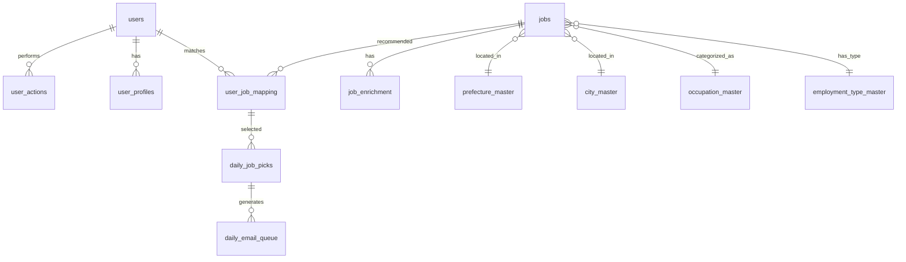

# データモデル定義: バイト求人マッチングシステム

**作成日**: 2025-09-15  
**更新日**: 2025-09-16（v5.1仕様書準拠）  
**データベース**: Supabase (PostgreSQL 15)  
**スキーマバージョン**: 1.1.0

## 1. エンティティ関係図（ER図）概要



## 2. コアエンティティ

### 2.1 jobs（求人情報）
**説明**: 10万件の求人マスターデータ（100+フィールド）

```sql
CREATE TABLE jobs (
    job_id BIGINT PRIMARY KEY,
    endcl_cd VARCHAR(20) NOT NULL,  -- エンドクライアントコード（企業識別）
    company_name VARCHAR(255) NOT NULL,
    application_name TEXT NOT NULL,  -- 求人タイトル
    
    -- 場所情報
    pref_cd CHAR(2) REFERENCES prefecture_master(code),
    city_cd VARCHAR(5) REFERENCES city_master(code),
    station_name_eki VARCHAR(100),
    address VARCHAR(500),
    latitude DECIMAL(10, 8),
    longitude DECIMAL(11, 8),
    
    -- 給与情報
    salary_type VARCHAR(20) CHECK (salary_type IN ('hourly', 'daily', 'monthly')),
    min_salary INTEGER,  -- v5.1仕様書準拠
    max_salary INTEGER,  -- v5.1仕様書準拠
    fee INTEGER CHECK (fee >= 0 AND fee <= 5000),  -- 応募促進費用（0-5000円）
    
    -- 勤務条件
    hours TEXT,  -- 勤務時間（HTML含む可能性）
    work_days VARCHAR(200),
    shift_flexibility VARCHAR(100),
    
    -- カテゴリ
    occupation_cd1 INTEGER,  -- 大分類
    occupation_cd2 INTEGER,  -- 中分類
    employment_type_cd INTEGER,  -- 雇用形態
    
    -- 特徴
    feature_codes TEXT,  -- カンマ区切りのfeatureコード
    -- 派生フラグ（feature_codesから生成）
    has_daily_payment BOOLEAN DEFAULT FALSE,
    has_weekly_payment BOOLEAN DEFAULT FALSE,
    has_no_experience BOOLEAN DEFAULT FALSE,
    has_student_welcome BOOLEAN DEFAULT FALSE,
    has_remote_work BOOLEAN DEFAULT FALSE,
    has_transportation BOOLEAN DEFAULT FALSE,
    
    -- メタデータ
    created_at TIMESTAMPTZ DEFAULT CURRENT_TIMESTAMP,
    updated_at TIMESTAMPTZ DEFAULT CURRENT_TIMESTAMP,
    is_active BOOLEAN DEFAULT TRUE,
    posting_date TIMESTAMPTZ,
    end_at TIMESTAMPTZ,  -- v5.1仕様書準拠（expiry_dateから変更）
    
    -- SEO関連
    search_keywords TEXT[],
    description TEXT,
    benefits TEXT,
    
    INDEX idx_jobs_location (pref_cd, city_cd, posting_date),
    INDEX idx_jobs_category (occupation_cd1, employment_type_cd),
    INDEX idx_jobs_active_date (is_active, posting_date),
    INDEX idx_jobs_endcl (endcl_cd, posting_date)
);
```

### 2.2 users（ユーザー情報）
**説明**: 1万人のユーザーマスターデータ

```sql
CREATE TABLE users (
    user_id INTEGER PRIMARY KEY,
    email VARCHAR(255) UNIQUE NOT NULL,
    
    -- 基本情報
    age_group VARCHAR(20), -- '10代', '20代前半', '20代後半', etc.
    gender VARCHAR(10),
    
    -- 居住地
    pref_cd CHAR(2) REFERENCES prefecture_master(code),
    city_cd VARCHAR(5) REFERENCES city_master(code),
    
    -- 希望条件
    preferred_work_style VARCHAR(50)[],
    preferred_categories VARCHAR(4)[],
    preferred_salary_min INTEGER,
    
    -- ステータス
    registration_date DATE,
    last_login_date TIMESTAMPTZ,
    is_active BOOLEAN DEFAULT TRUE,
    email_subscription BOOLEAN DEFAULT TRUE,
    
    created_at TIMESTAMPTZ DEFAULT CURRENT_TIMESTAMP,
    updated_at TIMESTAMPTZ DEFAULT CURRENT_TIMESTAMP,
    
    INDEX idx_users_location (pref_cd, city_cd),
    INDEX idx_users_active (is_active, email_subscription)
);
```

### 2.3 user_actions（ユーザー行動履歴）
**説明**: 応募、クリック、メール開封などの行動ログ

```sql
CREATE TABLE user_actions (
    action_id SERIAL PRIMARY KEY,
    user_id INTEGER REFERENCES users(user_id),
    job_id INTEGER REFERENCES jobs(job_id),
    
    action_type VARCHAR(50) NOT NULL, -- 'application', 'click', 'email_open', 'favorite'
    action_timestamp TIMESTAMP DEFAULT CURRENT_TIMESTAMP,
    
    -- コンテキスト情報
    source VARCHAR(50), -- 'email', 'web', 'app'
    session_id VARCHAR(100),
    device_type VARCHAR(20),
    
    -- 追加データ
    action_metadata JSONB,
    
    INDEX idx_actions_user (user_id, action_timestamp),
    INDEX idx_actions_job (job_id, action_type),
    INDEX idx_actions_timestamp (action_timestamp)
);
```

### 2.4 user_profiles（ユーザープロファイル）
**説明**: 応募傾向から生成される集計プロファイル

```sql
CREATE TABLE user_profiles (
    profile_id SERIAL PRIMARY KEY,
    user_id INTEGER UNIQUE REFERENCES users(user_id),
    
    -- 応募傾向スコア
    preference_scores JSONB, -- {"hourly_work": 0.8, "remote": 0.6, ...}
    
    -- カテゴリ別関心度
    category_interests JSONB, -- {"100": 0.9, "200": 0.3, ...}
    
    -- 地域選好
    location_preference_radius INTEGER DEFAULT 10, -- km
    preferred_areas VARCHAR(5)[], -- city_codes
    
    -- 行動パターン
    avg_salary_preference INTEGER,
    application_count INTEGER DEFAULT 0,
    click_count INTEGER DEFAULT 0,
    last_application_date DATE,
    
    -- 協調フィルタリング用
    latent_factors FLOAT[], -- 50次元のベクトル
    
    profile_updated_at TIMESTAMP DEFAULT CURRENT_TIMESTAMP,
    
    INDEX idx_profiles_user (user_id),
    INDEX idx_profiles_updated (profile_updated_at)
);
```

## 3. 処理系エンティティ

### 3.1 job_enrichment（求人拡張情報）
**説明**: スコアリング結果とカテゴリ分類

```sql
CREATE TABLE job_enrichment (
    enrichment_id SERIAL PRIMARY KEY,
    job_id INTEGER UNIQUE REFERENCES jobs(job_id),
    
    -- スコア（0-100）
    basic_score FLOAT, -- 時給、アクセス、福利厚生、人気度
    seo_score FLOAT, -- SEOキーワードマッチング
    personalized_score_base FLOAT, -- ベースライン人気度
    
    -- カテゴリ分類（複数可）
    needs_categories VARCHAR(30)[], -- ['日払い', '高時給', 'シフト自由', ...]
    occupation_categories VARCHAR(4)[], -- ['100', '200', ...]
    
    -- 集計データ
    application_count INTEGER DEFAULT 0,
    click_count INTEGER DEFAULT 0,
    conversion_rate FLOAT,
    
    -- キーワード分析
    extracted_keywords TEXT[],
    semrush_keyword_matches TEXT[],
    
    calculated_at TIMESTAMP DEFAULT CURRENT_TIMESTAMP,
    
    INDEX idx_enrichment_job (job_id),
    INDEX idx_enrichment_scores (basic_score, seo_score)
);
```

### 3.2 user_job_mapping（マッチング結果）
**説明**: 日次40万件のマッチング結果

```sql
CREATE TABLE user_job_mapping (
    mapping_id SERIAL PRIMARY KEY,
    user_id INTEGER REFERENCES users(user_id),
    job_id INTEGER REFERENCES jobs(job_id),
    
    -- マッチングスコア
    match_score FLOAT NOT NULL,
    score_components JSONB, -- {"basic": 70, "seo": 20, "personal": 85}
    
    -- マッチング理由
    match_reasons VARCHAR(100)[], -- ['地域が近い', '希望給与に合致', ...]
    
    -- メタデータ
    batch_date DATE NOT NULL,
    rank_in_batch INTEGER, -- そのユーザーの中での順位
    
    created_at TIMESTAMP DEFAULT CURRENT_TIMESTAMP,
    
    UNIQUE(user_id, job_id, batch_date),
    INDEX idx_mapping_user_date (user_id, batch_date, rank_in_batch),
    INDEX idx_mapping_score (batch_date, match_score DESC)
);
```

### 3.3 daily_job_picks（日次選定求人）
**説明**: 各ユーザー40件の厳選求人

```sql
CREATE TABLE daily_job_picks (
    pick_id SERIAL PRIMARY KEY,
    user_id INTEGER REFERENCES users(user_id),
    job_id INTEGER REFERENCES jobs(job_id),
    
    -- セクション分類
    section VARCHAR(30) NOT NULL, -- 'top5', 'regional', 'nearby', 'benefits', 'new'
    section_rank INTEGER NOT NULL, -- セクション内順位
    
    -- 表示用データ
    display_title VARCHAR(500),
    display_description TEXT,
    highlight_points VARCHAR(200)[],
    
    -- メタデータ
    pick_date DATE NOT NULL,
    mapping_id INTEGER REFERENCES user_job_mapping(mapping_id),
    
    created_at TIMESTAMP DEFAULT CURRENT_TIMESTAMP,
    
    UNIQUE(user_id, job_id, pick_date),
    INDEX idx_picks_user_date (user_id, pick_date, section, section_rank)
);
```

### 3.4 daily_email_queue（メール配信キュー）
**説明**: 生成されたメールコンテンツ

```sql
CREATE TABLE daily_email_queue (
    queue_id SERIAL PRIMARY KEY,
    user_id INTEGER REFERENCES users(user_id),
    
    -- メール内容
    subject VARCHAR(500) NOT NULL,
    html_content TEXT NOT NULL,
    text_content TEXT,
    
    -- 配信情報
    scheduled_date DATE NOT NULL,
    scheduled_time TIME DEFAULT '06:00:00',
    
    -- ステータス
    status VARCHAR(20) DEFAULT 'pending', -- 'pending', 'sent', 'failed', 'cancelled'
    sent_at TIMESTAMP,
    error_message TEXT,
    
    -- トラッキング
    email_tracking_id VARCHAR(100),
    
    created_at TIMESTAMP DEFAULT CURRENT_TIMESTAMP,
    
    UNIQUE(user_id, scheduled_date),
    INDEX idx_queue_status_date (status, scheduled_date, scheduled_time)
);
```

## 4. マスターデータ

### 4.1 prefecture_master（都道府県マスター）
```sql
CREATE TABLE prefecture_master (
    code CHAR(2) PRIMARY KEY,
    name VARCHAR(10) NOT NULL,
    region VARCHAR(20),
    sort_order INTEGER
);
```

### 4.2 city_master（市区町村マスター）
```sql
CREATE TABLE city_master (
    code VARCHAR(5) PRIMARY KEY,
    pref_cd CHAR(2) REFERENCES prefecture_master(code),
    name VARCHAR(50) NOT NULL,
    latitude DECIMAL(10, 8),
    longitude DECIMAL(11, 8),
    
    INDEX idx_cities_prefecture (pref_cd)
);
```

### 4.3 occupation_master（職種マスター）
```sql
CREATE TABLE occupation_master (
    code INTEGER PRIMARY KEY,
    name VARCHAR(100) NOT NULL,
    major_category_code INTEGER,
    minor_category_code INTEGER,
    description TEXT
);
```

### 4.4 employment_type_master（雇用形態マスター）
```sql
CREATE TABLE employment_type_master (
    code INTEGER PRIMARY KEY,
    name VARCHAR(50) NOT NULL,
    description TEXT
);
```

### 4.5 feature_master（特徴マスター）
```sql
CREATE TABLE feature_master (
    feature_code VARCHAR(3) PRIMARY KEY,
    feature_name VARCHAR(100) NOT NULL,
    category VARCHAR(50),
    display_priority INTEGER
);
```

### 4.6 semrush_keywords（SEOキーワードマスター）
```sql
CREATE TABLE semrush_keywords (
    keyword_id SERIAL PRIMARY KEY,
    keyword VARCHAR(100) NOT NULL,
    search_volume INTEGER,
    difficulty FLOAT,
    cpc DECIMAL(10, 2),
    category VARCHAR(50),
    
    INDEX idx_keywords_volume (search_volume DESC)
);
```

## 5. バリデーションルール

### 5.1 データ整合性
- 各ユーザーの daily_job_picks は必ず40件
- user_job_mapping のスコアは 0-100 の範囲
- job_enrichment のスコアは job が active の場合のみ計算

### 5.2 ビジネスルール
- 同じ求人を同じユーザーに連続3日以上推薦しない
- 期限切れ求人（expiry_date < today）は除外
- 非アクティブユーザーには配信しない

### 5.3 状態遷移
```
jobs: draft → active → expired/inactive
users: registered → active → inactive
daily_email_queue: pending → sent/failed → archived
```

## 6. インデックス戦略

### 6.1 高頻度クエリ用インデックス
- 地域検索: (pref_cd, city_cd, is_active)
- カテゴリ検索: (occupation_cd1, occupation_cd2, is_active)
- ユーザーマッチング: (user_id, batch_date)

### 6.2 集計用インデックス
- 日次バッチ: (batch_date, status)
- スコアランキング: (basic_score DESC, seo_score DESC)

## 7. パーティショニング戦略

### 7.1 時系列パーティション
- user_actions: 月単位パーティション
- user_job_mapping: 週単位パーティション
- daily_email_queue: 日単位パーティション

### 7.2 保持期間
- user_actions: 6ヶ月
- user_job_mapping: 1ヶ月
- daily_email_queue: 7日

## 8. マイグレーション計画

### 初期セットアップ
1. マスターデータテーブル作成
2. コアエンティティテーブル作成
3. 処理系テーブル作成
4. インデックス作成
5. 初期データ投入

### バージョン管理
- Supabase Migration機能を使用
- 各変更はマイグレーションファイルで管理
- ロールバック可能な設計