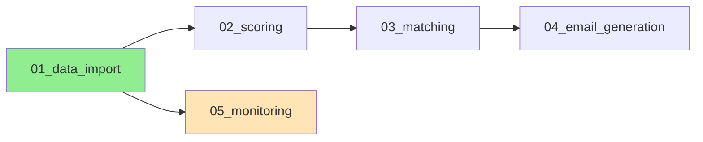

# モジュール実行ガイド

## 🎯 段階的/specify実行戦略

### 実行順序と依存関係



## 📋 実行コマンド

### Step 1: データ基盤
```bash
# データインポート機能
/specify modules/01_data_import.md --slug data-import

# モニタリング（並列実行可能）
/specify modules/05_monitoring.md --slug monitoring
```

### Step 2: コア処理
```bash
# スコアリング機能
/specify modules/02_scoring.md --slug scoring

# マッチング機能
/specify modules/03_matching.md --slug matching
```

### Step 3: 出力処理
```bash
# メール生成機能
/specify modules/04_email_generation.md --slug email-gen
```

## 🔄 統合方法

### オプション1: 個別実装
各モジュールを独立したマイクロサービスとして実装
- 利点: 独立性高い、並列開発可能
- 欠点: 統合作業が必要

### オプション2: 段階的統合
```bash
# 全モジュール実装後に統合
/plan --integrate-modules data-import scoring matching email-gen monitoring
```

### オプション3: モノリシック再構築
```bash
# 全モジュールを1つの仕様に統合
cat modules/*.md > integrated_spec.md
/specify integrated_spec.md --slug job-matching-system
```

## ✅ メリット

1. **段階的実行**: エラー時の部分再実行が容易
2. **並列開発**: チーム開発で分担可能
3. **明確な境界**: 各機能の責任範囲が明確
4. **テスト容易性**: モジュール単位でテスト可能
5. **再利用性**: 他プロジェクトでモジュール流用可能

## ⚠️ 注意事項

- データモデル（ER図）は全モジュールで共有
- モジュール間のインターフェースを明確に定義
- 各モジュールのspec.mdは`specs/MODULE_NAME/`に生成される