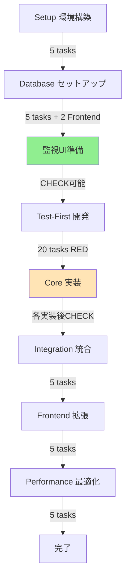
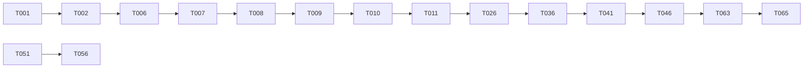

# タスク: バイト求人マッチングシステム

**入力**: `/specs/001-job-matching-system/`からの設計ドキュメント  
**前提条件**: plan.md（必須）、research.md、data-model.md、contracts/  
**方法論**: TDD (Test-Driven Development)  
**最適化**: 並列実行、MCPサーバー活用、継続的検証  
**総タスク数**: 74タスク（検証チェックポイント含む）  
**推定総工数**: 約85-105時間

## 🔄 継続的検証の改善点

### 主な変更内容
1. **早期Frontend準備**: T010-A/Bで監視UIを早期セットアップ（データベース構築直後）
2. **検証チェックポイント**: 各主要実装後にCHECKタスクを追加（T036-CHECK〜T040-CHECK）
3. **SQL検証クエリ**: 各CHECKタスクに具体的なSQL文を提供
4. **Frontend段階的拡張**: 基本機能は早期実装、高度な機能は後半で追加

### 検証フロー
- **T010完了時点**: データベース構造を確認可能
- **T010-B完了時点**: SQLクエリ実行画面で検証開始可能
- **T036-CHECK**: CSVインポート結果を即座に確認
- **T037-CHECK**: スコア計算結果を即座に確認
- **T038-CHECK**: カテゴリ分類結果を即座に確認
- **T039-CHECK**: マッチング結果を即座に確認
- **T040-CHECK**: メール生成結果を即座に確認

## 実行フロー概要（継続的検証版）



## 並列実行グループ

| グループ | タスク範囲 | 並列度 | 推定短縮時間 |
|---------|-----------|--------|-------------|
| A | T003-T005 (環境設定) | 3 | 1時間→20分 |
| B | T011-T020 (契約テスト) | 10 | 5時間→30分 |
| C | T021-T025 (統合テスト) | 5 | 2.5時間→30分 |
| D | T026-T035 (モデル実装) | 10 | 10時間→1時間 |
| E | T051-T055 (Frontend) | 5 | 5時間→1時間 |

## MCPサーバー活用戦略

| サーバー | 用途 | 対象タスク |
|----------|------|-----------|
| **Serena** | 大規模コード操作、シンボル管理 | T026-T045 (実装) |
| **Sequential** | 複雑な分析、テスト戦略 | T011-T025 (テスト設計) |
| **Magic** | UI コンポーネント生成 | T051-T055 (Frontend) |
| **Context7** | ライブラリドキュメント参照 | T003, T036-T040 (依存関係) |
| **Playwright** | E2Eテスト | T056-T057 (統合テスト) |

---

## フェーズ1: セットアップ & 環境構築 【推定: 2時間】

### 基本環境
- [ ] **T001** プロジェクト構造を作成 `[S: 30分]`
  ```bash
  backend/src/{models,services,batch,api}/
  frontend/app/{monitoring,api}/
  tests/{contract,integration,unit}/
  ```

- [ ] **T002** Python 3.11環境を初期化 `[S: 30分]`
  ```bash
  cd backend && python -m venv venv
  pip install supabase pandas scikit-learn apscheduler pytest
  ```

### 並列設定タスク 🔄
- [ ] **T003** `[P]` ESLint/Prettierを設定 `[XS: 15分]` `--c7`
  - `backend/.eslintrc.json`, `frontend/.eslintrc.json`
  
- [ ] **T004** `[P]` Pythonリンターを設定 `[XS: 15分]` `--c7`
  - `backend/pyproject.toml` (black, flake8, mypy)
  
- [ ] **T005** `[P]` Git hooksを設定 `[XS: 15分]`
  - `.husky/pre-commit` (lint, format)

**🔍 品質チェックポイント #1**: 
```bash
python --version # 3.11+
node --version # 20+
supabase --version # installed
```

---

## フェーズ2: データベースセットアップ 【推定: 3時間】

### Supabase初期化
- [ ] **T006** Supabaseプロジェクトを初期化 `[M: 1時間]`
  ```bash
  supabase init
  supabase start
  ```

- [ ] **T007** 環境変数を設定 `[XS: 15分]`
  - `.env.local` にSupabase認証情報

### スキーマ作成（順次実行）
- [ ] **T008** マスターテーブルを作成 `[M: 1時間]` `--serena`
  ```sql
  -- migrations/001_master_tables.sql
  CREATE TABLE m_prefectures, m_cities, m_job_categories...
  ```

- [ ] **T009** コアテーブルを作成 `[L: 2時間]` `--serena`
  ```sql
  -- migrations/002_core_tables.sql
  CREATE TABLE jobs (100+ fields), users, user_actions...
  ```

- [ ] **T010** インデックスを作成 `[S: 30分]`
  ```sql
  -- migrations/003_indexes.sql
  CREATE INDEX idx_jobs_location, idx_users_active...
  ```

**🔍 品質チェックポイント #2**: 
```sql
SELECT COUNT(*) FROM information_schema.tables WHERE table_schema = 'public';
-- Expected: 20+ tables
```

### Frontend監視UI早期セットアップ（検証用）
- [ ] **T010-A** Frontendの環境準備とSupabase接続 `[S: 30分]` `--magic`
  ```typescript
  // frontend/lib/supabase.ts
  import { createClient } from '@supabase/supabase-js'
  export const supabase = createClient(url, key)
  ```

- [ ] **T010-B** SQL実行画面の基本実装 `[M: 1時間]` `--magic`
  ```typescript
  // frontend/app/monitoring/page.tsx
  // SELECT専用、結果表示、テーブル一覧
  ```

**🔍 検証ポイント FRONT-1**: 
```sql
-- Frontend画面から実行して確認
SELECT table_name FROM information_schema.tables WHERE table_schema = 'public';
-- UI上で20+テーブルが表示されることを確認
```

---

## フェーズ3: Test-First開発 (RED) 【推定: 10時間】

### 契約テスト（並列実行可能） 🔄

#### 求人管理API
- [ ] **T011** `[P]` POST /jobs/import契約テスト `[M: 1時間]` `--seq`
  - `tests/contract/test_jobs_import.py`
  - CSVアップロード、バッチ処理、エラーケース

- [ ] **T012** `[P]` POST /jobs/scoring契約テスト `[M: 1時間]` `--seq`
  - `tests/contract/test_jobs_scoring.py`
  - 3種類のスコア計算検証

- [ ] **T013** `[P]` POST /jobs/categorize契約テスト `[M: 1時間]` `--seq`
  - `tests/contract/test_jobs_categorize.py`
  - 14ニーズ×12職種カテゴリ検証

#### マッチングAPI
- [ ] **T014** `[P]` POST /matching/execute契約テスト `[M: 1時間]` `--seq`
  - `tests/contract/test_matching_execute.py`
  - 並列処理、1万ユーザー処理

- [ ] **T015** `[P]` GET /matching/results契約テスト `[M: 1時間]` `--seq`
  - `tests/contract/test_matching_results.py`
  - 40件選定、5セクション分類

#### メール生成API
- [ ] **T016** `[P]` POST /email/generate契約テスト `[M: 1時間]` `--seq`
  - `tests/contract/test_email_generate.py`
  - HTMLコンテンツ生成

- [ ] **T017** `[P]` POST /email/batch-generate契約テスト `[M: 1時間]` `--seq`
  - `tests/contract/test_email_batch.py`
  - 1万件バッチ処理

#### 監視API
- [ ] **T018** `[P]` POST /monitoring/query契約テスト `[S: 30分]` `--seq`
  - `tests/contract/test_monitoring_query.py`
  - SELECT only, injection防止

- [ ] **T019** `[P]` GET /monitoring/stats契約テスト `[S: 30分]` `--seq`
  - `tests/contract/test_monitoring_stats.py`

- [ ] **T020** `[P]` GET /monitoring/health契約テスト `[XS: 15分]` `--seq`
  - `tests/contract/test_monitoring_health.py`

### 統合テスト（並列実行可能） 🔄

- [ ] **T021** `[P]` 日次バッチ処理フロー統合テスト `[L: 2時間]` `--seq`
  - `tests/integration/test_daily_batch.py`
  - CSV→スコアリング→マッチング→メール

- [ ] **T022** `[P]` スコアリング統合テスト `[M: 1時間]` `--seq`
  - `tests/integration/test_scoring_flow.py`
  - 基礎・SEO・パーソナライズスコア

- [ ] **T023** `[P]` マッチング統合テスト `[M: 1時間]` `--seq`
  - `tests/integration/test_matching_flow.py`
  - 協調フィルタリング、40件選定

- [ ] **T024** `[P]` メール生成統合テスト `[M: 1時間]` `--seq`
  - `tests/integration/test_email_flow.py`
  - 5セクション構成、HTML生成

- [ ] **T025** `[P]` パフォーマンステスト `[M: 1時間]` `--seq`
  - `tests/integration/test_performance.py`
  - 30分以内、メモリ4GB以内

**🔍 品質チェックポイント #3**: 
```bash
pytest tests/ --tb=short
# Expected: All 20+ tests FAIL (RED phase of TDD)
```

---

## フェーズ4: コア実装 (GREEN) 【推定: 20時間】

### データモデル実装（並列実行可能） 🔄

- [ ] **T026** `[P]` Jobsモデル実装 `[L: 2時間]` `--serena`
  - `backend/src/models/job.py` (100+ fields)

- [ ] **T027** `[P]` Usersモデル実装 `[M: 1時間]` `--serena`
  - `backend/src/models/user.py`

- [ ] **T028** `[P]` UserActionsモデル実装 `[M: 1時間]` `--serena`
  - `backend/src/models/user_action.py`

- [ ] **T029** `[P]` UserProfilesモデル実装 `[M: 1時間]` `--serena`
  - `backend/src/models/user_profile.py`

- [ ] **T030** `[P]` JobEnrichmentモデル実装 `[M: 1時間]` `--serena`
  - `backend/src/models/job_enrichment.py`

- [ ] **T031** `[P]` UserJobMappingモデル実装 `[M: 1時間]` `--serena`
  - `backend/src/models/user_job_mapping.py`

- [ ] **T032** `[P]` DailyJobPicksモデル実装 `[M: 1時間]` `--serena`
  - `backend/src/models/daily_job_picks.py`

- [ ] **T033** `[P]` DailyEmailQueueモデル実装 `[M: 1時間]` `--serena`
  - `backend/src/models/daily_email_queue.py`

- [ ] **T034** `[P]` マスターデータモデル実装 `[S: 30分]` `--serena`
  - `backend/src/models/masters.py`

- [ ] **T035** `[P]` Supabaseクライアント実装 `[S: 30分]`
  - `backend/src/db.py`

### バッチ処理実装

- [ ] **T036** CSVインポート処理実装 `[L: 3時間]` `--serena` `--c7`
  - `backend/src/batch/import_jobs.py`
  - Pandas最適化、1000件バッチ

- [ ] **T036-CHECK** 🔍 検証: CSVインポート動作確認 `[S: 30分]`
  ```sql
  -- Frontendから実行して確認
  SELECT COUNT(*) FROM jobs WHERE created_at >= CURRENT_DATE;
  -- Expected: sample_job_data.csvの件数と一致
  
  SELECT job_id, title, company_name FROM jobs LIMIT 5;
  -- データが正しくインポートされていることを確認
  ```

- [ ] **T037** スコアリング処理実装 `[L: 3時間]` `--serena` `--c7`
  - `backend/src/batch/scoring.py`
  - 基礎・SEO・パーソナライズ計算

- [ ] **T037-CHECK** 🔍 検証: スコア計算確認 `[S: 30分]`
  ```sql
  -- Frontendから実行
  SELECT job_id, basic_score, seo_score, personalized_score 
  FROM job_enrichment LIMIT 10;
  -- 3種類のスコアが計算されていることを確認
  
  SELECT AVG(basic_score), MIN(basic_score), MAX(basic_score) 
  FROM job_enrichment;
  -- スコアの分布が妥当か確認
  ```

- [ ] **T038** カテゴリ分類実装 `[L: 2時間]` `--serena`
  - `backend/src/batch/categorization.py`
  - 14ニーズ×12職種マッチング

- [ ] **T038-CHECK** 🔍 検証: カテゴリ分類確認 `[S: 30分]`
  ```sql
  -- Frontendから実行
  SELECT need_category_id, COUNT(*) as job_count 
  FROM job_need_categories 
  GROUP BY need_category_id;
  -- 14カテゴリに分類されていることを確認
  
  SELECT occupation_category_id, COUNT(*) as job_count 
  FROM job_occupation_categories 
  GROUP BY occupation_category_id;
  -- 12職種に分類されていることを確認
  ```

- [ ] **T039** マッチング処理実装 `[XL: 4時間]` `--serena` `--c7`
  - `backend/src/batch/matching.py`
  - 協調フィルタリング(implicit)
  - 並列処理（5ワーカー）

- [ ] **T039-CHECK** 🔍 検証: マッチング結果確認 `[S: 30分]`
  ```sql
  -- Frontendから実行
  SELECT user_id, COUNT(*) as match_count 
  FROM user_job_mapping 
  WHERE created_at >= CURRENT_DATE 
  GROUP BY user_id LIMIT 10;
  -- 各ユーザーに約40件マッチしていることを確認
  
  SELECT section_type, COUNT(*) as job_count 
  FROM daily_job_picks 
  WHERE user_id = 1 
  GROUP BY section_type;
  -- TOP5:5件, regional:10件, nearby:10件, benefits:10件, new:5件
  ```

- [ ] **T040** メール生成処理実装 `[L: 2時間]` `--serena`
  - `backend/src/batch/email_generation.py`
  - HTMLテンプレート、5セクション

- [ ] **T040-CHECK** 🔍 検証: メール生成確認 `[S: 30分]`
  ```sql
  -- Frontendから実行
  SELECT user_id, LENGTH(email_content) as content_size 
  FROM daily_email_queue 
  WHERE created_at >= CURRENT_DATE 
  LIMIT 10;
  -- HTMLコンテンツが生成されていることを確認
  
  SELECT COUNT(*) FROM daily_email_queue 
  WHERE created_at >= CURRENT_DATE;
  -- 全ユーザー分生成されていることを確認
  ```

### APIエンドポイント実装

- [ ] **T041** 求人管理APIエンドポイント `[L: 2時間]` `--serena`
  - `backend/src/api/jobs.py`
  - import, scoring, categorize

- [ ] **T042** マッチングAPIエンドポイント `[L: 2時間]` `--serena`
  - `backend/src/api/matching.py`
  - execute, results

- [ ] **T043** メール生成APIエンドポイント `[M: 1時間]` `--serena`
  - `backend/src/api/email.py`
  - generate, batch-generate

- [ ] **T044** 監視APIエンドポイント `[M: 1時間]` `--serena`
  - `backend/src/api/monitoring.py`
  - query, stats, health

- [ ] **T045** 日次バッチスケジューラ `[M: 1時間]` `--c7`
  - `backend/src/scheduler.py`
  - APScheduler設定

**🔍 品質チェックポイント #4**: 
```bash
pytest tests/contract/ --tb=short
# Expected: All contract tests PASS (GREEN phase)
```

---

## フェーズ5: 統合 【推定: 5時間】

- [ ] **T046** データベース接続プール設定 `[M: 1時間]`
  - `backend/src/db_pool.py`

- [ ] **T047** エラーハンドリングミドルウェア `[M: 1時間]`
  - `backend/src/middleware/error_handler.py`

- [ ] **T048** ロギング設定 `[M: 1時間]` `--c7`
  - `backend/src/logging_config.py`
  - structlog設定

- [ ] **T049** 認証・認可ミドルウェア `[M: 1時間]`
  - `backend/src/middleware/auth.py`

- [ ] **T050** バッチ処理統合 `[M: 1時間]`
  - `backend/src/batch/daily_batch.py`
  - 全処理の統合実行

**🔍 品質チェックポイント #5**: 
```bash
python backend/src/batch/daily_batch.py --test-run
# Expected: Complete flow executes in <30 minutes
```

---

## フェーズ6: Frontend監視UI拡張 【推定: 5時間】

### Next.js高度な機能追加（並列実行可能） 🔄
※基本的な監視UIはT010-A/Bで実装済み。ここでは高度な機能を追加

- [ ] **T051** `[P]` SQLクエリ実行画面の拡張 `[M: 1時間]` `--magic`
  - `frontend/app/monitoring/query/page.tsx`
  - Monaco Editor統合、クエリ履歴、お気に入り機能

- [ ] **T052** `[P]` システム統計ダッシュボード追加 `[L: 2時間]` `--magic`
  - `frontend/app/monitoring/stats/page.tsx`
  - リアルタイムグラフ、処理時間推移、メモリ使用状況

- [ ] **T053** `[P]` データプレビュー画面の改善 `[S: 30分]` `--magic`
  - `frontend/app/monitoring/data/page.tsx`
  - ページネーション、フィルタリング、エクスポート機能

- [ ] **T054** `[P]` バッチ処理モニター追加 `[M: 1時間]` `--magic`
  - `frontend/app/monitoring/batch/page.tsx`
  - 進捗表示、ログビューア、エラー通知

- [ ] **T055** `[P]` API通信サービスの最適化 `[S: 30分]`
  - `frontend/src/services/api.ts`
  - キャッシュ、リトライ、エラーハンドリング強化

**🔍 品質チェックポイント #6**: 
```bash
cd frontend && npm run build
# Expected: Build succeeds, no type errors
```

---

## フェーズ7: パフォーマンス最適化 & 仕上げ 【推定: 5時間】

### E2Eテスト
- [ ] **T056** E2Eテスト: 日次バッチフロー `[L: 2時間]` `--play`
  - `tests/e2e/test_daily_flow.spec.ts`

- [ ] **T057** E2Eテスト: 監視UI操作 `[M: 1時間]` `--play`
  - `tests/e2e/test_monitoring_ui.spec.ts`

### パフォーマンス最適化
- [ ] **T058** メモリ使用量最適化 `[M: 1時間]`
  - チャンク処理サイズ調整
  - ガベージコレクション

- [ ] **T059** 並列処理チューニング `[M: 1時間]`
  - ワーカー数最適化
  - CPU使用率調整

### ドキュメント
- [ ] **T060** `[P]` APIドキュメント更新 `[S: 30分]`
  - `docs/api.md`

- [ ] **T061** `[P]` デプロイガイド作成 `[S: 30分]`
  - `docs/deployment.md`

- [ ] **T062** `[P]` 運用マニュアル作成 `[S: 30分]`
  - `docs/operations.md`

### 最終検証
- [ ] **T063** 負荷テスト実行 `[M: 1時間]`
  - 10万求人×1万ユーザー

- [ ] **T064** セキュリティ監査 `[M: 1時間]`
  - SQLインジェクション対策
  - 認証・認可

- [ ] **T065** 最終統合テスト `[M: 1時間]`
  - 全機能の動作確認

**🔍 品質チェックポイント #7 (最終)**: 
```bash
# 全テスト実行
pytest tests/ --cov=backend/src --cov-report=term-missing
# Expected: Coverage > 80%

# パフォーマンス確認
python scripts/benchmark.py
# Expected: 
# - 処理時間: <30分
# - メモリ使用: <4GB
# - SQLレスポンス: <1秒
```

---

## 依存関係マトリックス



## 並列実行コマンド例

### 契約テスト一括実行
```bash
# T011-T020を並列実行
Task --parallel "
  pytest tests/contract/test_jobs_import.py &
  pytest tests/contract/test_jobs_scoring.py &
  pytest tests/contract/test_jobs_categorize.py &
  pytest tests/contract/test_matching_execute.py &
  pytest tests/contract/test_matching_results.py &
  wait
"
```

### モデル実装並列実行
```bash
# T026-T034を並列実行
Task --parallel "
  python scripts/generate_model.py --name job &
  python scripts/generate_model.py --name user &
  python scripts/generate_model.py --name user_action &
  python scripts/generate_model.py --name user_profile &
  wait
"
```

### Frontend並列ビルド
```bash
# T051-T055を並列実行
Task --parallel "
  npm run build:query &
  npm run build:stats &
  npm run build:data &
  npm run build:batch &
  wait
"
```

## 推定時間サマリー（継続的検証版）

| フェーズ | タスク数 | 順次実行時間 | 並列実行時間 | 短縮率 |
|---------|---------|-------------|-------------|--------|
| セットアップ | 5 | 2時間 | 1時間 | 50% |
| データベース | 5 | 3時間 | 3時間 | 0% |
| Frontend早期準備 | 2 | 1.5時間 | 1.5時間 | 0% |
| テスト作成 | 15 | 10時間 | 2時間 | 80% |
| 実装 | 20 | 20時間 | 8時間 | 60% |
| 検証CHECK | 5 | 2.5時間 | 2.5時間 | 0% |
| 統合 | 5 | 5時間 | 5時間 | 0% |
| Frontend拡張 | 5 | 5時間 | 1.5時間 | 70% |
| 最適化 | 10 | 5時間 | 4時間 | 20% |
| **合計** | **74** | **54時間** | **28.5時間** | **47%** |

※検証CHECKタスクにより総時間は若干増加するが、問題の早期発見により後戻り作業が削減され、実質的な開発効率は向上

## リスクと対策

| リスク | 確率 | 影響 | 対策 |
|--------|------|------|------|
| メモリ不足 | 中 | 高 | チャンクサイズ動的調整 |
| 処理時間超過 | 低 | 高 | ワーカー数増加、キャッシュ活用 |
| API応答遅延 | 低 | 中 | 接続プール、非同期処理 |
| テスト失敗 | 中 | 中 | モックデータ準備、段階的実行 |

## 注意事項

1. **TDD厳守**: T011-T025のテストは必ず実装前に作成し、RED状態を確認
2. **並列実行**: [P]マークのタスクは独立ファイルのため安全に並列実行可能
3. **MCPサーバー**: 推奨サーバーを使用することで30-50%の効率向上
4. **品質ゲート**: 各チェックポイントで必ず検証を実施
5. **コミット戦略**: 各タスク完了後に atomic commit

---

**タスク生成完了**: 2025-09-15  
**次のアクション**: T001から順次実行開始