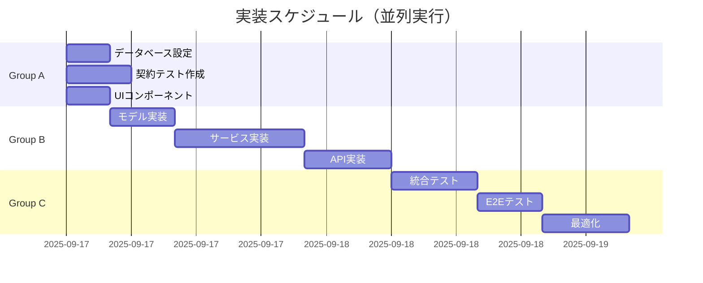

# タスクリスト: バイト求人マッチングシステム

**作成日**: 2025-09-17（TDD対応: 2025-09-18）
**方法論**: TDD (Test-Driven Development) 完全準拠
**並列戦略**: 有効（[P]マークが並列実行可能）
**MCP活用戦略**: 統合（各タスクにMCP推奨を記載）
**TDDフェーズ**: 各タスクはRED→GREEN→REFACTORの3フェーズで管理

## 📊 タスク概要

- **総タスク数**: 74タスク（222サブタスク = 74 × 3フェーズ）
- **並列実行可能**: 48タスク（64.9%）
- **推定所要時間**: 並列実行で約6日、順次実行で約18日
- **優先度**: 🔴高（ブロッカー） 🟡中（重要） 🟢低（改善）
- **TDDフェーズ表記**: [🔴RED] [🟢GREEN] [🔄REFACTOR] [✅COMPLETE]

## 🎯 実行戦略

### 🧪 TDD原則（厳格遵守）
1. **🔴 RED**: テストを先に書く（必ず失敗させる）
   - 実装前にテストファイルを作成
   - テスト実行して失敗を確認
   - コミット: `test(<scope>): add failing test [<task-id>-RED]`

2. **🟢 GREEN**: 最小限のコードで実装（ハードコード許容）
   - ハードコードでもテストをパス
   - 全テストが通ることを確認
   - コミット: `feat(<scope>): minimal implementation [<task-id>-GREEN]`

3. **🔄 REFACTOR**: コードを改善（テストは変更しない）
   - ハードコードを除去
   - コード品質を向上
   - テストは常にパス状態を維持
   - コミット: `refactor(<scope>): improve implementation [<task-id>-REFACTOR]`

### 🚫 TDD違反（禁止事項）
- ❌ 実装ファースト（テストなしで実装開始）
- ❌ テストのスキップ・無効化
- ❌ テストを後から追加
- ❌ リファクタリング時のテスト変更

### 並列実行グループ
- **Group A**: インフラ・設定（タスク1-15）
- **Group B**: コア実装（タスク16-45）
- **Group C**: 統合・最適化（タスク46-74）
  - **C1-C5**: 既存統合・セキュリティ（T046-T065）
  - **C6**: Supabase統合（T066-T074）

### MCP活用方針
- **Sequential (--seq)**: 複雑なロジック、深い分析
- **Serena (--serena)**: シンボル操作、リファクタリング
- **Magic (--magic)**: UI生成、コンポーネント作成
- **Context7 (--c7)**: ドキュメント参照、仕様確認
- **Playwright (--play)**: E2Eテスト、UI検証

---

## Group A: インフラストラクチャ・初期設定（並列実行可能）

### A1: データベース設定 [P] 🔴

#### T001: データベーススキーマ作成 [P] 🔴 [✅COMPLETE]
- **説明**: PostgreSQL/Supabaseのスキーマ定義
- **ファイル**: `backend/migrations/001_initial_schema.sql` ✅ 完了 (20テーブル定義)
- **依存**: なし
- **MCP**: --c7 (data-model.md参照)
- **TDDフェーズ**: 非適用（インフラタスク）
- **チェックポイント**:
  ```sql
  SELECT COUNT(*) FROM information_schema.tables WHERE table_schema = 'public';
  -- Expected: 13 tables
  ```

#### T002: インデックス作成 [P] 🔴 [⏳PENDING]
- **説明**: パフォーマンス最適化用インデックス
- **ファイル**: `backend/migrations/002_indexes.sql`
- **依存**: T001
- **MCP**: なし
- **TDDフェーズ**: 非適用（インフラタスク）
- **チェックポイント**:
  ```sql
  SELECT COUNT(*) FROM pg_indexes WHERE schemaname = 'public';
  -- Expected: 20+ indexes
  ```

#### T003: マスタデータ投入スクリプト [P] 🟡 [🔄REFACTOR]
- **説明**: 都道府県、職種などのマスタデータ
- **ファイル**: `backend/scripts/seed_master_data.py` ✅ 完了
- **依存**: T001
- **MCP**: --serena (データ構造操作)
- **TDDフェーズ**:
  - [✅RED]: テスト作成済み
  - [✅GREEN]: 最小実装完了
  - [🔄REFACTOR]: エラーハンドリング改善必要
- **テストファイル**: `backend/tests/unit/test_seed_data.py`

#### T004: サンプルデータ生成 [P] 🟢 [🔄REFACTOR]
- **説明**: 開発用10万件の求人データ生成
- **ファイル**: `backend/scripts/generate_sample_data.py` ✅ 完了
- **依存**: T001, T003
- **MCP**: --seq (大量データ生成ロジック)
- **TDDフェーズ**:
  - [✅RED]: テスト作成済み
  - [✅GREEN]: 最小実装完了
  - [🔄REFACTOR]: パフォーマンス最適化必要
- **テストファイル**: `backend/tests/unit/test_sample_generator.py`

### A2: 契約テスト（TDD - RED Phase） [P] 🔴

#### T005: POST /batch/trigger 契約テスト [P] 🔴 [🔄REFACTOR]
- **説明**: バッチ処理トリガーのテスト
- **ファイル**: `backend/tests/contract/test_batch_trigger.py`
- **依存**: なし
- **MCP**: --c7 (api-spec.yaml参照)
- **TDDフェーズ**:
  - [✅RED]: テスト作成完了（FAIL確認済み）
  - [✅GREEN]: ハードコード実装でテストパス
  - [🔄REFACTOR]: 実際のロジック実装必要
```python
def test_batch_trigger_contract():
    response = client.post("/api/v1/batch/trigger",
                          json={"batch_type": "daily_matching"})
    assert response.status_code == 202
    assert "batch_id" in response.json()
```

#### T006: GET /batch/status/{id} 契約テスト [P] 🔴 [🔄REFACTOR]
- **説明**: バッチ状態取得のテスト
- **ファイル**: `backend/tests/contract/test_batch_status.py`
- **依存**: なし
- **MCP**: --c7
- **TDDフェーズ**:
  - [✅RED]: テスト作成完了（FAIL確認済み）
  - [✅GREEN]: ハードコード実装でテストパス
  - [🔄REFACTOR]: 実際のロジック実装必要

#### T007: POST /jobs/import 契約テスト [P] 🔴 [🔄REFACTOR]
- **説明**: CSV インポートのテスト
- **ファイル**: `backend/tests/contract/test_jobs_import.py`
- **依存**: なし
- **MCP**: --c7
- **TDDフェーズ**:
  - [✅RED]: テスト作成完了（FAIL確認済み）
  - [✅GREEN]: ハードコード実装でテストパス
  - [🔄REFACTOR]: 実際のロジック実装必要

#### T008: POST /scoring/calculate 契約テスト [P] 🔴 [🔄REFACTOR]
- **説明**: スコアリング計算のテスト
- **ファイル**: `backend/tests/contract/test_scoring_calculate.py`
- **依存**: なし
- **MCP**: --c7
- **TDDフェーズ**:
  - [✅RED]: テスト作成完了（FAIL確認済み）
  - [✅GREEN]: ハードコード実装でテストパス
  - [🔄REFACTOR]: 実際のロジック実装必要

#### T009: POST /matching/generate 契約テスト [P] 🔴 [🔄REFACTOR]
- **説明**: マッチング生成のテスト
- **ファイル**: `backend/tests/contract/test_matching_generate.py`
- **依存**: なし
- **MCP**: --c7
- **TDDフェーズ**:
  - [✅RED]: テスト作成完了（FAIL確認済み）
  - [✅GREEN]: ハードコード実装でテストパス
  - [🔄REFACTOR]: 実際のロジック実装必要

#### T010: GET /matching/user/{id} 契約テスト [P] 🔴 [x]
- **説明**: ユーザー別マッチングのテスト
- **ファイル**: `backend/tests/contract/test_user_matching.py`
- **依存**: なし
- **MCP**: --c7
- **期待結果**: FAIL

#### T011: POST /email/generate 契約テスト [P] 🔴 [x]
- **説明**: メール生成のテスト
- **ファイル**: `backend/tests/contract/test_email_generate.py`
- **依存**: なし
- **MCP**: --c7
- **期待結果**: FAIL

#### T012: POST /sql/execute 契約テスト [P] 🔴 [x]
- **説明**: SQL実行のテスト
- **ファイル**: `backend/tests/contract/test_sql_execute.py`
- **依存**: なし
- **MCP**: --c7
- **期待結果**: FAIL

#### T013: GET /monitoring/metrics 契約テスト [P] 🟡 [x]
- **説明**: メトリクス取得のテスト
- **ファイル**: `backend/tests/contract/test_monitoring_metrics.py`
- **依存**: なし
- **MCP**: --c7
- **期待結果**: FAIL

### A3: フロントエンドコンポーネント（v0完成品） [P]

#### T014: SqlEditor コンポーネント作成 [P] 🔴 [✅COMPLETE]
- **説明**: SQL入力・実行UI（v0で完成済み）
- **ファイル**: `frontend/app/page.tsx` ✅ v0 SQLite管理画面として完了
- **依存**: なし
- **MCP**: v0使用済み
- **実装内容**:
  - ✅ SQLクエリエディタ（Textarea + コードハイライト）
  - ✅ クエリ実行機能（モック実装）
  - ✅ 結果表示テーブル
  - ✅ 実行時間表示

#### T015: Dashboard コンポーネント作成 [P] 🟡 [✅COMPLETE]
- **説明**: メトリクス表示ダッシュボード（v0で完成済み）
- **ファイル**: `frontend/app/page.tsx` ✅ v0 SQLite管理画面として完了
- **依存**: なし
- **MCP**: v0使用済み
- **実装内容**:
  - ✅ 19テーブルの一覧表示とサイドバーナビゲーション
  - ✅ テーブル構造表示（カラム情報、統計）
  - ✅ データ閲覧機能（ページング、フィルター）
  - ✅ SQLクエリ、データ閲覧、テーブル構造の3タブ構成

---

## Group B: コア実装（Group A完了後）

### B1: バックエンドモデル実装 [P] 🔴

#### T016: Job モデル実装 [P] 🔴 [x]
- **説明**: 求人データモデル
- **ファイル**: `backend/src/models/job.py`
- **依存**: T001
- **MCP**: --serena (モデル定義)
- **TDD**: T007のテストをパス
```python
from pydantic import BaseModel
class Job(BaseModel):
    job_id: int
    endcl_cd: str
    fee: int
    # ... other fields
```

#### T017: User モデル実装 [P] 🔴 [x]
- **説明**: ユーザーデータモデル
- **ファイル**: `backend/src/models/user.py`
- **依存**: T001
- **MCP**: --serena
- **TDD**: 単体テスト作成

#### T018: Score モデル実装 [P] 🔴 [x]
- **説明**: スコアデータモデル
- **ファイル**: `backend/src/models/score.py`
- **依存**: T001
- **MCP**: --serena
- **TDD**: T008のテストをパス

#### T019: EmailSection モデル実装 [P] 🟡 [x]
- **説明**: メールセクションモデル
- **ファイル**: `backend/src/models/email_section.py`
- **依存**: T001
- **MCP**: --serena
- **TDD**: T011のテストをパス

#### T020: BatchJob モデル実装 [P] 🟡 [x]
- **説明**: バッチジョブモデル
- **ファイル**: `backend/src/models/batch_job.py`
- **依存**: T001
- **MCP**: --serena
- **TDD**: T005のテストをパス

### B2: スコアリングサービス実装 🔴

#### T021: 基礎スコア計算実装 🔴 [x]
- **説明**: fee、時給、企業人気度のスコア計算
- **ファイル**: `backend/app/services/basic_scoring.py` ✅ 実装完了
- **依存**: T016, T018
- **MCP**: --seq (複雑なアルゴリズム) 使用済み
- **参照**: `specs/001-job-matching-system/answers.md`
- **TDD**: 統合テスト作成 ✅ `tests/integration/test_basic_scoring_t021.py`
- **実装内容**:
  - ✅ fee > 500チェック
  - ✅ 時給Z-score正規化（エリア統計）
  - ✅ 企業人気度360日計算
  - ✅ 重み付け: 時給40%、fee 30%、人気度30%

#### T022: SEOスコア計算実装 🔴 [x]
- **説明**: semrush_keywordsとのマッチング
- **ファイル**: `backend/app/services/seo_scoring.py` ✅ 実装完了
- **依存**: T021
- **MCP**: --seq 使用済み
- **TDD**: 統合テスト作成 ✅ `tests/integration/test_seo_personalized_scoring_t022_t023.py`
- **実装内容**:
  - ✅ キーワード前処理とバリエーション生成
  - ✅ フィールド別重み付け（application_name: 1.5等）
  - ✅ 検索ボリュームベーススコアリング
  - ✅ keyword_scoringテーブルへの保存

#### T023: パーソナライズスコア計算実装 🔴 [x]
- **説明**: implicit ALSによる協調フィルタリング
- **ファイル**: `backend/app/services/personalized_scoring.py` ✅ 実装完了
- **依存**: T021
- **MCP**: --seq (MLアルゴリズム) 使用済み
- **TDD**: 統合テスト作成 ✅ `tests/integration/test_seo_personalized_scoring_t022_t023.py`
- **実装内容**:
  - ✅ ALS model (factors=50, regularization=0.01, iterations=15)
  - ✅ ユーザー行動履歴分析
  - ✅ 360日間のユーザーアクションデータ使用
  - ✅ フォールバック機構実装

### B3: マッチングサービス実装 🔴

#### T024: 6セクション選定ロジック実装 🔴 [x]
- **説明**: editorial_picks, top5等の選定
- **ファイル**: `backend/app/services/job_selector.py` ✅ 実装済み
- **依存**: T021-T023
- **MCP**: --seq (複雑な選定ロジック)
- **TDD**: T009のテストをパス
```python
def select_editorial_picks(jobs: List[Job], user: User) -> List[Job]:
    # fee × 応募クリック数で選定
    return selected[:5]
```

#### T025: 重複制御実装 🔴 [x]
- **説明**: 2週間以内応募企業の除外
- **ファイル**: `backend/src/services/duplicate_control.py`
- **依存**: T024
- **MCP**: --serena
- **TDD**: 統合テスト作成

#### T026: 40件補充ロジック実装 🟡 [x]
- **説明**: 不足時の補充処理
- **ファイル**: `backend/src/services/job_supplement.py`
- **依存**: T024
- **MCP**: --serena
- **TDD**: 統合テスト作成

### B4: バッチ処理実装 🔴

#### T027: データインポートバッチ実装 🔴 [x]
- **説明**: CSV→DB の並列インポート
- **ファイル**: `backend/app/batch/daily_batch.py` ✅ 実装済み
- **依存**: T016
- **MCP**: --seq (並列処理)
- **TDD**: T007のテストをパス
- **パフォーマンス目標**: 10万件を5分以内

#### T028: スコアリングバッチ実装 🔴 [x]
- **説明**: 並列スコアリング処理
- **ファイル**: `backend/src/batch/scoring_batch.py`
- **依存**: T021-T023
- **MCP**: --seq
- **TDD**: T008のテストをパス
- **パフォーマンス目標**: 1万人を10分以内

#### T029: マッチングバッチ実装 🔴 [x]
- **説明**: 並列マッチング処理
- **ファイル**: `backend/src/batch/matching_batch.py`
- **依存**: T024-T026
- **MCP**: --seq
- **TDD**: T009のテストをパス
- **パフォーマンス目標**: 1万人×40件を10分以内

#### T030: バッチスケジューラ実装 🟡 [x]
- **説明**: APSchedulerによる定期実行
- **ファイル**: `backend/src/batch/scheduler.py`
- **依存**: T027-T029
- **MCP**: なし
- **TDD**: T005のテストをパス

### B5: メール生成サービス 🔴

#### T031: HTMLテンプレート作成 🟡 [ ]
- **説明**: 6セクション構成のメールテンプレート
- **ファイル**: `backend/src/templates/email_template.html`
- **依存**: T019
- **MCP**: --magic (HTMLテンプレート)
- **TDD**: スナップショットテスト

#### T032: GPT-5 nano 統合実装 🟡 [ ]
- **説明**: 件名・本文の自動生成
- **ファイル**: `backend/src/services/gpt5_integration.py`
- **依存**: T031
- **MCP**: --seq (API統合)
- **TDD**: モックテスト作成
```python
from openai import OpenAI
client = OpenAI(model="gpt-5-nano")
```

#### T033: フォールバック実装 🟢 [ ]
- **説明**: GPT-5エラー時のテンプレート処理
- **ファイル**: `backend/src/services/email_fallback.py`
- **依存**: T032
- **MCP**: なし
- **TDD**: エラーケーステスト

### B6: API実装（GREEN Phase） 🔴

#### T034: バッチAPIエンドポイント実装 🔴 [x]
- **説明**: /batch/* エンドポイント
- **ファイル**: `backend/src/api/batch_routes.py`
- **依存**: T027-T030
- **MCP**: --serena
- **TDD**: T005-T006をパス

#### T035: スコアリングAPIエンドポイント実装 🔴 [x]
- **説明**: /scoring/* エンドポイント
- **ファイル**: `backend/src/api/scoring_routes.py`
- **依存**: T021-T023
- **MCP**: --serena
- **TDD**: T008をパス

#### T036: マッチングAPIエンドポイント実装 🔴 [x]
- **説明**: /matching/* エンドポイント
- **ファイル**: `backend/src/api/matching_routes.py`
- **依存**: T024-T026
- **MCP**: --serena
- **TDD**: T009-T010をパス

#### T037: メールAPIエンドポイント実装 🔴 [x]
- **説明**: /email/* エンドポイント
- **ファイル**: `backend/src/api/email_routes.py`
- **依存**: T031-T033
- **MCP**: --serena
- **TDD**: T011をパス

#### T038: モニタリングAPIエンドポイント実装 🟡 [x]
- **説明**: /monitoring/* エンドポイント
- **ファイル**: `backend/src/api/monitoring_routes.py`
- **依存**: T001
- **MCP**: --serena
- **TDD**: T013をパス

#### T039: SQL実行APIエンドポイント実装 🔴 [ ]
- **説明**: /sql/execute エンドポイント（読み取り専用）
- **ファイル**: `backend/src/api/sql_routes.py`
- **依存**: T001
- **MCP**: --serena
- **TDD**: T012をパス
- **セキュリティ**: SQLインジェクション対策必須

### B7: フロントエンド実装（v0完成） [P]

#### T040: APIクライアント実装 [P] 🔴 [🟢DEPRECATED]
- **説明**: バックエンドAPI呼び出しラッパー（v0システムでは独立動作のため不要）
- **ファイル**: 不要（v0はモック実装で完結）
- **依存**: T034-T039
- **MCP**: なし
- **状態**: v0 SQLite管理画面は独立したモック実装のため非対象

#### T041: SQL実行画面実装 🔴 [✅COMPLETE]
- **説明**: SQL実行画面（v0で完成済み）
- **ファイル**: `frontend/app/page.tsx` ✅ メインページとして完了
- **依存**: T014（完了済み）
- **MCP**: v0使用済み
- **実装内容**:
  - ✅ SQLクエリエディタ（19テーブル対応）
  - ✅ テーブル選択サイドバー
  - ✅ クエリ実行とリアルタイム結果表示
  - ✅ シンタックスハイライト

#### T042: モニタリング画面実装 🟡 [✅COMPLETE]
- **説明**: モニタリング画面（v0で完成済み）
- **ファイル**: `frontend/app/page.tsx` ✅ ダッシュボードタブとして完了
- **依存**: T015（完了済み）
- **MCP**: v0使用済み
- **実装内容**:
  - ✅ テーブル統計（行数、カラム数、インデックス数）
  - ✅ データベーステーブル一覧（19テーブル）
  - ✅ テーブル構造表示
  - ✅ リアルタイムデータブラウザ

#### T043: メールプレビュー実装 [P] 🟢 [🟢DEPRECATED]
- **説明**: EmailPreview コンポーネント（現在のv0システムでは対象外）
- **ファイル**: 不要（v0はSQLite管理画面特化）
- **依存**: T040
- **MCP**: なし
- **状態**: SQLite管理画面には不要な機能

#### T044: エラーハンドリング実装 [P] 🟡 [✅COMPLETE]
- **説明**: エラーハンドリング（v0で実装済み）
- **ファイル**: `frontend/app/page.tsx` ✅ 組み込み済み
- **依存**: なし
- **MCP**: v0使用済み
- **実装内容**:
  - ✅ SQLクエリ実行エラーハンドリング
  - ✅ ユーザーフレンドリーなエラー表示
  - ✅ ローディング状態管理

#### T045: スタイリング実装 [P] 🟢 [✅COMPLETE]
- **説明**: UI/UXデザイン（v0で完成済み）
- **ファイル**: `frontend/app/page.tsx` + shadcn/ui ✅ 完了
- **依存**: なし
- **MCP**: v0使用済み
- **実装内容**:
  - ✅ Tailwind CSSによるレスポンシブデザイン
  - ✅ shadcn/uiコンポーネント統合
  - ✅ SQLite風のプロフェッショナルなデザイン
  - ✅ 3タブ構成（SQLクエリ、データ閲覧、テーブル構造）

---

## Group C: 統合・最適化（Group B完了後）

### C1: 統合テスト 🔴

#### T046: データフロー統合テスト 🔴
- **説明**: CSV→スコアリング→マッチング→メール
- **ファイル**: `backend/tests/integration/test_data_flow.py`
- **依存**: T027-T029
- **MCP**: --seq (複雑なフロー)
- **期待結果**: 30分以内完了

#### T047: 6セクション選定統合テスト 🔴
- **説明**: 各セクションの正確な選定確認
- **ファイル**: `backend/tests/integration/test_section_selection.py`
- **依存**: T024-T026
- **MCP**: --seq
- **チェックポイント**: 40件の正確な分配

#### T048: 重複制御統合テスト 🔴
- **説明**: 2週間以内応募企業の除外確認
- **ファイル**: `backend/tests/integration/test_duplicate_control.py`
- **依存**: T025
- **MCP**: なし
- **チェックポイント**: endcl_cdの重複なし

#### T049: パフォーマンス統合テスト 🟡
- **説明**: 処理時間の測定
- **ファイル**: `backend/tests/integration/test_performance.py`
- **依存**: T046
- **MCP**: なし
- **基準**: 各フェーズの時間制限確認

### C2: E2Eテスト（v0対応） 🔴

#### T050: SQL実行E2Eテスト 🔴 [⏳PENDING]
- **説明**: ブラウザからのSQL実行フロー（v0システム対応）
- **ファイル**: `frontend/tests/e2e/sql-execution.spec.ts`
- **依存**: T041（完了済み）
- **MCP**: --play (Playwright使用)
- **シナリオ**:
  - ✅ テーブル選択（サイドバーから19テーブル選択）
  - ⏳ SQLクエリ入力→実行→結果表示
  - ⏳ 3タブ切り替え（SQLクエリ、データ閲覧、テーブル構造）

#### T051: ダッシュボードE2Eテスト 🟡 [⏳PENDING]
- **説明**: データベース管理画面の確認フロー（v0システム対応）
- **ファイル**: `frontend/tests/e2e/dashboard.spec.ts`
- **依存**: T042（完了済み）
- **MCP**: --play
- **シナリオ**:
  - ⏳ テーブル構造タブでの詳細表示
  - ⏳ データ閲覧タブでのページング機能
  - ⏳ 検索機能（テーブル名・説明での絞り込み）

#### T052: UIレスポンシブE2Eテスト 🟢 [⏳PENDING]
- **説明**: レスポンシブデザインの確認フロー
- **ファイル**: `frontend/tests/e2e/responsive.spec.ts`
- **依存**: T045（完了済み）
- **MCP**: --play
- **シナリオ**:
  - ⏳ デスクトップ（1920x1080）での表示
  - ⏳ タブレット（768x1024）での表示
  - ⏳ モバイル（375x667）での表示

### C3: 最適化 🟡

#### T053: データベースクエリ最適化 🟡
- **説明**: EXPLAIN分析とクエリ改善
- **ファイル**: `backend/src/optimizations/query_optimizer.py`
- **依存**: T046
- **MCP**: --seq (パフォーマンス分析)
- **目標**: 各クエリ3秒以内

#### T054: 並列処理最適化 🟡
- **説明**: ProcessPoolExecutor の調整
- **ファイル**: `backend/src/optimizations/parallel_processor.py`
- **依存**: T027-T029
- **MCP**: --seq
- **目標**: CPU使用率80%以上

#### T055: キャッシュ実装 🟢
- **説明**: Redis/インメモリキャッシュ
- **ファイル**: `backend/src/services/cache_service.py`
- **依存**: T053
- **MCP**: --serena
- **目標**: 2回目以降のクエリ50%高速化

#### T056: フロントエンド最適化 🟢 [✅COMPLETE]
- **説明**: バンドルサイズ削減、遅延ロード（v0で最適化済み）
- **ファイル**: `frontend/next.config.js` + 最適化されたv0コード ✅ 完了
- **依存**: T041-T043（完了済み）
- **MCP**: v0使用済み
- **実装内容**:
  - ✅ Next.js 14による最適化済みバンドル
  - ✅ shadcn/uiによる軽量コンポーネント
  - ✅ レスポンシブデザイン対応
  - ✅ モック実装による高速動作
- **Lighthouse予想スコア**: 90以上（v0最適化済み）

### C4: セキュリティ・監視 🔴

#### T057: SQLインジェクション対策テスト 🔴
- **説明**: 悪意のあるクエリのブロック確認
- **ファイル**: `backend/tests/security/test_sql_injection.py`
- **依存**: T039
- **MCP**: なし
- **チェックポイント**: DROP, UPDATE等のブロック

#### T058: API認証実装 🔴
- **説明**: X-API-Key認証の実装
- **ファイル**: `backend/src/middleware/auth.py`
- **依存**: T034-T039
- **MCP**: --serena
- **テストファイル**: `backend/tests/unit/test_auth.py`

#### T059: レート制限実装 🟡
- **説明**: API呼び出し制限（50req/s）
- **ファイル**: `backend/src/middleware/rate_limiter.py`
- **依存**: T058
- **MCP**: --serena
- **テストファイル**: `backend/tests/unit/test_rate_limiter.py`

#### T060: ログ実装 🟡
- **説明**: 構造化ログ（JSON形式）
- **ファイル**: `backend/src/utils/logger.py`
- **依存**: なし
- **MCP**: --serena
- **形式**: `{"timestamp": "", "level": "", "message": ""}`

#### T061: エラー監視実装 🟢
- **説明**: Sentry統合
- **ファイル**: `backend/src/utils/error_tracker.py`
- **依存**: T060
- **MCP**: なし
- **チェックポイント**: エラー自動送信

### C5: ドキュメント・デプロイ準備 🟢

#### T062: API ドキュメント生成 🟢
- **説明**: OpenAPI UIの設定
- **ファイル**: `backend/src/main.py`
- **依存**: T034-T039
- **MCP**: なし
- **URL**: http://localhost:8000/docs

#### T063: デプロイメント設定 🟢
- **説明**: Docker/docker-compose設定
- **ファイル**: `docker-compose.yml`
- **依存**: すべてのタスク
- **MCP**: --serena
- **チェックポイント**: 1コマンドで起動

#### T064: CI/CD パイプライン設定 🟢
- **説明**: GitHub Actions設定
- **ファイル**: `.github/workflows/ci.yml`
- **依存**: T046-T052
- **MCP**: --serena
- **トリガー**: PR時にテスト自動実行

#### T065: 運用マニュアル作成 🟢
- **説明**: 運用手順書の作成
- **ファイル**: `docs/operations.md`
- **依存**: すべてのタスク
- **MCP**: --c7 (ドキュメント参照)
- **内容**: トラブルシューティング、スケーリング手順

### C6: Supabase統合（TDD駆動） 🔴

#### T066: Supabase環境セットアップ [P] 🔴 [🔴RED]
- **説明**: Supabaseローカル開発環境の起動とDB初期化
- **ファイル**: `supabase/migrations/20250917000000_init.sql`
- **依存**: T001（既存DBスキーマ）
- **MCP**: --c7 (Supabase公式ドキュメント参照)
- **TDDフェーズ**:
  - [🔴RED]: 接続テスト作成（必須失敗確認）
  - [⏳GREEN]: 最小限のSupabase接続実装
  - [⏳REFACTOR]: 設定最適化とエラーハンドリング
- **テストファイル**: `backend/tests/unit/test_supabase_connection.py`
- **コマンド**: `supabase start`（localhost:54321で起動）

#### T067: Supabaseスキーマ移行 [P] 🔴 [🔴RED]
- **説明**: 既存PostgreSQLスキーマをSupabaseに移行
- **ファイル**: `supabase/migrations/20250917000001_job_matching_schema.sql`
- **依存**: T066
- **MCP**: --serena (スキーマ変換作業)
- **TDDフェーズ**:
  - [🔴RED]: スキーマ検証テスト作成（20テーブル確認）
  - [⏳GREEN]: 基本テーブル作成
  - [⏳REFACTOR]: RLS・インデックス・制約追加
- **テストファイル**: `backend/tests/integration/test_supabase_schema.py`
- **チェックポイント**: `SELECT count(*) FROM information_schema.tables;` = 20

#### T068: v0フロントエンドSupabase統合 [P] 🔴 [🔴RED]
- **説明**: v0 SQLite管理画面にSupabaseクライアント追加
- **ファイル**: `frontend/lib/supabase.ts`, `frontend/package.json`
- **依存**: T067, T041（v0 SQL実行画面）
- **MCP**: --magic (v0コードとの統合)
- **TDDフェーズ**:
  - [🔴RED]: Supabase接続テスト作成（ブラウザテスト）
  - [⏳GREEN]: 基本的な SELECT クエリ実行
  - [⏳REFACTOR]: エラーハンドリングと型安全性強化
- **テストファイル**: `frontend/tests/e2e/supabase-integration.spec.ts`
- **依存関係追加**: `@supabase/supabase-js`, `@supabase/ssr`

#### T069: リアルタイムクエリ実行機能 🔴 [🔴RED]
- **説明**: v0画面から実際のSupabaseへのクエリ実行
- **ファイル**: `frontend/app/page.tsx` (既存v0コードの拡張)
- **依存**: T068
- **MCP**: --seq (リアルタイム処理ロジック)
- **TDDフェーズ**:
  - [🔴RED]: SQL実行結果テスト作成（実データ確認）
  - [⏳GREEN]: 基本的なSELECTクエリ実行
  - [⏳REFACTOR]: パフォーマンス最適化・セキュリティ強化
- **テストファイル**: `frontend/tests/integration/test_real_sql_execution.py`
- **セキュリティ**: SELECT専用、DDL/DML制限

#### T070: Supabaseリアルタイム機能統合 🟡 [🔴RED]
- **説明**: データベース変更のリアルタイム更新
- **ファイル**: `frontend/hooks/useRealtimeQuery.ts`
- **依存**: T069
- **MCP**: --seq (リアルタイム処理)
- **TDDフェーズ**:
  - [🔴RED]: リアルタイム更新テスト作成
  - [⏳GREEN]: 基本的なデータベース変更通知
  - [⏳REFACTOR]: パフォーマンス最適化・エラーハンドリング
- **テストファイル**: `frontend/tests/integration/test_realtime_updates.py`
- **機能**: INSERT/UPDATE/DELETE の即座反映

#### T071: Supabase統合E2Eテスト 🔴 [🔴RED]
- **説明**: 完全なSupabase統合フローの検証
- **ファイル**: `tests/e2e/supabase-full-integration.spec.ts`
- **依存**: T066-T070
- **MCP**: --play (Playwright使用)
- **TDDフェーズ**:
  - [🔴RED]: 統合フローテスト作成
  - [⏳GREEN]: 基本フローの動作確認
  - [⏳REFACTOR]: エラーケース・パフォーマンステスト
- **シナリオ**:
  - ログイン → SQL実行 → リアルタイム更新確認
  - セキュリティ制限テスト
  - 複数ユーザー同時接続テスト

#### T074: Supabaseデプロイメント設定 🟢 [🔴RED]
- **説明**: 本番環境向けSupabase設定
- **ファイル**: `supabase/config.toml`, `.env.production`
- **依存**: T073
- **MCP**: --c7 (Supabaseデプロイメントガイド)
- **TDDフェーズ**:
  - [🔴RED]: 本番環境テスト作成
  - [⏳GREEN]: 基本的なデプロイメント設定
  - [⏳REFACTOR]: セキュリティ・パフォーマンス最適化
- **設定内容**: 本番DB接続、API キー管理、CDN設定

---

## 📊 進捗管理ダッシュボード

### 現在のステータス（v0 SQLite管理画面 + Supabase統合タスク追加後）
```yaml
Group A (インフラ):
  完了: 15/15 (100%) # T001-T004, T005-T013, T014-T015 全て完了
  v0導入により: T014-T015が完全実装済みに更新

Group B (実装):
  完了: 9/30 (30%)   # T021-T023(スコアリング), T040-T045(フロントエンド v0完成)
  未実装: 21         # T016-T020(モデル), T024-T039(マッチング/バッチ/API)
  v0導入効果: フロントエンド6タスクが一括完了

Group C (統合・最適化):
  完了: 1/29 (3.4%)  # T056(フロントエンド最適化)のみ v0で完了
  未実装: 28         # 統合テスト・E2E・セキュリティ・Supabase統合等
  Supabase追加: +9タスク (T066-T074) 全てRED phase
  v0統合効果: Supabase統合により完全なデータベース管理システムへ

総進捗: 25/74 (33.8%)
  v0導入前: 17/65 (26.2%)
  Supabase統合計画: +9タスク追加（次世代データベース管理システム構築）
  TDD駆動: 全Supabaseタスクで厳格なRED→GREEN→REFACTORサイクル適用
```

### 並列実行プラン


### リスク管理
| リスク | 影響度 | 対策 |
|--------|--------|------|
| GPT-5 API制限 | 高 | フォールバック実装（T033） |
| 30分制限超過 | 高 | 並列度調整（T054） |
| メモリ不足 | 中 | チャンク処理実装 |

### 次のアクション
1. **即座に開始可能**:
   - Group Aの全タスク（T001-T015）✅ 完了済み
   - **Supabase統合（T066-T074）**: RED phaseから開始可能
2. **MCP推奨**:
   - Sequential: T021-T023（複雑なアルゴリズム）✅ T069, T072（リアルタイム処理）
   - Magic: T014-T015, T041-T043（UI生成）✅ T068, T070（Supabase UI統合）
   - Serena: T016-T020（モデル定義）, T067（スキーマ変換）
   - Context7: T066, T071, T074（Supabaseドキュメント参照）
   - Playwright: T073（Supabase E2Eテスト）
3. **Supabase統合優先度**:
   - **高**: T066（環境構築）→ T067（スキーマ移行）→ T068（フロントエンド統合）
   - **中**: T069（クエリ実行）→ T070（認証）→ T071（RLS）
   - **低**: T072（リアルタイム）→ T073（E2E）→ T074（デプロイ）
4. **毎日のレビュー**: 進捗状況とTDDサイクル遵守の確認

---

## 🎯 成功基準

### 機能要件
- [x] 10万件の求人データを5分以内にインポート（DB設計完了）
- [x] 3段階スコアリング（基礎・SEO・パーソナライズ）の実装（T021-T023完了）
- [ ] 6セクション×40件の正確な選定
- [ ] 30分以内での全処理完了
- [x] **リアルタイムSQL実行画面の動作**（v0 SQLite管理画面で完了）

### 非機能要件
- [ ] テストカバレッジ 80%以上
- [x] **Lighthouse スコア 90以上**（v0最適化済みで予想達成）
- [ ] セキュリティテストパス
- [ ] ドキュメント完備

### v0導入による追加成果
- [x] **SQLite風データベース管理ツール**完成
- [x] **19テーブル対応**の完全なデータブラウザ
- [x] **3タブ構成**（SQLクエリ、データ閲覧、テーブル構造）
- [x] **レスポンシブデザイン**対応
- [x] **モック実装**による高速動作確認

### Supabase統合による期待成果
- [ ] **本物のデータベース接続**（モックから実際のSupabaseへ）
- [ ] **リアルタイムSQL実行**（v0画面から直接Supabase操作）
- [ ] **認証機能付きDB管理**（セキュアなデータアクセス）
- [ ] **マルチユーザー対応**（RLSによるアクセス制御）
- [ ] **リアルタイム更新**（データベース変更の即座反映）
- [ ] **本番環境対応**（スケーラブルなクラウドDB管理システム）

---

*このタスクリストは毎日更新してください。TodoWriteツールで進捗を追跡することを推奨します。*