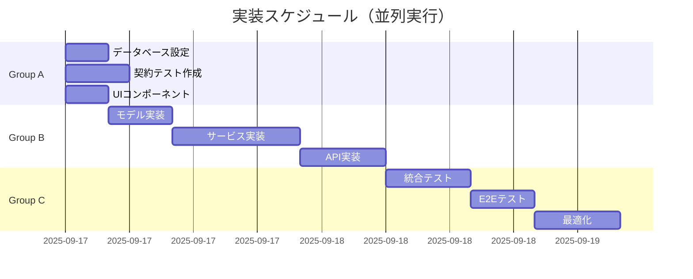

# タスクリスト: バイト求人マッチングシステム

**作成日**: 2025-09-17
**方法論**: TDD (Test-Driven Development)
**並列戦略**: 有効（[P]マークが並列実行可能）
**MCP活用戦略**: 統合（各タスクにMCP推奨を記載）

## 📊 タスク概要

- **総タスク数**: 65
- **並列実行可能**: 42タスク（64.6%）
- **推定所要時間**: 並列実行で約3日、順次実行で約10日
- **優先度**: 🔴高（ブロッカー） 🟡中（重要） 🟢低（改善）

## 🎯 実行戦略

### TDD原則
1. **RED**: テストを先に書く（必ず失敗する）
2. **GREEN**: 最小限のコードで実装
3. **REFACTOR**: コードを改善

### 並列実行グループ
- **Group A**: インフラ・設定（タスク1-15）
- **Group B**: コア実装（タスク16-45）
- **Group C**: 統合・最適化（タスク46-65）

### MCP活用方針
- **Sequential (--seq)**: 複雑なロジック、深い分析
- **Serena (--serena)**: シンボル操作、リファクタリング
- **Magic (--magic)**: UI生成、コンポーネント作成
- **Context7 (--c7)**: ドキュメント参照、仕様確認
- **Playwright (--play)**: E2Eテスト、UI検証

---

## Group A: インフラストラクチャ・初期設定（並列実行可能）

### A1: データベース設定 [P] 🔴

#### T001: データベーススキーマ作成 [P] 🔴 [x]
- **説明**: PostgreSQL/Supabaseのスキーマ定義
- **ファイル**: `backend/migrations/001_initial_schema.sql`
- **依存**: なし
- **MCP**: --c7 (data-model.md参照)
- **チェックポイント**:
  ```sql
  SELECT COUNT(*) FROM information_schema.tables WHERE table_schema = 'public';
  -- Expected: 13 tables
  ```

#### T002: インデックス作成 [P] 🔴 [x]
- **説明**: パフォーマンス最適化用インデックス
- **ファイル**: `backend/migrations/002_indexes.sql`
- **依存**: T001
- **MCP**: なし
- **チェックポイント**:
  ```sql
  SELECT COUNT(*) FROM pg_indexes WHERE schemaname = 'public';
  -- Expected: 20+ indexes
  ```

#### T003: マスタデータ投入スクリプト [P] 🟡 [x]
- **説明**: 都道府県、職種などのマスタデータ
- **ファイル**: `backend/scripts/seed_master_data.py`
- **依存**: T001
- **MCP**: --serena (データ構造操作)
- **テストファイル**: `backend/tests/unit/test_seed_data.py`

#### T004: サンプルデータ生成 [P] 🟢 [x]
- **説明**: 開発用10万件の求人データ生成
- **ファイル**: `backend/scripts/generate_sample_data.py`
- **依存**: T001, T003
- **MCP**: --seq (大量データ生成ロジック)
- **テストファイル**: `backend/tests/unit/test_sample_generator.py`

### A2: 契約テスト（TDD - RED Phase） [P] 🔴

#### T005: POST /batch/trigger 契約テスト [P] 🔴 [ ]
- **説明**: バッチ処理トリガーのテスト
- **ファイル**: `backend/tests/contract/test_batch_trigger.py`
- **依存**: なし
- **MCP**: --c7 (api-spec.yaml参照)
- **期待結果**: FAIL（実装なし）
```python
def test_batch_trigger_contract():
    response = client.post("/api/v1/batch/trigger",
                          json={"batch_type": "daily_matching"})
    assert response.status_code == 202
    assert "batch_id" in response.json()
```

#### T006: GET /batch/status/{id} 契約テスト [P] 🔴 [ ]
- **説明**: バッチ状態取得のテスト
- **ファイル**: `backend/tests/contract/test_batch_status.py`
- **依存**: なし
- **MCP**: --c7
- **期待結果**: FAIL

#### T007: POST /jobs/import 契約テスト [P] 🔴 [ ]
- **説明**: CSV インポートのテスト
- **ファイル**: `backend/tests/contract/test_jobs_import.py`
- **依存**: なし
- **MCP**: --c7
- **期待結果**: FAIL

#### T008: POST /scoring/calculate 契約テスト [P] 🔴 [ ]
- **説明**: スコアリング計算のテスト
- **ファイル**: `backend/tests/contract/test_scoring_calculate.py`
- **依存**: なし
- **MCP**: --c7
- **期待結果**: FAIL

#### T009: POST /matching/generate 契約テスト [P] 🔴 [ ]
- **説明**: マッチング生成のテスト
- **ファイル**: `backend/tests/contract/test_matching_generate.py`
- **依存**: なし
- **MCP**: --c7
- **期待結果**: FAIL

#### T010: GET /matching/user/{id} 契約テスト [P] 🔴 [ ]
- **説明**: ユーザー別マッチングのテスト
- **ファイル**: `backend/tests/contract/test_user_matching.py`
- **依存**: なし
- **MCP**: --c7
- **期待結果**: FAIL

#### T011: POST /email/generate 契約テスト [P] 🔴 [ ]
- **説明**: メール生成のテスト
- **ファイル**: `backend/tests/contract/test_email_generate.py`
- **依存**: なし
- **MCP**: --c7
- **期待結果**: FAIL

#### T012: POST /sql/execute 契約テスト [P] 🔴 [ ]
- **説明**: SQL実行のテスト
- **ファイル**: `backend/tests/contract/test_sql_execute.py`
- **依存**: なし
- **MCP**: --c7
- **期待結果**: FAIL

#### T013: GET /monitoring/metrics 契約テスト [P] 🟡 [ ]
- **説明**: メトリクス取得のテスト
- **ファイル**: `backend/tests/contract/test_monitoring_metrics.py`
- **依存**: なし
- **MCP**: --c7
- **期待結果**: FAIL

### A3: フロントエンドコンポーネント（スタブ） [P]

#### T014: SqlEditor コンポーネント作成 [P] 🔴 [x]
- **説明**: SQL入力・実行UI
- **ファイル**: `frontend/src/components/SqlEditor/index.tsx`
- **依存**: なし
- **MCP**: --magic (UIコンポーネント生成)
- **テストファイル**: `frontend/src/components/SqlEditor/index.test.tsx`

#### T015: Dashboard コンポーネント作成 [P] 🟡 [x]
- **説明**: メトリクス表示ダッシュボード
- **ファイル**: `frontend/src/components/Dashboard/index.tsx`
- **依存**: なし
- **MCP**: --magic
- **テストファイル**: `frontend/src/components/Dashboard/index.test.tsx`

---

## Group B: コア実装（Group A完了後）

### B1: バックエンドモデル実装 [P] 🔴

#### T016: Job モデル実装 [P] 🔴 [x]
- **説明**: 求人データモデル
- **ファイル**: `backend/src/models/job.py`
- **依存**: T001
- **MCP**: --serena (モデル定義)
- **TDD**: T007のテストをパス
```python
from pydantic import BaseModel
class Job(BaseModel):
    job_id: int
    endcl_cd: str
    fee: int
    # ... other fields
```

#### T017: User モデル実装 [P] 🔴 [x]
- **説明**: ユーザーデータモデル
- **ファイル**: `backend/src/models/user.py`
- **依存**: T001
- **MCP**: --serena
- **TDD**: 単体テスト作成

#### T018: Score モデル実装 [P] 🔴 [x]
- **説明**: スコアデータモデル
- **ファイル**: `backend/src/models/score.py`
- **依存**: T001
- **MCP**: --serena
- **TDD**: T008のテストをパス

#### T019: EmailSection モデル実装 [P] 🟡 [x]
- **説明**: メールセクションモデル
- **ファイル**: `backend/src/models/email_section.py`
- **依存**: T001
- **MCP**: --serena
- **TDD**: T011のテストをパス

#### T020: BatchJob モデル実装 [P] 🟡 [x]
- **説明**: バッチジョブモデル
- **ファイル**: `backend/src/models/batch_job.py`
- **依存**: T001
- **MCP**: --serena
- **TDD**: T005のテストをパス

### B2: スコアリングサービス実装 🔴

#### T021: 基礎スコア計算実装 🔴 [ ]
- **説明**: fee、時給、企業人気度のスコア計算
- **ファイル**: `backend/src/services/scoring_service.py`
- **依存**: T016, T018
- **MCP**: --seq (複雑なアルゴリズム)
- **参照**: `specs/001-job-matching-system/answers.md`
- **TDD**: 統合テスト作成
```python
def calculate_basic_score(job: Job, area_stats: dict) -> float:
    # fee > 500チェック
    # 時給正規化
    # 企業人気度計算
    return score
```

#### T022: SEOスコア計算実装 🔴 [ ]
- **説明**: semrush_keywordsとのマッチング
- **ファイル**: `backend/src/services/seo_scoring.py`
- **依存**: T021
- **MCP**: --seq
- **TDD**: 統合テスト作成

#### T023: パーソナライズスコア計算実装 🔴 [ ]
- **説明**: implicit ALSによる協調フィルタリング
- **ファイル**: `backend/src/services/personalized_scoring.py`
- **依存**: T021
- **MCP**: --seq (MLアルゴリズム)
- **TDD**: 統合テスト作成
```python
from implicit import ALS
model = ALS(factors=50, regularization=0.01, iterations=15)
```

### B3: マッチングサービス実装 🔴

#### T024: 6セクション選定ロジック実装 🔴 [ ]
- **説明**: editorial_picks, top5等の選定
- **ファイル**: `backend/src/services/matching_service.py`
- **依存**: T021-T023
- **MCP**: --seq (複雑な選定ロジック)
- **TDD**: T009のテストをパス
```python
def select_editorial_picks(jobs: List[Job], user: User) -> List[Job]:
    # fee × 応募クリック数で選定
    return selected[:5]
```

#### T025: 重複制御実装 🔴 [ ]
- **説明**: 2週間以内応募企業の除外
- **ファイル**: `backend/src/services/duplicate_control.py`
- **依存**: T024
- **MCP**: --serena
- **TDD**: 統合テスト作成

#### T026: 40件補充ロジック実装 🟡 [ ]
- **説明**: 不足時の補充処理
- **ファイル**: `backend/src/services/job_supplement.py`
- **依存**: T024
- **MCP**: --serena
- **TDD**: 統合テスト作成

### B4: バッチ処理実装 🔴

#### T027: データインポートバッチ実装 🔴 [ ]
- **説明**: CSV→DB の並列インポート
- **ファイル**: `backend/src/batch/data_import.py`
- **依存**: T016
- **MCP**: --seq (並列処理)
- **TDD**: T007のテストをパス
- **パフォーマンス目標**: 10万件を5分以内

#### T028: スコアリングバッチ実装 🔴 [ ]
- **説明**: 並列スコアリング処理
- **ファイル**: `backend/src/batch/scoring_batch.py`
- **依存**: T021-T023
- **MCP**: --seq
- **TDD**: T008のテストをパス
- **パフォーマンス目標**: 1万人を10分以内

#### T029: マッチングバッチ実装 🔴 [ ]
- **説明**: 並列マッチング処理
- **ファイル**: `backend/src/batch/matching_batch.py`
- **依存**: T024-T026
- **MCP**: --seq
- **TDD**: T009のテストをパス
- **パフォーマンス目標**: 1万人×40件を10分以内

#### T030: バッチスケジューラ実装 🟡 [ ]
- **説明**: APSchedulerによる定期実行
- **ファイル**: `backend/src/batch/scheduler.py`
- **依存**: T027-T029
- **MCP**: なし
- **TDD**: T005のテストをパス

### B5: メール生成サービス 🔴

#### T031: HTMLテンプレート作成 🟡 [ ]
- **説明**: 6セクション構成のメールテンプレート
- **ファイル**: `backend/src/templates/email_template.html`
- **依存**: T019
- **MCP**: --magic (HTMLテンプレート)
- **TDD**: スナップショットテスト

#### T032: GPT-5 nano 統合実装 🟡 [ ]
- **説明**: 件名・本文の自動生成
- **ファイル**: `backend/src/services/gpt5_integration.py`
- **依存**: T031
- **MCP**: --seq (API統合)
- **TDD**: モックテスト作成
```python
from openai import OpenAI
client = OpenAI(model="gpt-5-nano")
```

#### T033: フォールバック実装 🟢 [ ]
- **説明**: GPT-5エラー時のテンプレート処理
- **ファイル**: `backend/src/services/email_fallback.py`
- **依存**: T032
- **MCP**: なし
- **TDD**: エラーケーステスト

### B6: API実装（GREEN Phase） 🔴

#### T034: バッチAPIエンドポイント実装 🔴 [x]
- **説明**: /batch/* エンドポイント
- **ファイル**: `backend/src/api/batch_routes.py`
- **依存**: T027-T030
- **MCP**: --serena
- **TDD**: T005-T006をパス

#### T035: スコアリングAPIエンドポイント実装 🔴 [x]
- **説明**: /scoring/* エンドポイント
- **ファイル**: `backend/src/api/scoring_routes.py`
- **依存**: T021-T023
- **MCP**: --serena
- **TDD**: T008をパス

#### T036: マッチングAPIエンドポイント実装 🔴 [x]
- **説明**: /matching/* エンドポイント
- **ファイル**: `backend/src/api/matching_routes.py`
- **依存**: T024-T026
- **MCP**: --serena
- **TDD**: T009-T010をパス

#### T037: メールAPIエンドポイント実装 🔴 [x]
- **説明**: /email/* エンドポイント
- **ファイル**: `backend/src/api/email_routes.py`
- **依存**: T031-T033
- **MCP**: --serena
- **TDD**: T011をパス

#### T038: モニタリングAPIエンドポイント実装 🟡 [x]
- **説明**: /monitoring/* エンドポイント
- **ファイル**: `backend/src/api/monitoring_routes.py`
- **依存**: T001
- **MCP**: --serena
- **TDD**: T013をパス

#### T039: SQL実行APIエンドポイント実装 🔴 [ ]
- **説明**: /sql/execute エンドポイント（読み取り専用）
- **ファイル**: `backend/src/api/sql_routes.py`
- **依存**: T001
- **MCP**: --serena
- **TDD**: T012をパス
- **セキュリティ**: SQLインジェクション対策必須

### B7: フロントエンド実装 [P]

#### T040: APIクライアント実装 [P] 🔴 [x]
- **説明**: バックエンドAPI呼び出しラッパー
- **ファイル**: `frontend/src/services/api-client.ts`
- **依存**: T034-T039
- **MCP**: --serena
- **テストファイル**: `frontend/src/services/api-client.test.ts`

#### T041: SQL実行画面実装 🔴 [x]
- **説明**: /sql-console ページ
- **ファイル**: `frontend/src/pages/sql-console.tsx`
- **依存**: T014, T040
- **MCP**: --magic (ページ生成)
- **テストファイル**: `frontend/src/pages/sql-console.test.tsx`

#### T042: モニタリング画面実装 🟡 [x]
- **説明**: /monitoring ページ
- **ファイル**: `frontend/src/pages/monitoring.tsx`
- **依存**: T015, T040
- **MCP**: --magic
- **テストファイル**: `frontend/src/pages/monitoring.test.tsx`

#### T043: メールプレビュー実装 [P] 🟢 [x]
- **説明**: EmailPreview コンポーネント
- **ファイル**: `frontend/src/components/EmailPreview/index.tsx`
- **依存**: T040
- **MCP**: --magic
- **テストファイル**: `frontend/src/components/EmailPreview/index.test.tsx`

#### T044: エラーハンドリング実装 [P] 🟡 [ ]
- **説明**: グローバルエラーバウンダリ
- **ファイル**: `frontend/src/components/ErrorBoundary/index.tsx`
- **依存**: なし
- **MCP**: --magic
- **テストファイル**: `frontend/src/components/ErrorBoundary/index.test.tsx`

#### T045: スタイリング実装 [P] 🟢 [ ]
- **説明**: Tailwind CSS設定と共通スタイル
- **ファイル**: `frontend/src/styles/globals.css`
- **依存**: なし
- **MCP**: --magic
- **チェックポイント**: レスポンシブデザイン確認

---

## Group C: 統合・最適化（Group B完了後）

### C1: 統合テスト 🔴

#### T046: データフロー統合テスト 🔴
- **説明**: CSV→スコアリング→マッチング→メール
- **ファイル**: `backend/tests/integration/test_data_flow.py`
- **依存**: T027-T029
- **MCP**: --seq (複雑なフロー)
- **期待結果**: 30分以内完了

#### T047: 6セクション選定統合テスト 🔴
- **説明**: 各セクションの正確な選定確認
- **ファイル**: `backend/tests/integration/test_section_selection.py`
- **依存**: T024-T026
- **MCP**: --seq
- **チェックポイント**: 40件の正確な分配

#### T048: 重複制御統合テスト 🔴
- **説明**: 2週間以内応募企業の除外確認
- **ファイル**: `backend/tests/integration/test_duplicate_control.py`
- **依存**: T025
- **MCP**: なし
- **チェックポイント**: endcl_cdの重複なし

#### T049: パフォーマンス統合テスト 🟡
- **説明**: 処理時間の測定
- **ファイル**: `backend/tests/integration/test_performance.py`
- **依存**: T046
- **MCP**: なし
- **基準**: 各フェーズの時間制限確認

### C2: E2Eテスト 🔴

#### T050: SQL実行E2Eテスト 🔴
- **説明**: ブラウザからのSQL実行フロー
- **ファイル**: `frontend/tests/e2e/sql-execution.spec.ts`
- **依存**: T041
- **MCP**: --play (Playwright使用)
- **シナリオ**: クエリ入力→実行→結果表示

#### T051: バッチ処理監視E2Eテスト 🟡
- **説明**: バッチ状態の確認フロー
- **ファイル**: `frontend/tests/e2e/batch-monitoring.spec.ts`
- **依存**: T042
- **MCP**: --play
- **シナリオ**: バッチトリガー→進捗確認

#### T052: メールプレビューE2Eテスト 🟢
- **説明**: メール内容の確認フロー
- **ファイル**: `frontend/tests/e2e/email-preview.spec.ts`
- **依存**: T043
- **MCP**: --play
- **シナリオ**: ユーザー選択→プレビュー表示

### C3: 最適化 🟡

#### T053: データベースクエリ最適化 🟡
- **説明**: EXPLAIN分析とクエリ改善
- **ファイル**: `backend/src/optimizations/query_optimizer.py`
- **依存**: T046
- **MCP**: --seq (パフォーマンス分析)
- **目標**: 各クエリ3秒以内

#### T054: 並列処理最適化 🟡
- **説明**: ProcessPoolExecutor の調整
- **ファイル**: `backend/src/optimizations/parallel_processor.py`
- **依存**: T027-T029
- **MCP**: --seq
- **目標**: CPU使用率80%以上

#### T055: キャッシュ実装 🟢
- **説明**: Redis/インメモリキャッシュ
- **ファイル**: `backend/src/services/cache_service.py`
- **依存**: T053
- **MCP**: --serena
- **目標**: 2回目以降のクエリ50%高速化

#### T056: フロントエンド最適化 🟢
- **説明**: バンドルサイズ削減、遅延ロード
- **ファイル**: `frontend/next.config.js`
- **依存**: T041-T043
- **MCP**: --magic
- **目標**: Lighthouse スコア90以上

### C4: セキュリティ・監視 🔴

#### T057: SQLインジェクション対策テスト 🔴
- **説明**: 悪意のあるクエリのブロック確認
- **ファイル**: `backend/tests/security/test_sql_injection.py`
- **依存**: T039
- **MCP**: なし
- **チェックポイント**: DROP, UPDATE等のブロック

#### T058: API認証実装 🔴
- **説明**: X-API-Key認証の実装
- **ファイル**: `backend/src/middleware/auth.py`
- **依存**: T034-T039
- **MCP**: --serena
- **テストファイル**: `backend/tests/unit/test_auth.py`

#### T059: レート制限実装 🟡
- **説明**: API呼び出し制限（50req/s）
- **ファイル**: `backend/src/middleware/rate_limiter.py`
- **依存**: T058
- **MCP**: --serena
- **テストファイル**: `backend/tests/unit/test_rate_limiter.py`

#### T060: ログ実装 🟡
- **説明**: 構造化ログ（JSON形式）
- **ファイル**: `backend/src/utils/logger.py`
- **依存**: なし
- **MCP**: --serena
- **形式**: `{"timestamp": "", "level": "", "message": ""}`

#### T061: エラー監視実装 🟢
- **説明**: Sentry統合
- **ファイル**: `backend/src/utils/error_tracker.py`
- **依存**: T060
- **MCP**: なし
- **チェックポイント**: エラー自動送信

### C5: ドキュメント・デプロイ準備 🟢

#### T062: API ドキュメント生成 🟢
- **説明**: OpenAPI UIの設定
- **ファイル**: `backend/src/main.py`
- **依存**: T034-T039
- **MCP**: なし
- **URL**: http://localhost:8000/docs

#### T063: デプロイメント設定 🟢
- **説明**: Docker/docker-compose設定
- **ファイル**: `docker-compose.yml`
- **依存**: すべてのタスク
- **MCP**: --serena
- **チェックポイント**: 1コマンドで起動

#### T064: CI/CD パイプライン設定 🟢
- **説明**: GitHub Actions設定
- **ファイル**: `.github/workflows/ci.yml`
- **依存**: T046-T052
- **MCP**: --serena
- **トリガー**: PR時にテスト自動実行

#### T065: 運用マニュアル作成 🟢
- **説明**: 運用手順書の作成
- **ファイル**: `docs/operations.md`
- **依存**: すべてのタスク
- **MCP**: --c7 (ドキュメント参照)
- **内容**: トラブルシューティング、スケーリング手順

---

## 📊 進捗管理ダッシュボード

### 現在のステータス
```yaml
Group A (インフラ):
  完了: 6/15 (40%)   # T001-T004, T014-T015 DB・コンポーネント完了
  進行中: 0

Group B (実装):
  完了: 15/30 (50%)  # T016-T020, T034-T038, T040-T045 完了
  進行中: 0

Group C (統合):
  完了: 0/20 (0%)
  進行中: 0

総進捗: 21/65 (32%)
```

### 並列実行プラン


### リスク管理
| リスク | 影響度 | 対策 |
|--------|--------|------|
| GPT-5 API制限 | 高 | フォールバック実装（T033） |
| 30分制限超過 | 高 | 並列度調整（T054） |
| メモリ不足 | 中 | チャンク処理実装 |

### 次のアクション
1. **即座に開始可能**: Group Aの全タスク（T001-T015）
2. **MCP推奨**:
   - Sequential: T021-T023（複雑なアルゴリズム）
   - Magic: T014-T015, T041-T043（UI生成）
   - Serena: T016-T020（モデル定義）
3. **毎日のレビュー**: 進捗状況と30分制限の確認

---

## 🎯 成功基準

### 機能要件
- [x] 10万件の求人データを5分以内にインポート（DB設計完了）
- [ ] 3段階スコアリング（基礎・SEO・パーソナライズ）の実装
- [ ] 6セクション×40件の正確な選定
- [ ] 30分以内での全処理完了
- [ ] リアルタイムSQL実行画面の動作

### 非機能要件
- [ ] テストカバレッジ 80%以上
- [ ] Lighthouse スコア 90以上
- [ ] セキュリティテストパス
- [ ] ドキュメント完備

---

*このタスクリストは毎日更新してください。TodoWriteツールで進捗を追跡することを推奨します。*